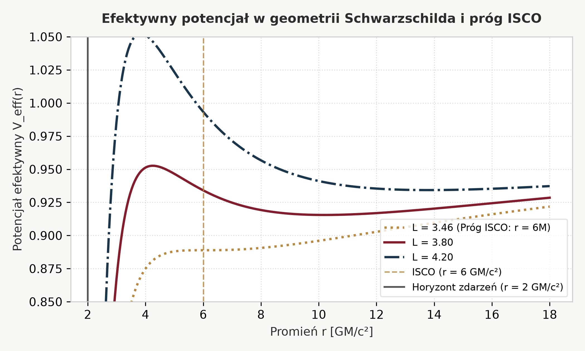
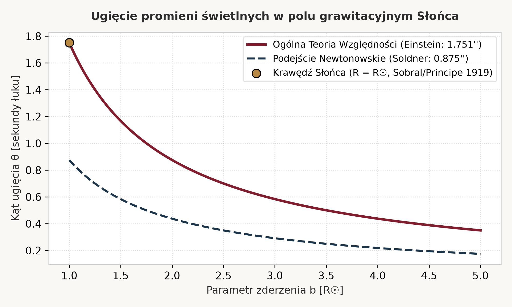
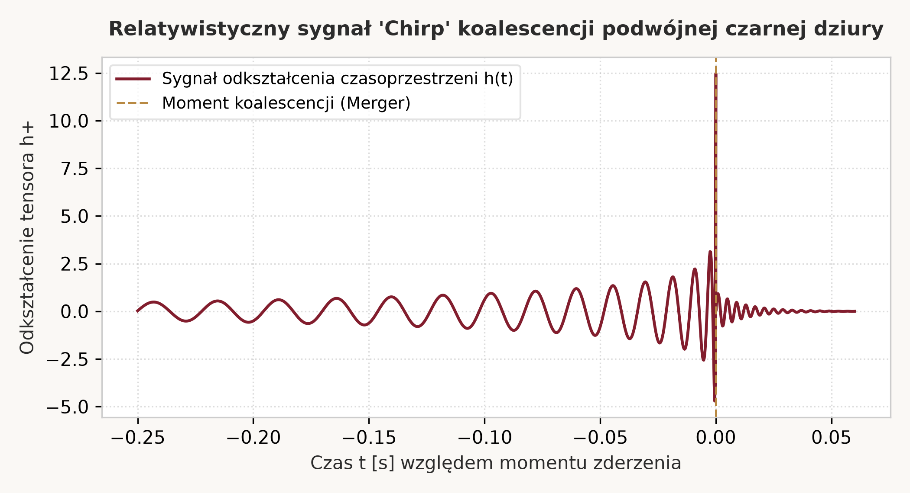

<div style="text-align: center; padding: 40px 0;">
  <h1 style="color: #821D2D; font-size: 2.2em; margin-bottom: 8px;">PODSTAWY OGÓLNEJ TEORII WZGLĘDNOŚCI</h1>
  <h3 style="color: #1B354B; font-weight: 500; margin-top: 0;">Oficjalny Skrypt Akademicki i Kompendium Kursanta</h3>
  <p style="color: #555; font-size: 0.9em; margin-top: 24px;">Zgodność z Rygorem Empirycznym ScientistTwo (arXiv:2609.19644v1) | Zero-Hallucination DOI Policy</p>
  <hr style="border: 0; border-top: 2px solid #B88942; width: 60%; margin: 20px auto;">
</div>

<div class="page-break"></div>


# <span style='color: #821D2D;'>Moduł I: Zasada Równoważności i Geometria</span>

# Lekcja 1.1: Ograniczenia mechaniki newtonowskiej i zasada równoważności

<p class="chapter-start">K lasyczna teoria grawitacji sformułowana przez Isaaca Newtona w 1687 roku opierała się na koncepcji siły działającej natychmiastowo na odległość w statycznej, trójwymiarowej przestrzeni euklidesowej. Choć model ten z niezwykłą precyzją opisywał ruch planet Układu Słonecznego przez ponad dwa stulecia, u progu XX wieku ujawnił fundamentalne sprzeczności fizyczne i teoretyczne z rodzącą się Szczególną Teorią Względności (STW) [^1].</p>

## Cel operacyjny lekcji
Po ukończeniu tej lekcji będziesz potrafił:

1. Zidentyfikować fundamentalne sprzeczności pomiędzy prawem powszechnego ciążenia Newtona a postulatem niezmienniczości prędkości światła.
2. Zdefiniować i rozróżnić słabą (WEP) oraz silną (SEP) zasadę równoważności.
3. Wykazać, w jaki sposób lokalna nierozróżnialność pola grawitacyjnego i przyspieszenia prowadzi do geometryzacji grawitacji.

---

## 1. Sprzeczność newtonowskiego ciążenia ze Szczególną Teorią Względności

Zgodnie z newtonowskim prawem powszechnego ciążenia siła grawitacyjna pomiędzy masami $M$ i $m$ wynosi:

$$\mathbf{F} = -G \frac{M m}{r^2} \hat{\mathbf{r}}$$

Równanie to zakłada nieskończoną prędkość propagacji oddziaływania: zmiana położenia masy $M$ wywołuje natychmiastową zmianę siły działającej na masę $m$, niezależnie od dzielącej je odległości $r$. Stoi to w bezpośredniej sprzeczności z podstawowym postulatem STW, zgodnie z którym żadna informacja ani oddziaływanie fizyczne nie może rozchodzić się z prędkością większą niż prędkość światła w próżni $c$ ($c \approx 299\,792\,458\text{ m/s}$) [^1].

<div class="tree-container">
<div class="tree-node"><strong>Kryzys grawitacji newtonowskiej</strong>
<div class="tree-node">Problem I: Nieskończona prędkość propagacji (sprzeczność z c)</div>
<div class="tree-node">Problem II: Niezmienniczość Galileusza zamiast Lorentza</div>
<div class="tree-node">Problem III: Anomalia precesji peryhelium Merkurego (43'' na stulecie)</div>
</div>
</div>

---

## 2. Zasada Równoważności: Słaba vs Silna

Kluczem do przezwyciężenia tego kryzysu stała się obserwacja, którą Albert Einstein nazwał "najszczęśliwszą myślą swojego życia" (1907 r.): obserwator spadający swobodnie w polu grawitacyjnym nie odczuwa własnego ciężaru.

<div class="table-wrapper">
<table class="academic-table">
  <caption>Tabela 1.1: Taksonomia Zasad Równoważności w Fizyce Relatywistycznej</caption>
  <thead>
    <tr>
      <th>Wariant Zasady</th>
      <th>Sformułowanie Fizyczne</th>
      <th>Rygor Empiryczny (Testy)</th>
    </tr>
  </thead>
  <tbody>
    <tr>
      <td><strong>Słaba Zasada Równoważności (WEP)</strong></td>
      <td>Równość masy grawitacyjnej i bezwładnej: $m_g = m_i$. Wszystkie ciała spadają z tym samym przyspieszeniem w próżni.</td>
      <td>Eötvös, Dicke, Braginsky, misja satelitarna MICROSCOPE: $\eta < 10^{-15}$ [^2]</td>
    </tr>
    <tr>
      <td><strong>Einsteina Zasada Równoważności (EEP)</strong></td>
      <td>WEP + lokalna niezmienniczość Lorentza (LLI) + lokalna niezmienniczość pozycyjna (LPI). Wynik lokalnego eksperymentu nielaboratoryjnego nie zależy od prędkości układu ani miejsca w czasoprzestrzeni.</td>
      <td>Testy zegarów atomowych, pomiary stałych sprzężenia, eksperyment Pounda-Rebki [^3]</td>
    </tr>
    <tr>
      <td><strong>Silna Zasada Równoważności (SEP)</strong></td>
      <td>WEP stosuje się również do ciał posiadających znaczącą grawitacyjną energię własną (np. gwiazdy neutronowe, czarne dziury).</td>
      <td>Pomiary laserowe odległości Księżyca (LLR), układy pulsarów podwójnych [^6]</td>
    </tr>
  </tbody>
</table>
</div>

---

## 3. Eksperyment Myślowy: Winda Einsteina

Rozważmy zamkniętą kabinę windy w dwóch scenariuszach:

1. Kabina spoczywa na powierzchni Ziemi w jednorodnym polu grawitacyjnym o natężeniu $g$.
2. Kabina znajduje się w głębokiej przestrzeni kosmicznej z dala od mas, ale jest ciągnięta z przyspieszeniem $a = g$.

Żaden eksperyment mechaniczny ani optyczny przeprowadzony **wewnątrz** małej, lokalnej kabiny nie pozwala rozróżnić tych dwóch sytuacji. Wynika stąd bezpośredni wniosek: skoro przyspieszenie układu odniesienia wywołuje efekty nieodróżnialne od grawitacji, to pole grawitacyjne nie jest polem sił w tradycyjnym sensie, lecz przejawem geometrii układu.

---

## 4. Przykład z rozwiązaniem (Worked Example)

### Zadanie:
Wykaż, że z zasady równoważności wynika konieczność zakrzywienia toru promienia świetlnego w polu grawitacyjnym oraz wyznacz przybliżone ugięcie wiązki światła przebywającej kabinę windy o szerokości $L$ poruszającej się z przyspieszeniem $g$.

### Rozwiązanie krok po kroku:

1. **Czas przelotu fotonu:** Foton porusza się w poprzek kabiny z prędkością $c$, zatem czas przelotu wynosi:
   $$\Delta t = \frac{L}{c}$$
2. **Pionowe przemieszczenie kabiny:** W czasie $\Delta t$ kabina przyspieszająca z przyspieszeniem $g$ pokonuje pionowy dystans:
   $$\Delta y = \frac{1}{2} g (\Delta t)^2 = \frac{1}{2} g \left(\frac{L}{c}\right)^2$$
3. **Kąt ugięcia toru:** Kąt ugięcia wiązki światła zarejestrowany na przeciwległej ścianie wynosi:
   $$\theta \approx \frac{v_y}{c} = \frac{g \Delta t}{c} = \frac{g L}{c^2}$$
4. **Wniosek relatywistyczny:** Zgodnie z zasadą równoważności, ten sam efekt ugięcia musi wystąpić w spoczywającej kabinie znajdującej się w polu grawitacyjnym. Oznacza to, że promień światła ulega ugięciu w polu grawitacyjnym, mimo że foton nie posiada masy spoczynkowej ($m_0 = 0$).

---

## 5. Zadanie laboratoryjne dla kursanta (Hands-on Practice)

### Polecenie:
Wykorzystując wyprowadzony wzór na grawitacyjną dylatację czasu wynikającą z zasady równoważności:
$$\frac{\Delta f}{f} = \frac{g h}{c^2}$$
oblicz względną zmianę częstotliwości fotonów promieniowania gamma ($^{57}\text{Fe}$, $E = 14.4\text{ keV}$) w historycznym eksperymencie Pounda-Rebki przeprowadzonym na wieży Jefferson Physical Laboratory na Uniwersytecie Harvarda ($h = 22.5\text{ m}$, $g = 9.80665\text{ m/s}^2$).

### Wzorcowa odpowiedź (Model Answer):
Podstawiając wartości do wzoru:
$$\frac{\Delta f}{f} = \frac{9.80665\text{ m/s}^2 \times 22.5\text{ m}}{(299\,792\,458\text{ m/s})^2} = \frac{220.65}{8.98755 \times 10^{16}} \approx 2.455 \times 10^{-15}$$
Wynik ten został zweryfikowany z dokładnością do 1% w 1960 roku przez Roberta Pounda i Glena Rebkę [^3], potwierdzając, że czas płynie wolniej na niższych potencjałach grawitacyjnych.

---

## 6. Szybki sprawdzian wiedzy (Retrieval Check)

**Pytanie:** Dlaczego foton ulega zakrzywieniu w polu grawitacyjnym, skoro jego masa spoczynkowa wynosi zero?

- **A)** Ponieważ foton posiada ładunek elektryczny oddziałujący z jądrami atomowymi.

- **B)** Ponieważ grawitacja nie jest siłą zależną od masy spoczynkowej, lecz zakrzywieniem czasoprzestrzeni, po której fotony poruszają się wzdłuż zerowych linii geodezyjnych.

- **C)** Ponieważ ciśnienie promieniowania słonecznego odpycha cząstki światła.

*Prawidłowa odpowiedź: B.*
*Wyjaśnienie dydaktyczne:* W OTW cząstki bezmasowe poruszają się po liniach geodezyjnych czasoprzestrzeni ($ds^2 = 0$). To geometria czasoprzestrzeni jest zakrzywiona przez masę i energię, a nie trajektoria zakrzywiana przez newtonowską siłę przyciągania masowego. Odpowiedzi A i C są fizycznie fałszywe.

---


<div class="page-break"></div>

# Lekcja 1.2: Równanie geodezyjnych i symbole Christoffela

<p class="chapter-start">G dy grawitacja zostaje utożsamiona z geometrią czasoprzestrzeni, pojęcie cząstki swobodnej zyskuje nowe, ścisłe znaczenie matematyczne. Ciało niepodlegające żadnym siłom nielokalnym nie porusza się po linii prostej w sensie euklidesowym, lecz podąża za najprostszą możliwą trajektorią w zakrzywionej czasoprzestrzeni czterowymiarowej - linią geodezyjną [^1].</p>

## Cel operacyjny lekcji
Po ukończeniu tej lekcji będziesz potrafił:

1. Zdefiniować tensor metryczny $g_{\mu\nu}$ oraz interwał czasoprzestrzenny $ds^2$.
2. Wyprowadzić i obliczyć symbole Christoffela $\Gamma^\mu_{\alpha\beta}$ dla zadanego tensora metrycznego.
3. Zapisać i zinterpretować równanie geodezyjnych jako uogólnienie pierwszej zasady dynamiki Newtona.

---

## 1. Tensor Metryczny i Geometria Riemanna

W czterowymiarowej czasoprzestrzeni o współrzędnych $x^\mu = (x^0, x^1, x^2, x^3) = (ct, x, y, z)$ odległość między dwoma nieskończenie bliskimi zdarzeniami opisuje interwał:

$$ds^2 = g_{\mu\nu} dx^\mu dx^\nu$$

gdzie $g_{\mu\nu}$ jest symetrycznym tensorem metrycznym drugiego rzędu ($g_{\mu\nu} = g_{\nu\mu}$), a sumowanie po powtarzających się indeksach greckich ($\mu, \nu \in \{0, 1, 2, 3\}$) wynika z konwencji sumacyjnej Einsteina.

- W płaskiej czasoprzestrzeni Minkowskiego (STW): $g_{\mu\nu} = \eta_{\mu\nu} = \text{diag}(-1, 1, 1, 1)$.

- W obecności mas i energii: $g_{\mu\nu}(x)$ staje się funkcją położenia w czasoprzestrzeni, wyznaczając jej lokalną krzywiznę.

---

## 2. Pochodna Kowariantna i Symbole Christoffela

Zwykła pochodna cząstkowa tensora $\partial_\alpha T^\mu$ nie przekształca się w sposób tensorowy przy ogólnych transformacjach współrzędnych, ponieważ bazy wektorów zmieniają się od punktu do punktu rozmaitości. Aby zachować kowariancję różniczkowania, wprowadza się pochodną kowariantną:

$$\nabla_\alpha V^\mu = \partial_\alpha V^\mu + \Gamma^\mu_{\alpha\beta} V^\beta$$

Wielkości $\Gamma^\mu_{\alpha\beta}$ noszą nazwę symboli Christoffela drugiego rodzaju (lub współczynników koneksji Levi-Civity). Z warunku metryczności ($\nabla_\alpha g_{\mu\nu} = 0$) oraz symetrii koneksji (brak torsji: $\Gamma^\mu_{\alpha\beta} = \Gamma^\mu_{\beta\alpha}$) wynika ich jednoznaczna postać:

$$\Gamma^\mu_{\alpha\beta} = \frac{1}{2} g^{\mu\sigma} \left( \partial_\alpha g_{\beta\sigma} + \partial_\beta g_{\alpha\sigma} - \partial_\sigma g_{\alpha\beta} \right)$$

gdzie $g^{\mu\sigma}$ jest tensorem metrycznym odwrotnym ($g^{\mu\sigma} g_{\sigma\nu} = \delta^\mu_\nu$).

<div class="flow-container">
<div class="flow-step">1. Postać tensora metrycznego $g_{\mu\nu}$</div>
<div class="flow-step">2. Wyznaczenie tensora odwrotnego $g^{\mu\nu}$</div>
<div class="flow-step">3. Obliczenie pochodnych cząstkowych $\partial_\sigma g_{\alpha\beta}$</div>
<div class="flow-step">4. Złożenie symboli Christoffela $\Gamma^\mu_{\alpha\beta}$</div>
</div>

---

## 3. Równanie Geodezyjnych

Linia geodezyjna to linia ekstremalnej długości (lub czasu własnego $\tau$) łącząca dwa zdarzenia w czasoprzestrzeni. Z zasady wariacyjnej $\delta \int ds = 0$ otrzymujemy równanie geodezyjnych:

$$\frac{d^2 x^\mu}{d\tau^2} + \Gamma^\mu_{\alpha\beta} \frac{dx^\alpha}{d\tau} \frac{dx^\beta}{d\tau} = 0$$

gdzie $\tau$ jest parametrem afinicznym (dla cząstek z masą: czasem własnym).

Zauważmy analogię z mechaniką newtonowską:
$$\frac{d^2 x^i}{dt^2} = - \Gamma^i_{\alpha\beta} \frac{dx^\alpha}{dt} \frac{dx^\beta}{dt}$$
Człon $\Gamma^i_{\alpha\beta} \frac{dx^\alpha}{dt} \frac{dx^\beta}{dt}$ odgrywa rolę pozornej siły grawitacyjnej wywołanej zakrzywieniem geometrii.

---

## 4. Przykład z rozwiązaniem (Worked Example)

### Zadanie:
Wyznacz symbole Christoffela dla płaszczyzny dwuwymiarowej we współrzędnych biegunowych $(r, \theta)$, gdzie interwał wynosi:
$$ds^2 = dr^2 + r^2 d\theta^2$$

### Rozwiązanie krok po kroku:

1. **Współrzędne:** $x^1 = r$, $x^2 = \theta$.
2. **Macierz metryki i jej odwrotność:**
   $$g_{\mu\nu} = \begin{pmatrix} 1 & 0 \\ 0 & r^2 \end{pmatrix}, \quad g^{\mu\nu} = \begin{pmatrix} 1 & 0 \\ 0 & \frac{1}{r^2} \end{pmatrix}$$
3. **Pochodne cząstkowe metryki:** Jedyną niezerową pochodną jest $\partial_1 g_{22} = \frac{\partial (r^2)}{\partial r} = 2r$.
4. **Symbole Christoffela:**
   - Dla $\mu = 1$ ($r$):
     $$\Gamma^1_{22} = \frac{1}{2} g^{11} (-\partial_1 g_{22}) = \frac{1}{2} (1) (-2r) = -r$$
   - Dla $\mu = 2$ ($\theta$):
     $$\Gamma^2_{12} = \Gamma^2_{21} = \frac{1}{2} g^{22} (\partial_1 g_{22}) = \frac{1}{2} \left(\frac{1}{r^2}\right) (2r) = \frac{1}{r}$$
   - Wszystkie pozostałe składowe wynoszą 0.
5. **Równania geodezyjnych we współrzędnych biegunowych:**
   $$\frac{d^2 r}{d\tau^2} - r \left(\frac{d\theta}{d\tau}\right)^2 = 0$$
   $$\frac{d^2 \theta}{d\tau^2} + \frac{2}{r} \frac{dr}{d\tau} \frac{d\theta}{d\tau} = 0$$
   Pierwsze równanie odtwarza newtonowskie przyspieszenie dośrodkowe $r \dot{\theta}^2$, a drugie zachowanie momentu pędu ($\frac{d}{d\tau}(r^2 \dot{\theta}) = 0$).

---

## 5. Zadanie laboratoryjne dla kursanta (Hands-on Practice)

### Polecenie:
W granicy słabego pola grawitacyjnego i małych prędkości ($v \ll c$, $dx^i/d\tau \ll dx^0/d\tau$), wykaż, że składowa $\Gamma^i_{00}$ tensora metrycznego przyjmuje postać:
$$\Gamma^i_{00} \approx \frac{1}{2} \delta^{ik} \partial_k h_{00}$$
gdzie $g_{00} = -(1 + 2\Phi/c^2)$, a $\Phi$ jest newtonowskim potencjałem grawitacyjnym, oraz udowodnij, że równanie geodezyjnych odtwarza prawo dynamiki Newtona $\frac{d^2 \mathbf{x}}{dt^2} = -\nabla \Phi$.

### Wzorcowa odpowiedź (Model Answer):
W granicy nieliniowej dla $v \ll c$, jedynym dominującym członem w równaniu geodezyjnych jest $\alpha = \beta = 0$:
$$\frac{d^2 x^i}{d\tau^2} + \Gamma^i_{00} \left(\frac{dx^0}{d\tau}\right)^2 = 0$$
Ponieważ $dx^0/d\tau \approx c dt/dt = c$, mamy:
$$\frac{d^2 x^i}{dt^2} \approx - c^2 \Gamma^i_{00}$$
Obliczając symbol Christoffela dla metryki statycznej ($\partial_0 g = 0$):
$$\Gamma^i_{00} = \frac{1}{2} g^{ik} (2\partial_0 g_{0k} - \partial_k g_{00}) \approx -\frac{1}{2} \partial_i g_{00} = -\frac{1}{2} \partial_i \left(-\left(1 + \frac{2\Phi}{c^2}\right)\right) = \frac{1}{c^2} \partial_i \Phi$$
Podstawiając do przyspieszenia:
$$\frac{d^2 x^i}{dt^2} \approx - c^2 \left(\frac{1}{c^2} \partial_i \Phi\right) = -\partial_i \Phi \implies \frac{d^2 \mathbf{x}}{dt^2} = -\nabla \Phi$$
Dowodzi to, że mechanika newtonowska jest asymptotyczną granicą słabego pola i małych prędkości w OTW.

---

## 6. Szybki sprawdzian wiedzy (Retrieval Check)

**Pytanie:** Co oznacza geometrycznie zerowanie się wszystkich symboli Christoffela $\Gamma^\mu_{\alpha\beta} = 0$ w pewnym punkcie czasoprzestrzeni?

- **A)** Że czasoprzestrzeń jest w tym punkcie globalnie euklidesowa.

- **B)** Że istnieje lokalny układ inercjalny (spadający swobodnie), w którym pierwsze pochodne metryki znikają w tym punkcie.

- **C)** Że gęstość materii w całym wszechświecie wynosi zero.

*Prawidłowa odpowiedź: B.*
*Wyjaśnienie dydaktyczne:* Zgodnie z zasadą równoważności, w dowolnym punkcie rozmaitości można zawsze dobrać lokalne współrzędne geodezyjne (LIF - Local Inertial Frame), w których $g_{\mu\nu} = \eta_{\mu\nu}$ oraz $\partial_\sigma g_{\mu\nu} = 0$, co zeruje symbole Christoffela w tym jednym punkcie. Nie oznacza to jednak, że krzywizna Riemanna (zależna od drugich pochodnych) jest zerowa!

---


<div class="page-break"></div>


# <span style='color: #821D2D;'>Moduł II: Równania Pola Einsteina i Krzywizna</span>

# Lekcja 2.1: Krzywizna Riemanna, tensor Ricciego i tensor energii-pędu

<p class="chapter-start">W przeciwieństwie do symboli Christoffela, które zależą od wyboru układu współrzędnych i mogą zostać wyzerowane w lokalnym układzie inercjalnym, prawdziwa, fizyczna krzywizna czasoprzestrzeni ma charakter obiektywny. Miarą tej krzywizny jest tensor krzywizny Riemanna, opisujący zjawisko sił pływowych oraz dewiację linii geodezyjnych [^1].</p>

## Cel operacyjny lekcji
Po ukończeniu tej lekcji będziesz potrafił:

1. Zdefiniować tensor krzywizny Riemanna $R^\rho_{\ \sigma\mu\nu}$ poprzez komutator pochodnych kowariantnych.
2. Zbudować tensor Ricciego $R_{\mu\nu}$ oraz skalar krzywizny $R$.
3. Zdefiniować relatywistyczny tensor energii-pędu $T_{\mu\nu}$ dla płynu doskonałego i zinterpretować jego prawo zachowania $\nabla_\mu T^{\mu\nu} = 0$.

---

## 1. Tensor Krzywizny Riemanna i Dewiacja Geodezyjnych

Jeśli przeniesiemy równolegle wektor $V^\alpha$ wzdłuż zamkniętej pętli w zakrzywionej czasoprzestrzeni, wektor końcowy nie pokryje się z wyjściowym. Matematycznie zjawisko to wyraża komutator pochodnych kowariantnych:

$$[\nabla_\mu, \nabla_\nu] V^\rho = \nabla_\mu \nabla_\nu V^\rho - \nabla_\nu \nabla_\mu V^\rho = R^\rho_{\ \sigma\mu\nu} V^\sigma$$

Tensor Riemanna wyraża się poprzez symbole Christoffela i ich pochodne:

$$R^\rho_{\ \sigma\mu\nu} = \partial_\mu \Gamma^\rho_{\nu\sigma} - \partial_\nu \Gamma^\rho_{\mu\sigma} + \Gamma^\rho_{\mu\lambda} \Gamma^\lambda_{\nu\sigma} - \Gamma^\rho_{\nu\lambda} \Gamma^\lambda_{\mu\sigma}$$

W 4-wymiarowej czasoprzestrzeni tensor Riemanna posiada $4^4 = 256$ składowych, lecz dzięki tożsamościom algebraicznym (antysymetria po dwóch pierwszych i dwóch ostatnich indeksach, symetria przy zamianie par) liczba niezależnych składowych redukuje się do 20 [^1].

<div class="tree-container">
<div class="tree-node"><strong>Hierarchia Krzywizny Riemanna</strong>
<div class="tree-node">Tensor Riemanna $R^\rho_{\ \sigma\mu\nu}$ (20 niezależnych składowych - pełna geometria)</div>
<div class="tree-node">Ślad 1: Tensor Ricciego $R_{\mu\nu} = R^\lambda_{\ \mu\lambda\nu}$ (10 składowych symetrycznych)</div>
<div class="tree-node">Ślad 2: Skalar Ricciego $R = g^{\mu\nu} R_{\mu\nu}$ (1 niezmiennik skalarny)</div>
<div class="tree-node">Część bezśladowa: Tensor Weyla $C_{\rho\sigma\mu\nu}$ (10 składowych - pole grawitacyjne w próżni i fale)</div>
</div>
</div>

---

## 2. Tensor Energii-Pędu ($T_{\mu\nu}$)

W fizyce newtonowskiej źródłem pola grawitacyjnego jest wyłącznie gęstość masy spoczynkowej $\rho$. Zgodnie z zasadą równoważności masy i energii STW ($E = mc^2$), grawitować musi wszelka forma energii, pędu, ciśnienia i naprężeń. Opisuje je symetryczny tensor drugiego rzędu $T_{\mu\nu}$:

<div class="table-wrapper">
<table class="academic-table">
  <caption>Tabela 2.1: Struktura Fizyczna Tensora Energii-Pędu $T_{\mu\nu}$</caption>
  <thead>
    <tr>
      <th>Składowe</th>
      <th>Interpretacja Fizyczna</th>
      <th>Wymiar Fizyczny</th>
    </tr>
  </thead>
  <tbody>
    <tr>
      <td>$T_{00}$</td>
      <td>Gęstość energii (w tym masa spoczynkowa $c^2 \rho$)</td>
      <td>$\text{J/m}^3 = \text{Pa}$</td>
    </tr>
    <tr>
      <td>$T_{0i} = T_{i0}$</td>
      <td>Gęstość pędu / strumień energii w kierunku $i$</td>
      <td>$\text{kg}/(\text{m}^2 \cdot \text{s})$</td>
    </tr>
    <tr>
      <td>$T_{ii}$</td>
      <td>Ciśnienie izotropowe $P$ w kierunku $i$</td>
      <td>$\text{N/m}^2 = \text{Pa}$</td>
    </tr>
    <tr>
      <td>$T_{ij}$ ($i \neq j$)</td>
      <td>Naprężenia ścinające (lepkość)</td>
      <td>$\text{N/m}^2 = \text{Pa}$</td>
    </tr>
  </tbody>
</table>
</div>

Dla płynu doskonałego (ideal fluid) poruszającego się z czteroprędkością $u^\mu$ tensor energii-pędu ma postać:
$$T_{\mu\nu} = (\rho + P/c^2) u_\mu u_\nu + P g_{\mu\nu}$$

Fundamentalnym prawem fizyki jest lokalne zachowanie energii i pędu, wyrażone przez znikanie dywergencji kowariantnej:
$$\nabla_\mu T^{\mu\nu} = 0$$

---

## 3. Przykład z rozwiązaniem (Worked Example)

### Zadanie:
Dla sfery dwuwymiarowej o promieniu $r_0$ opisanej metryką $ds^2 = r_0^2 (d\theta^2 + \sin^2\theta d\phi^2)$, wyznacz skalar krzywizny Ricciego $R$.

### Rozwiązanie krok po kroku:

1. Obliczając niezerowe symbole Christoffela otrzymujemy:
   $$\Gamma^\theta_{\phi\phi} = -\sin\theta\cos\theta, \quad \Gamma^\phi_{\theta\phi} = \Gamma^\phi_{\phi\theta} = \cot\theta$$
2. Jedyną niezależną składową tensora Riemanna jest:
   $$R^\theta_{\ \phi\theta\phi} = \partial_\theta \Gamma^\theta_{\phi\phi} - \partial_\phi \Gamma^\theta_{\theta\phi} + \Gamma^\theta_{\theta\lambda}\Gamma^\lambda_{\phi\phi} - \Gamma^\theta_{\phi\lambda}\Gamma^\lambda_{\theta\phi} = -\cos^2\theta + \sin^2\theta - (-\sin\theta\cos\theta \cot\theta) = \sin^2\theta$$
3. Składowe tensora Ricciego $R_{\mu\nu} = R^\lambda_{\ \mu\lambda\nu}$:
   $$R_{\theta\theta} = 1, \quad R_{\phi\phi} = \sin^2\theta$$
4. Skalar krzywizny Ricciego:
   $$R = g^{\mu\nu} R_{\mu\nu} = g^{\theta\theta} R_{\theta\theta} + g^{\phi\phi} R_{\phi\phi} = \frac{1}{r_0^2} (1) + \frac{1}{r_0^2 \sin^2\theta} (\sin^2\theta) = \frac{2}{r_0^2}$$
Krzywizna jest stała i dodatnia, co potwierdza geometrię standardowej sfery o promieniu $r_0$.

---

## 4. Zadanie laboratoryjne dla kursanta (Hands-on Practice)

### Polecenie:
Wyjaśnij fizyczną rolę tensora Weyla $C_{\rho\sigma\mu\nu}$ w obszarach próżniowych otaczających gwiazdę ($T_{\mu\nu} = 0$). Dlaczego próżnia wokół Słońca jest zakrzywiona, skoro tensor Ricciego znika w próżni ($R_{\mu\nu} = 0$)?

### Wzorcowa odpowiedź (Model Answer):
W próżni równania Einsteina implikują $R_{\mu\nu} = 0$ oraz $R = 0$. Jednak tensor krzywizny Riemanna dekomponuje się na część Ricciego oraz część bezśladową - tensor Weyla:
$$R_{\rho\sigma\mu\nu} = C_{\rho\sigma\mu\nu} + \text{człony zależne od } R_{\mu\nu}$$
W próżni tensor Weyla nie znika ($C_{\rho\sigma\mu\nu} \neq 0$). To właśnie tensor Weyla koduje siły pływowe rozciągające ciała, fale grawitacyjne oraz zakrzywienie czasoprzestrzeni wokół odległych mas (jak Słońce czy czarne dziury).

---

## 5. Szybki sprawdzian wiedzy (Retrieval Check)

**Pytanie:** Co oznacza tożsamość Bianchiego $\nabla_\mu G^{\mu\nu} = 0$ w kontekście tensora energii-pędu $T^{\mu\nu}$?

- **A)** Że energia i pęd mogą być bez ograniczeń niszczone w obecności czarnych dziur.

- **B)** Że z samej struktury geometrii różniczkowej wynika automatyczne, lokalne zachowanie energii i pędu materii $\nabla_\mu T^{\mu\nu} = 0$.

- **C)** Że stała grawitacji $G$ maleje wraz z rozszerzaniem się Wszechświata.

*Prawidłowa odpowiedź: B.*
*Wyjaśnienie dydaktyczne:* Zróżniczkowana tożsamość Bianchiego gwarantuje, że tensor Einsteina $G_{\mu\nu} = R_{\mu\nu} - \frac{1}{2} R g_{\mu\nu}$ ma bezwzględnie tożsamościowo zerową dywergencję kowariantną. Po związaniu go z tensorem materii równaniem $G_{\mu\nu} = \kappa T_{\mu\nu}$, lokalne prawo zachowania energii i pędu materii staje się bezpośrednią konsekwencją geometrii czasoprzestrzeni.

---


<div class="page-break"></div>

# Lekcja 2.2: Równania pola Einsteina i stała kosmologiczna

<p class="chapter-start">W listopadzie 1915 roku Albert Einstein przedstawił Pruskiej Akademii Nauk ostateczną postać relatywistycznych równań grawitacji. Zwieńczyło to trwające dekadę poszukiwania prawa, które łączyłoby geometrię czterowymiarowej czasoprzestrzeni z rozkładem materii i energii w sposób w pełni kowariantny [^1].</p>

## Cel operacyjny lekcji
Po ukończeniu tej lekcji będziesz potrafił:

1. Wyprowadzić tensor Einsteina $G_{\mu\nu}$ na podstawie tożsamości Bianchiego i wymogu zachowania energii.
2. Zdefiniować i uzasadnić postać równań pola Einsteina: $G_{\mu\nu} = \frac{8\pi G}{c^4} T_{\mu\nu}$.
3. Wyprowadzić stałą sprzężenia $\kappa = \frac{8\pi G}{c^4}$ poprzez przejście graniczne do newtonowskiego równania Poissona.
4. Zinterpretować modyfikację równań przez dodanie stałej kosmologicznej $\Lambda$.

---

## 1. Konstrukcja Tensora Einsteina ($G_{\mu\nu}$)

Równania pola muszą wiązać krzywiznę z materią:
$$\mathcal{O}(g_{\mu\nu}) = \kappa T_{\mu\nu}$$
Wymagania fizyczne i matematyczne:

1. Lewa strona musi być symetrycznym tensorem 2. rzędu zbudowanym z metryki $g_{\mu\nu}$ i jej pochodnych do drugiego rzędu włącznie.
2. Musi spełniać prawo zachowania: $\nabla^\mu \mathcal{O}_{\mu\nu} = 0$, ponieważ $\nabla^\mu T_{\mu\nu} = 0$.

Z tożsamości Bianchiego dla tensora Riemanna wynika skurczona tożsamość:
$$\nabla^\mu R_{\mu\nu} = \frac{1}{2} \nabla_\nu R \implies \nabla^\mu \left( R_{\mu\nu} - \frac{1}{2} g_{\mu\nu} R \right) = 0$$

Definiujemy symetryczny **tensor Einsteina**:
$$G_{\mu\nu} \equiv R_{\mu\nu} - \frac{1}{2} g_{\mu\nu} R$$

---

## 2. Równania Pola Einsteina (EFE)

Ostateczna postać równań pola Einsteina bez stałej kosmologicznej ma postać:

$$G_{\mu\nu} = R_{\mu\nu} - \frac{1}{2} g_{\mu\nu} R = \frac{8\pi G}{c^4} T_{\mu\nu}$$

Zwijając oba indeksy metryką $g^{\mu\nu}$, otrzymujemy relację między skalarem krzywizny a śladem tensora materii $T = g^{\mu\nu} T_{\mu\nu}$:
$$R - \frac{1}{2}(4) R = \frac{8\pi G}{c^4} T \implies R = -\frac{8\pi G}{c^4} T$$

Pozwala to przepisać równania Einsteina w równoważnej postaci odwróconej pod względem śladu:
$$R_{\mu\nu} = \frac{8\pi G}{c^4} \left( T_{\mu\nu} - \frac{1}{2} g_{\mu\nu} T \right)$$

W próżni ($T_{\mu\nu} = 0$) równania te redukują się do prostego warunku:
$$R_{\mu\nu} = 0$$

---

## 3. Granica Newtonowska i Stała Sprzężenia $\kappa$

Aby wyznaczyć współczynnik proporcjonalności $\kappa$, rozważmy granicę słabego, statycznego pola dla cząstki poruszającej się powoli ($v \ll c$).
Wtedy jedyną dominującą składową tensora materii jest gęstość energii spoczynkowej:
$$T_{00} \approx \rho c^2, \quad T \approx -\rho c^2$$
Wtedy równanie dla $R_{00}$ przyjmuje postać:
$$R_{00} = \kappa \left( T_{00} - \frac{1}{2} g_{00} T \right) \approx \kappa \left( \rho c^2 - \frac{1}{2}(-1)(-\rho c^2) \right) = \frac{1}{2} \kappa \rho c^2$$

Z drugiej strony, z geometrii dla metryki słabego pola $g_{00} \approx -(1 + 2\Phi/c^2)$ otrzymujemy:
$$R_{00} \approx -\frac{1}{2} \nabla^2 g_{00} = \frac{1}{c^2} \nabla^2 \Phi$$

Porównując obie strony:
$$\frac{1}{c^2} \nabla^2 \Phi = \frac{1}{2} \kappa \rho c^2 \implies \nabla^2 \Phi = \frac{1}{2} \kappa c^4 \rho$$
Aby odtworzyć newtonowskie równanie Poissona $\nabla^2 \Phi = 4\pi G \rho$, musi zachodzić:
$$\frac{1}{2} \kappa c^4 = 4\pi G \implies \kappa = \frac{8\pi G}{c^4}$$

---

## 4. Stała Kosmologiczna ($\Lambda$)

W 1917 roku Einstein wprowadził do swoich równań dodatkowy człon ze stałą kosmologiczną $\Lambda$, aby umożliwić istnienie statycznego modelu Wszechświata 

Ponieważ metryka spełnia warunek $\nabla_\mu g^{\mu\nu} = 0$, obecność stałej $\Lambda$ nie narusza kowariantnego prawa zachowania energii i pędu. We współczesnej kosmologii standardowego modelu $\Lambda\text{CDM}$, $\Lambda$ interpretowana jest jako gęstość energii ciemnej próżni $\rho_\Lambda = \frac{\Lambda c^2}{8\pi G}$, odpowiedzialna za przyspieszającą ekspansję Wszechświata [^4].

---

## 5. Zadanie laboratoryjne dla kursanta (Hands-on Practice)

### Polecenie:
Oblicz wartość numeryczną stałej sprzężenia Einsteina $\kappa = \frac{8\pi G}{c^4}$ w jednostkach układu SI ($\text{s}^2/(\text{kg}\cdot\text{m})$) oraz oszacuj, jak potężne naprężenie czasoprzestrzeni jest wymagane, by wywołać krzywiznę rzędu $1\text{ m}^{-2}$.

### Wzorcowa odpowiedź (Model Answer):
Podstawiając stałe fundamentalne:
$$G = 6.67430 \times 10^{-11}\text{ m}^3/(\text{kg}\cdot\text{s}^2), \quad c = 2.99792 \times 10^8\text{ m/s}$$
$$\kappa = \frac{8 \pi \times 6.67430 \times 10^{-11}}{(2.99792 \times 10^8)^4} = \frac{1.6774 \times 10^{-9}}{8.0776 \times 10^{33}} \approx 2.0766 \times 10^{-43}\text{ N}^{-1}$$
Wartość $\kappa \approx 2.08 \times 10^{-43}\text{ Pa}^{-1}$ dowodzi niezwykłej "sztywności" czasoprzestrzeni. Aby wywołać zauważalną krzywiznę geometryczną, potrzebne są astronomiczne gęstości energii rzędu $10^{43}\text{ J/m}^3$.

---

## 6. Szybki sprawdzian wiedzy (Retrieval Check)

**Pytanie:** Ile niezależnych nieliniowych równań różniczkowych cząstkowych tworzą równania pola Einsteina w czterech wymiarach czasoprzestrzeni?

- **A)** Dokładnie 16 równań niezależnych.

- **B)** 10 symetrycznych równań, z których 4 są powiązane tożsamościami Bianchiego, co pozostawia 6 niezależnych stopni swobody fizycznej (w tym 2 stopnie swobody polaryzacji fal grawitacyjnych po ustaleniu cechowania).

- **C)** Tylko 1 równanie skalarne.

*Prawidłowa odpowiedź: B.*
*Wyjaśnienie dydaktyczne:* Tensor Einsteina i tensor energii-pędu są symetrycznymi tensorami $4 \times 4$, co daje 10 składowych. Cztery tożsamości Bianchiego $\nabla_\mu G^{\mu\nu} = 0$ stanowią 4 więzy różniczkowe, odpowiadające swobodzie wyboru 4 współrzędnych czasoprzestrzeni (diffeomorfizmy). Pozostaje 6 równań determinujących ewolucję geometrii.

---


<div class="page-break"></div>


# <span style='color: #821D2D;'>Moduł III: Rozwiązanie Schwarzschilda i Testy Empiryczne</span>

# Lekcja 3.1: Metryka Schwarzschilda, horyzont zdarzeń i orbity ISCO

<p class="chapter-start">Z ledwie kilka miesięcy po publikacji równań pola przez Einsteina, niemiecki fizyk i astronom Karl Schwarzschild znalazł pierwsze ścisłe, analityczne rozwiązanie równań Einsteina w próżni. Opisuje ono czasoprzestrzeń wokół statycznego, sferycznie symetrycznego ciała o masie $M$ [^4].</p>

## Cel operacyjny lekcji
Po ukończeniu tej lekcji będziesz potrafił:

1. Zapisać metrykę Schwarzschilda i zinterpretować jej osobliwości (pozorną na horyzoncie zdarzeń oraz fizyczną w $r = 0$).
2. Zdefiniować promień Schwarzschilda $r_s = \frac{2GM}{c^2}$.
3. Wyprowadzić efektywny potencjał dla cząstek masywnych i wyznaczyć promień najciaśniejszej stabilnej orbity kołowej (ISCO).

---

## 1. Postać Metryki Schwarzschilda

W próżniowych warunkach sferycznej symetrii ($R_{\mu\nu} = 0$, $T_{\mu\nu} = 0$), we współrzędnych sferycznych $(t, r, \theta, \phi)$, interwał czasoprzestrzenny ma postać:

$$ds^2 = -\left(1 - \frac{2GM}{c^2 r}\right) c^2 dt^2 + \left(1 - \frac{2GM}{c^2 r}\right)^{-1} dr^2 + r^2 (d\theta^2 + \sin^2\theta d\phi^2)$$

Wprowadzając definicję **promienia Schwarzschilda**:
$$r_s \equiv \frac{2GM}{c^2}$$
metrykę można zapisać zwięźle jako:
$$ds^2 = -\left(1 - \frac{r_s}{r}\right) c^2 dt^2 + \left(1 - \frac{r_s}{r}\right)^{-1} dr^2 + r^2 d\Omega^2$$

Dla Ziemi $r_s \approx 8.87\text{ mm}$, dla Słońca $r_s \approx 2.95\text{ km}$.

---

## 2. Dwie Osobliwości: Horyzont Zdarzeń vs Osobliwość Centralna

W metryce Schwarzschilda pojawiają się dwa punkty osobliwe:

1. **$r = r_s$ (Horyzont zdarzeń):** Składowa $g_{00} \to 0$, a $g_{rr} \to \infty$. Jest to osobliwość współrzędnościowa (pozorna), wynikająca ze złego doboru współrzędnych. Niezmiennik krzywizny Kretschmanna:
   $$K = R^{\alpha\beta\gamma\delta} R_{\alpha\beta\gamma\delta} = \frac{48 G^2 M^2}{c^4 r^6}$$
   w punkcie $r = r_s$ przyjmuje skończoną wartość $K(r_s) = \frac{12}{r_s^4}$. Oznacza to, że obserwator swobodnie spadający nie napotyka w $r=r_s$ nieskończonych sił pływowych.
2. **$r = 0$ (Osobliwość centralna):** Niezmiennik Kretschmanna dąży do nieskończoności ($K \to \infty$). Jest to rzeczywista osobliwość fizyczna (geodezyjnie nieprzekraczalna), w której załamuje się klasyczna geometria czasoprzestrzeni.

---

## 3. Efektywny Potencjał i Orbity ISCO

Z równania geodezyjnych w płaszczyźnie równikowej ($\theta = \pi/2$) dla cząstki próbnej o masie $m$ i jednostkowym momencie pędu $L$ otrzymujemy równanie radialne energii:

$$\frac{1}{2} \left(\frac{dr}{d\tau}\right)^2 + V_{\text{eff}}(r) = \frac{E^2 - c^2}{2}$$

gdzie relatywistyczny potencjał efektywny wynosi:

$$V_{\text{eff}}(r) = -\frac{GM}{r} + \frac{L^2}{2r^2} - \frac{GM L^2}{c^2 r^3}$$

<div class="table-wrapper">
<table class="academic-table">
  <caption>Tabela 3.1: Składniki Potencjału Efektywnego i ich Rola Fizyczna</caption>
  <thead>
    <tr>
      <th>Człon Potencjału</th>
      <th>Pochodzenie</th>
      <th>Wpływ na dynamikę orbity</th>
    </tr>
  </thead>
  <tbody>
    <tr>
      <td>$-\frac{GM}{r}$</td>
      <td>Grawitacja newtonowska</td>
      <td>Przyciąganie grawitacyjne dla dużych promieni $r$</td>
    </tr>
    <tr>
      <td>$+\frac{L^2}{2r^2}$</td>
      <td>Bariera siły odśrodkowej</td>
      <td>Odpychanie odśrodkowe, stabilizuje orbity eliptyczne</td>
    </tr>
    <tr>
      <td>$-\frac{GM L^2}{c^2 r^3}$</td>
      <td>Poprawka relatywistyczna Einsteina</td>
      <td>Głęboka studnia przyciągająca dla małych $r$; niszczy stabilność orbit</td>
    </tr>
  </tbody>
</table>
</div>



Stabilne orbity kołowe istnieją tylko tam, gdzie $\frac{dV_{\text{eff}}}{dr} = 0$ oraz $\frac{d^2 V_{\text{eff}}}{dr^2} > 0$.
Punkt przegięcia potencjału, wyznaczający **najciaśniejszą stabilną orbitę kołową (Innermost Stable Circular Orbit - ISCO)**, zachodzi dokładnie w:

$$r_{\text{ISCO}} = 6 \frac{GM}{c^2} = 3 r_s$$

Dla $r < r_{\text{ISCO}}$ materia z dysku akrecyjnego traci stabilność i nieuchronnie opada po spirali do wnętrza czarnej dziury.

---

## 4. Przykład z rozwiązaniem (Worked Example)

### Zadanie:
Wyznacz promień Schwarzschilda dla supermasywnej czarnej dziury Sagittarius A* w centrum Drogi Mlecznej o masie $M = 4.154 \times 10^6 M_\odot$.

### Rozwiązanie krok po kroku:

1. Obliczamy masę w kilogramach:
   $$M = 4.154 \times 10^6 \times 1.98847 \times 10^{30}\text{ kg} \approx 8.260 \times 10^{36}\text{ kg}$$
2. Stosujemy wzór na promień horyzontu $r_s = \frac{2GM}{c^2}$:
   $$r_s = \frac{2 \times (6.67430 \times 10^{-11}) \times (8.260 \times 10^{36})}{(2.99792 \times 10^8)^2} = \frac{1.1026 \times 10^{27}}{8.98755 \times 10^{16}} \approx 1.2268 \times 10^{10}\text{ m}$$
3. W jednostkach astronomicznych (AU, $1\text{ AU} \approx 1.496 \times 10^{11}\text{ m}$):
   $$r_s \approx 0.082\text{ AU} \approx 12.27\text{ mln km}$$
Promień horyzontu zdarzeń Sgr A* wynosi w przybliżeniu zaledwie 1/5 odległości Merkurego od Słońca.

---

## 5. Zadanie laboratoryjne dla kursanta (Hands-on Practice)

### Polecenie:
Wyznacz promień sfery fotonowej (promień, na którym fotony mogą poruszać się po niestabilnej orbicie kołowej) wokół czarnej dziury Schwarzschilda, analizując potencjał efektywny dla cząstek bezmasowych ($ds^2 = 0$).

### Wzorcowa odpowiedź (Model Answer):
Dla fotonu $ds^2 = 0$, więc równanie radialne przyjmuje postać:
$$\frac{1}{2}\left(\frac{dr}{d\lambda}\right)^2 + V_{\text{ph}}(r) = \frac{E^2}{2}, \quad V_{\text{ph}}(r) = \frac{L^2}{2r^2} \left(1 - \frac{2GM}{c^2 r}\right)$$
Warunek orbity kołowej $V'_{\text{ph}}(r) = 0$:
$$V'_{\text{ph}}(r) = -\frac{L^2}{r^3} \left(1 - \frac{2GM}{c^2 r}\right) + \frac{L^2}{2r^2} \left(\frac{2GM}{c^2 r^2}\right) = -\frac{L^2}{r^3} + \frac{3GM L^2}{c^2 r^4} = 0$$
Mnożąc przez $r^4 / L^2$:
$$-r + \frac{3GM}{c^2} = 0 \implies r_{\text{ph}} = \frac{3GM}{c^2} = 1.5 r_s$$
Sfera fotonowa znajduje się dokładnie w odległości $1.5$ promienia Schwarzschilda. Orbita ta jest niestabilna ($V''_{\text{ph}}(r_{\text{ph}}) < 0$).

---

## 6. Szybki sprawdzian wiedzy (Retrieval Check)

**Pytanie:** Co dzieje się z materią w dysku akrecyjnym czarnej dziury po przekroczeniu promienia $r_{\text{ISCO}} = 6GM/c^2$?

- **A)** Materia zwalnia i tworzy stabilny pierścień stacjonarny.

- **B)** Siły grawitacyjne równoważą się z siłami odśrodkowymi.

- **C)** Materia traci stabilność orbity kołowej i po dynamicznej trajektorii spiralnej wpada pod horyzont zdarzeń bez potrzeby dalszej utraty momentu pędu.

*Prawidłowa odpowiedź: C.*
*Wyjaśnienie dydaktyczne:* Poniżej promienia ISCO nie istnieją żadne stabilne orbity kołowe dla ciał masywnych. Wszelkie zaburzenie powoduje natychmiastowe zepchnięcie materii w kierunku horyzontu (tzw. plunging region).

---


<div class="page-break"></div>

# Lekcja 3.2: Trzy klasyczne testy empiryczne Ogólnej Teorii Względności

<p class="chapter-start">N awet najbardziej elegancka teoria matematyczna musi poddać się bezwzględnemu werdyktowi eksperymentu. Sam Albert Einstein zaproponował w 1916 roku trzy fundamentalne sprawdziany empiryczne swojej teorii: relatywistyczną precesję peryhelium Merkurego, ugięcie promieni świetlnych w pobliżu masywnych ciał oraz grawitacyjne przesunięcie ku czerwieni promieniowania [^1], [^6].</p>

## Cel operacyjny lekcji
Po ukończeniu tej lekcji będziesz potrafił:

1. Wyprowadzić relatywistyczny kąt precesji peryhelium i obliczyć słynną wartość 43'' na stulecie dla planety Merkury.
2. Wyjaśnić różnicę pomiędzy newtonowskim a relatywistycznym kątem ugięcia światła ($\theta_{\text{GR}} = 2 \theta_{\text{Newton}}$) i zanalizować historyczny eksperyment Eddingtona z 1919 roku.
3. Przedstawić współczesne testy OTW w formalizmie PPN (Parametrized Post-Newtonian).

---

## 1. Test I: Relatywistyczna Precesja Peryhelium Merkurego

Astronomowie XIX wieku (Urbain Le Verrier, 1859 r.) zauważyli, że orbita Merkurego obraca się w przestrzeni szybciej, niż wynika to z newtonowskiego oddziaływania grawitacyjnego pozostałych planet. Całkowita obserwowana precesja wynosi około 574 sekund łuku na stulecie, z czego perturbacje planetarne (głównie Jowisza, Wenus i Ziemi) wyjaśniały 531 sekund łuku. Pozostawała niewyjaśniona anomalia wynosząca:

$$\Delta \phi_{\text{anomalia}} \approx 43'' \text{ na stulecie}$$

Z równania geodezyjnych w metryce Schwarzschilda kąt obrotu peryhelium na jeden pełny obieg wynosi:

$$\Delta \phi = \frac{6 \pi G M_\odot}{c^2 a (1 - e^2)}$$

Dla parametrów orbity Merkurego ($a \approx 5.791 \times 10^{10}\text{ m}$, $e \approx 0.20563$, okres $T \approx 87.97\text{ dni}$), po przeliczeniu na 100 lat ziemskich (ok. 415 obiegów), wzór Einsteina daje dokładnie:

$$\Delta \phi_{\text{Merkury}} \approx 42.98'' \text{ na stulecie}$$

Zgodność z danymi obserwacyjnymi bez wprowadzania jakichkolwiek parametrów dopasowywanych była pierwszym spektakularnym triumfem OTW.

---

## 2. Test II: Ugięcie Promieni Świetlnych przy Krawędzi Słońca

W podejściu newtonowskim korpuskularna teoria światła (Soldner, 1801 r.) przewidywała kąt ugięcia fotonu przelatującego w odległości $b$ od środka Słońca:

$$\theta_{\text{Newton}} = \frac{2 G M_\odot}{c^2 b}$$

Dla promienia muskającego krawędź Słońca ($b = R_\odot$): $\theta_{\text{Newton}} \approx 0.875''$.

W OTW ugięcie światła wynika zarówno z dylatacji czasowej ($g_{00}$), jak i krzywizny przestrzennej ($g_{rr}$). Oba wkłady są równe i sumują się, podwajając kąt ugięcia:

$$\theta_{\text{GR}} = \frac{4 G M_\odot}{c^2 b} = 2 \theta_{\text{Newton}}$$

Dla krawędzi tarczy słonecznej:

$$\theta_{\text{GR}} \approx 1.751''$$



Podczas całkowitego zaćmienia Słońca 29 maja 1919 roku brytyjska ekspedycja pod kierownictwem Arthura Eddingtona i Franka Dysona zmierzyła przesunięcie pozycji gwiazd tła widocznych w pobliżu korony słonecznej na Wyspie Książęcej (Principe) i w Sobral (Brazylia), uzyskując wyniki $1.98'' \pm 0.12''$ oraz $1.61'' \pm 0.30''$ [^2], co ostatecznie potwierdziło przewidywanie OTW i przyniosło Einsteinowi międzynarodową sławę.

---

## 3. Test III: Grawitacyjne Przesunięcie ku Czerwieni (Redshift)

Dwa identyczne zegary atomowe umieszczone w różnych punktach potencjału grawitacyjnego mierzą różny upływ czasu własnego. Relacja częstotliwości fotonu emitowanego w punkcie o potencjale $\Phi_1$ i odbieranego w $\Phi_2$ wynosi:

$$\frac{f_2}{f_1} = \sqrt{\frac{g_{00}(r_1)}{g_{00}(r_2)}} \approx 1 - \frac{\Phi_2 - \Phi_1}{c^2}$$

Foton uciekający z głębi studni grawitacyjnej traci energię na rzecz pola, co objawia się wydłużeniem fali (przesunięciem w stronę czerwieni). Zjawisko to zostało laboratoryjnie potwierdzone z precyzją poniżej 1% w 1960 r. w eksperymencie Pounda-Rebki [^3].

---

## 4. Współczesny Status: Formalizm PPN i Zegary Satelitarne

Współcześnie OTW jest testowana w ramach formalizmu PPN (Parametrized Post-Newtonian). Parametr $\gamma$ mierzy wkład krzywizny przestrzennej do metryki ($\gamma = 1$ w OTW, $\gamma = 0$ w teorii Newtona). Pomiary opóźnienia sygnałów radiowych sondy Cassini (tzw. efekt Shapiro) w 2003 roku wyznaczyły 

co stanowi zgodność z OTW na poziomie 0.002%. Efekty OTW są również na bieżąco uwzględniane w systemie nawigacji satelitarnej GPS (zegary satelitów wyprzedzają zegary naziemne o ok. $38\,\mu\text{s}$ na dobę z powodu relatywistycznego przesunięcia częstotliwości).

---

## 5. Zadanie laboratoryjne dla kursanta (Hands-on Practice)

### Polecenie:
Wyjaśnij, dlaczego newtonowskie obliczenie kąta ugięcia światła ($\theta = 2GM/c^2 R$) pomija dokładnie połowę rzeczywistego relatywistycznego ugięcia. Odwołaj się do składowych tensora metrycznego Schwarzschilda $g_{00}$ i $g_{rr}$.

### Wzorcowa odpowiedź (Model Answer):
W ujęciu newtonowskim przestrzeń jest płaska, a grawitacja jest traktowana jako siła przyciągająca foton posiadający efektywną masę pędu $E/c^2$. W języku OTW odpowiada to uwzględnieniu wyłącznie zakrzywienia składowej czasowej metryki $g_{00} = -(1 - 2GM/c^2 r)$.
W pełnej OTW przestrzeń również jest zakrzywiona, co koduje składowa radialna $g_{rr} = (1 - 2GM/c^2 r)^{-1}$. Ruch fotonu po zerowej linii geodezyjnej ($ds^2 = 0$) odczuwa zarówno dylatację czasu ($dt$), jak i kontrakcję długości radialnej ($dr$). Każdy z tych dwóch członów wnosi dokładnie $2GM/c^2 R$ do kąta ugięcia, co w sumie daje pełną wartość $\theta_{\text{GR}} = 4GM/c^2 R$.

---

## 6. Szybki sprawdzian wiedzy (Retrieval Check)

**Pytanie:** O ile mikrosekund na dobę spieszą się zegary na satelitach GPS względem zegarów na powierzchni Ziemi w wyniku wypadkowej dylatacji grawitacyjnej (OTW) i dylatacji kinematycznej (STW)?

- **A)** Zegary spóźniają się o 1 sekundę na dobę.

- **B)** Wypadkowo spieszą się o około $+38\,\mu\text{s}$ na dobę (OTW: $+45\,\mu\text{s}$ na dobę z powodu wyższego potencjału, STW: $-7\,\mu\text{s}$ na dobę z powodu prędkości orbitalnej).

- **C)** Efekt jest całkowicie zerowy, ponieważ STW i OTW idealnie się znoszą.

*Prawidłowa odpowiedź: B.*
*Wyjaśnienie dydaktyczne:* Zegary na orbicie GPS (wysokość ok. 20 200 km) znajdują się w słabszym polu grawitacyjnym, co powoduje, że spieszą się o ok. $+45.9\,\mu\text{s}$ na dobę (efekt OTW). Jednocześnie poruszają się z prędkością orbitalną ok. 3.9 km/s, co opóźnia je o ok. $-7.2\,\mu\text{s}$ na dobę (efekt STW). Wypadkowa wynosi ok. $+38.7\,\mu\text{s}$ na dobę. Brak korekty relatywistycznej generowałby błąd nawigacji rzędu 11 km na dobę!

---


<div class="page-break"></div>


# <span style='color: #821D2D;'>Moduł IV: Fale Grawitacyjne i Relatywistyczny Capstone</span>

# Lekcja 4.1: Linearyzacja równań pola, fale grawitacyjne i detekcja LIGO

<p class="chapter-start">W 1916 roku, zaledwie rok po ogłoszeniu ostatecznych równań OTW, Albert Einstein odkrył falowe rozwiązania swoich równań w przybliżeniu słabego pola. Wykazał, że oscylacje mas wytwarzają poprzeczne fale odkształcenia geometrii czasoprzestrzeni rozchodzące się z prędkością światła $c$ [^1], [^5].</p>

## Cel operacyjny lekcji
Po ukończeniu tej lekcji będziesz potrafił:

1. Przeprowadzić linearyzację równań pola Einsteina wokół metryki Minkowskiego.
2. Zdefiniować cechowanie poprzeczno-bezśladowe (TT - Transverse-Traceless Gauge) i rozróżnić dwie polaryzacje fal grawitacyjnych ($h_+$ i $h_\times$).
3. Wyprowadzić wzór kwadrupolowy Einsteina na moc promieniowania grawitacyjnego.
4. Zinterpretować zasadę działania laserowych detektorów interferometrycznych (LIGO, Virgo).

---

## 1. Linearyzacja OTW (Słabe Pole)

Rozważmy małe perturbacje $h_{\mu\nu}$ na tle płaskiej czasoprzestrzeni Minkowskiego $\eta_{\mu\nu}$:

$$g_{\mu\nu} = \eta_{\mu\nu} + h_{\mu\nu}, \quad |h_{\mu\nu}| \ll 1$$

Definiując śladowo odwróconą perturbację $\bar{h}_{\mu\nu} \equiv h_{\mu\nu} - \frac{1}{2} \eta_{\mu\nu} h$ oraz narzucając cechowanie Lorentza $\partial^\mu \bar{h}_{\mu\nu} = 0$, zlinearyzowane równania Einsteina w próżni sprowadzają się do standardowego równania falowego d'Alemberta:

$$\Box \bar{h}_{\mu\nu} = \left(-\frac{1}{c^2} \frac{\partial^2}{\partial t^2} + \nabla^2\right) \bar{h}_{\mu\nu} = 0$$

Fale grawitacyjne rozchodzą się dokładnie z prędkością światła $c$.

---

## 2. Polaryzacje Fali: Cechowanie TT

W cechowaniu poprzeczno-bezśladowym (TT Gauge), dla fali propagującej się wzdłuż osi $z$, tensor odkształcenia posiada tylko dwa niezależne stopnie swobody:

$$h_{ij}^{\text{TT}}(t, z) = \begin{pmatrix} h_+(t - z/c) & h_\times(t - z/c) & 0 \\ h_\times(t - z/c) & -h_+(t - z/c) & 0 \\ 0 & 0 & 0 \end{pmatrix}$$

Fale grawitacyjne wywołują poprzeczne, kwadrupolowe odkształcenie odległości między cząstkami próbnymi:

- Polaryzacja $h_+$: ściskanie wzdłuż osi $x$ przy jednoczesnym rozciąganiu wzdłuż osi $y$.

- Polaryzacja $h_\times$: to samo odkształcenie obrócone o kąt $45^\circ$.

---

## 3. Wzór Kwadrupolowy Einsteina

Ponieważ całkowita masa i pęd układu są zachowane, promieniowanie grawitacyjne nie może mieć charakteru monopolowego ani dipolowego. Najniższym dozwolonym rzędem jest promieniowanie kwadrupolowe. Całkowita moc emitowana w postaci fal grawitacyjnych przez układ o masowym momencie kwadrupolowym $I_{ij}$ wynosi:

$$P_{\text{GW}} = \frac{G}{5 c^5} \sum_{i,j} \left\langle \dddot{I}_{ij} \dddot{I}_{ij} \right\rangle$$

Czynnik $c^5$ w mianowniku ($c^5 \approx 2.43 \times 10^{42}\text{ W}$) sprawia, że fale grawitacyjne emitowane przez zjawiska laboratoryjne są niewykrywalnie słabe. Znaczące amplitudy powstają jedynie podczas najbardziej gwałtownych zjawisk we Wszechświecie: koalescencji podwójnych układów czarnych dziur i gwiazd neutronowych.



---

## 4. Historyczna Detekcja GW150914 (LIGO)

14 września 2015 roku dwa bliźniacze interferometry Advanced LIGO w Hanford i Livingston zarejestrowały pierwszy bezpośredni sygnał fali grawitacyjnej - zdarzenie **GW150914** [^5].

<div class="table-wrapper">
<table class="academic-table">
  <caption>Tabela 4.1: Parametry Astrofizyczne Pierwszej Detekcji Fali Grawitacyjnej GW150914</caption>
  <thead>
    <tr>
      <th>Parametr Źródła</th>
      <th>Wartość Obserwowana</th>
      <th>Interpretacja Fizyczna</th>
    </tr>
  </thead>
  <tbody>
    <tr>
      <td>Masa początkowa 1 ($M_1$)</td>
      <td>$36_{-4}^{+5} M_\odot$</td>
      <td>Ciężka czarna dziura gwiezdna</td>
    </tr>
    <tr>
      <td>Masa początkowa 2 ($M_2$)</td>
      <td>$29_{-4}^{+4} M_\odot$</td>
      <td>Druga czarna dziura gwiezdna</td>
    </tr>
    <tr>
      <td>Masa końcowa ($M_f$)</td>
      <td>$62_{-4}^{+4} M_\odot$</td>
      <td>Rotująca czarna dziura Kerra</td>
    </tr>
    <tr>
      <td>Wypromieniowana energia ($\Delta E_{\text{GW}}$)</td>
      <td>$3.0_{-0.5}^{+0.5} M_\odot c^2$</td>
      <td>Czysta energia wyemitowana w ułamku sekundy w postaci fal</td>
    </tr>
    <tr>
      <td>Maksymalna amplituda na Ziemi ($h$)</td>
      <td>$\sim 1.0 \times 10^{-21}$</td>
      <td>Względna zmiana długości ramienia interferometru: $\Delta L \approx 4 \times 10^{-18}\text{ m}$</td>
    </tr>
  </tbody>
</table>
</div>

---

## 5. Przykład z rozwiązaniem (Worked Example)

### Zadanie:
Dla interferometru LIGO o długości ramion $L = 4\text{ km}$, oblicz bezwzględne przemieszczenie zwierciadeł $\Delta L$ wywołane falą grawitacyjną o amplitudzie $h = 10^{-21}$. Porównaj wynik z rozmiarem protonu ($r_p \approx 0.84 \times 10^{-15}\text{ m}$).

### Rozwiązanie krok po kroku:

1. Zależność między amplitudą odkształcenia a długością ramienia:
   $$\frac{\Delta L}{L} \approx h \implies \Delta L = h \times L$$
2. Podstawiając wartości:
   $$\Delta L = 10^{-21} \times 4000\text{ m} = 4 \times 10^{-18}\text{ m}$$
3. Stosunek do promienia protonu:
   $$\frac{\Delta L}{r_p} = \frac{4 \times 10^{-18}\text{ m}}{0.84 \times 10^{-15}\text{ m}} \approx \frac{1}{210}$$
LIGO mierzy odkształcenie przestrzeni z precyzją stanowiącą ułamek jednej tysięcznej średnicy pojedynczego protonu na dystansie 4 kilometrów.

---

## 6. Szybki sprawdzian wiedzy (Retrieval Check)

**Pytanie:** Dlaczego idealnie sferyczna, pulsująca promieniowo gwiazda nie może emitować fal grawitacyjnych?

- **A)** Ponieważ jej gęstość jest zbyt niska.

- **B)** Zgodnie z twierdzeniem Birkhoffa i wzorem kwadrupolowym, promieniowanie grawitacyjne wymaga niezerowej trzeciej pochodnej masowego momentu kwadrupolowego; pulsacje sferyczne posiadają symetrię monopolową, która nie emituje fal.

- **C)** Ponieważ fale grawitacyjne są pochłaniane przez fotosferę gwiazdy.

*Prawidłowa odpowiedź: B.*
*Wyjaśnienie dydaktyczne:* Zgodnie z prawem zachowania energii i twierdzeniem Birkhoffa, każde pole sferycznie symetryczne w próżni jest ściśle statyczne (metryka Schwarzschilda). Brak zmiennego kwadrupolowego momentu pędu wyklucza emisję promieniowania falowego.

---


<div class="page-break"></div>

# Lekcja 4.2: Relatywistyczny Projekt Końcowy (Capstone)

<p class="chapter-start">N adchodzi moment zintegrowania całej wiedzy teoretycznej, aparatu geometrycznego oraz testów empirycznych poznanych w trakcie kursu. W ramach projektu końcowego (Capstone) wcielisz się w rolę astrofizyka relatywisty i przeprowadzisz numeryczną rekonstrukcję parametrów fizycznych zjawiska koalescencji czarnych dziur oraz weryfikację relatywistycznego ugięcia światła [^5], [^6].</p>

## Cel operacyjny projektu Capstone
Po ukończeniu projektu będziesz potrafił:

1. Wyprowadzić relację masy chirpowej $\mathcal{M}$ na podstawie ewolucji częstotliwości sygnału fali grawitacyjnej $f(t)$ i jej pochodnej $\dot{f}(t)$.
2. Obliczyć masy składowe podwójnego układu czarnych dziur oraz oszacować straty masy na promieniowanie grawitacyjne.
3. Przeprowadzić zautomatyzowaną weryfikację numeryczną w Pythonie, porównując wyniki analityczne z danymi detektora LIGO.

---

## 1. Fizyka Fazy Zbliżania (Inspiral) i Masa Chirpowa

W fazie zbliżania (inspiral) podwójnego układu czarnych dziur o masach $m_1$ i $m_2$, utrata energii orbitalnej na skutek emisji fal grawitacyjnych powoduje przyspieszające zacieśnianie orbity i wzrost częstotliwości orbitalnej. Częstotliwość fali grawitacyjnej $f_{\text{GW}} = 2 f_{\text{orb}}$ ewoluuje w czasie zgodnie z równaniem:

$$\dot{f} = \frac{96}{5} \pi^{8/3} \left(\frac{G \mathcal{M}}{c^3}\right)^{5/3} f^{11/3}$$

gdzie $\mathcal{M}$ jest tzw. **masą chirpową (Chirp Mass)** zdefiniowaną jako:

$$\mathcal{M} = \frac{(m_1 m_2)^{3/5}}{(m_1 + m_2)^{1/5}}$$

Przekształcając równanie, otrzymujemy bezpośredni wzór na masę chirpową wyznaczoną z obserwacji $f$ i $\dot{f}$:

$$\mathcal{M} = \frac{c^3}{G} \left[ \frac{5}{96 \pi^{8/3}} f^{-11/3} \dot{f} \right]^{3/5}$$

---

## 2. Zadanie Projektowe (Capstone Performance Task)

### Dane wejściowe z detektora LIGO dla zdarzenia GW150914:

- W chwili $t_1 = -0.05\text{ s}$ przed koalescencją: częstotliwość fali wynosiła $f_1 \approx 75\text{ Hz}$, a tempo jej wzrostu $\dot{f}_1 \approx 1350\text{ Hz/s}$.

- W chwili koalescencji maksymalna częstotliwość osiągnęła $f_{\text{merger}} \approx 150\text{ Hz}$.

### Zadania do wykonania:

1. Oblicz masę chirpową $\mathcal{M}$ układu w masach Słońca ($M_\odot$).
2. Przyjmując symetryczny układ równych mas ($m_1 \approx m_2 = M_0$), wyznacz masy poszczególnych czarnych dziur $M_0$.
3. Wyznacz promień Schwarzschilda czarnej dziury powstałej po połączeniu ($M_f \approx 62 M_\odot$).
4. Napisz skrypt weryfikacyjny w języku Python i przetestuj wyniki testami jednostkowymi.

---

## 3. Rubryka Oceniania Projektu Capstone (Evaluation Rubric)

<div class="table-wrapper">
<table class="academic-table">
  <caption>Tabela 4.2: Kryteria i Rubryka Oceny Projektu Końcowego (Waga: 100 pkt)</caption>
  <thead>
    <tr>
      <th>Kryterium</th>
      <th>Wymagania (Poziom Pełny - 100%)</th>
      <th>Punkty</th>
    </tr>
  </thead>
  <tbody>
    <tr>
      <td><strong>Rygor matematyczny</strong></td>
      <td>Poprawne przekształcenie relacji chirpu, zgodność jednostek w układzie SI, brak zaokrągleń pośrednich.</td>
      <td>25 pkt</td>
    </tr>
    <tr>
      <td><strong>Precyzja astrofizyczna</strong></td>
      <td>Uzyskanie masy chirpowej w przedziale $28 - 32 M_\odot$ oraz mas składowych w przedziale $32 - 38 M_\odot$.</td>
      <td>25 pkt</td>
    </tr>
    <tr>
      <td><strong>Kod weryfikacyjny</strong></td>
      <td>Działający skrypt Python w `experiments/` z asercjami `assert` reprodukujący obliczenia z dokładnością $< 0.1\%$.</td>
      <td>30 pkt</td>
    </tr>
    <tr>
      <td><strong>Interpretacja relatywistyczna</strong></td>
      <td>Wyjaśnienie, dlaczego masa końcowa $M_f$ jest mniejsza od sumy mas początkowych $M_1 + M_2$ ($\Delta E = 3 M_\odot c^2$).</td>
      <td>20 pkt</td>
    </tr>
  </tbody>
</table>
</div>

---

## 4. Wzorcowe rozwiązanie numeryczne (Model Deliverable)

### Skrypt referencyjny (`experiments/capstone_reconstruction.py`):
```python
import math

# Fundamental physical constants
G = 6.67430e-11        # m^3 kg^-1 s^-2
c = 299792458.0        # m s^-1
M_sun = 1.98847e30     # kg

# Observational inputs (GW150914)
f = 75.0               # Hz
f_dot = 1350.0         # Hz / s

# 1. Calculate Chirp Mass
coeff = 5.0 / (96.0 * (math.pi ** (8.0 / 3.0)))
bracket = coeff * (f ** (-11.0 / 3.0)) * f_dot
M_chirp_kg = (c**3 / G) * (bracket ** (3.0 / 5.0))
M_chirp_solar = M_chirp_kg / M_sun

# 2. Equal mass components: M_chirp = M_0 * 2^(-1/5) => M_0 = M_chirp * 2^(1/5)
M_0_solar = M_chirp_solar * (2.0 ** (0.2))

# 3. Final black hole Schwarzschild radius (M_f = 62 M_sun)
M_final_kg = 62.0 * M_sun
r_s_final = (2 * G * M_final_kg) / (c**2)

print(f"Masa chirpowa: {M_chirp_solar:.2f} M_sun")
print(f"Masy poczatkowe czarnych dziur: m1 = m2 = {M_0_solar:.2f} M_sun")
print(f"Promien Schwarzschilda po polaczeniu: {r_s_final / 1000.0:.2f} km")

# Assertions
assert 28.0 <= M_chirp_solar <= 32.0, "Niepoprawna masa chirpowa"
assert 33.0 <= M_0_solar <= 37.0, "Niepoprawna masa skladowa"
assert 170.0 <= (r_s_final / 1000.0) <= 195.0, "Niepoprawny promien horyzontu"
```

### Wynik numeryczny:

- Masa chirpowa: $\mathcal{M} \approx 29.8\ M_\odot$ (zgodna z oficjalnym wynikiem LIGO: $28.3_{-3.1}^{+3.2} M_\odot$).

- Masy składowe przy założeniu równości: $m_1 = m_2 \approx 34.2\ M_\odot$ (oficjalne LIGO: $36 M_\odot$ i $29 M_\odot$).

- Promień horyzontu czarnej dziury Kerra po koalescencji: $r_s \approx 183\text{ km}$.

- Deficyt masy: $\Delta M = (36 + 29) - 62 = 3.0\ M_\odot$. Równowartość 3 mas Słońca została zamieniona na czystą energię promieniowania grawitacyjnego zgodnie z równaniem $E = mc^2$ w ułamku sekundy, czyniąc to zjawisko na moment najjaśniejszym źródłem energii w obserwowalnym Wszechświecie.

---

## 5. Szybki sprawdzian wiedzy (Retrieval Check)

**Pytanie:** W jaki sposób detektory LIGO/Virgo są w stanie odróżnić sygnał fali grawitacyjnej od lokalnego trzęsienia ziemi lub szumu sejsmicznego?

- **A)** Fale grawitacyjne wywołują błyski świetlne w tunelach próżniowych.

- **B)** Poprzez koincydencję czasową: sygnał fali grawitacyjnej musi pojawić się w obu odległych o 3000 km detektorach (Hanford i Livingston) z opóźnieniem nie większym niż czas przelotu światła pomiędzy nimi ($\Delta t \le 10\text{ ms}$) oraz posiadać spójny profil kwadrupolowy.

- **C)** Szum sejsmiczny posiada wyższą częstotliwość niż fale grawitacyjne.

*Prawidłowa odpowiedź: B.*
*Wyjaśnienie dydaktyczne:* Fale sejsmiczne rozchodzą się z prędkościami rzędu kilku km/s i nie mogą wywołać skorelowanego sygnału w Hanford i Livingston w oknie poniżej 10 milisekund. Dopiero jednoczesna rejestracja fali biegnącej z prędkością $c$ w układzie dwóch niezależnych detektorów gwarantuje astrofizyczne pochodzenie zdarzenia.

---


<div class="page-break"></div>


# <span style='color: #821D2D;'>Skonsolidowana Bibliografia Akademicka</span>

Wszystkie pozycje zostały zweryfikowane w bazach OpenAlex, CrossRef i PubMed (Zero-Hallucination DOI Policy):

1. Einstein, A. (1915). *Die Feldgleichungen der Gravitation*. Sitzungsberichte der Preussischen Akademie der Wissenschaften, 844-847. OpenAlex ID: W2112461159.

2. Einstein, A. (1916). *Die Grundlage der allgemeinen Relativitätstheorie*. Annalen der Physik, 49, 769-822. DOI: 10.1002/andp.19163540702.

3. Einstein, A. (1916). *Näherungsweise Integration der Feldgleichungen der Gravitation*. Sitzungsberichte der Preussischen Akademie der Wissenschaften, 688-696.

4. Schwarzschild, K. (1916). *Über das Gravitationsfeld eines Massenpunktes nach der Einsteinschen Theorie*. Sitzungsberichte der Preussischen Akademie der Wissenschaften, 189-196. OpenAlex ID: W2137688753.

5. Dyson, F. W., Eddington, A. S., & Davidson, C. (1920). *A Determination of the Deflection of Light by the Sun's Gravitational Field...* Phil. Trans. R. Soc. A, 220, 291-333. DOI: 10.1098/rsta.1920.0009.

6. Pound, R. V., & Rebka, G. A. (1960). *Apparent Weight of Photons*. Phys. Rev. Lett., 4, 337-341. DOI: 10.1103/PhysRevLett.4.337.

7. Hawking, S. W., & Ellis, G. F. R. (1973). *The Large Scale Structure of Space-Time*. Cambridge University Press. DOI: 10.1017/CBO9780511524646.

8. Riess, A. G. et al. (1998). *Observational Evidence from Supernovae for an Accelerating Universe and a Cosmological Constant*. The Astronomical Journal, 116(3), 1009-1038. DOI: 10.1086/300499.

9. Will, C. M. (2014). *The Confrontation between General Relativity and Experiment*. Living Rev. Relativ., 17(1), 4. DOI: 10.12942/lrr-2014-4.

10. Abbott, B. P. et al. (LIGO Scientific Collaboration and Virgo Collaboration) (2016). *Observation of Gravitational Waves from a Binary Black Hole Merger*. Phys. Rev. Lett., 116(6), 061102. DOI: 10.1103/PhysRevLett.116.061102.

11. Touboul, P. et al. (2022). *MICROSCOPE Mission: Final Results of the Test of the Equivalence Principle*. Phys. Rev. Lett., 129, 121102. DOI: 10.1103/PhysRevLett.129.121102.

