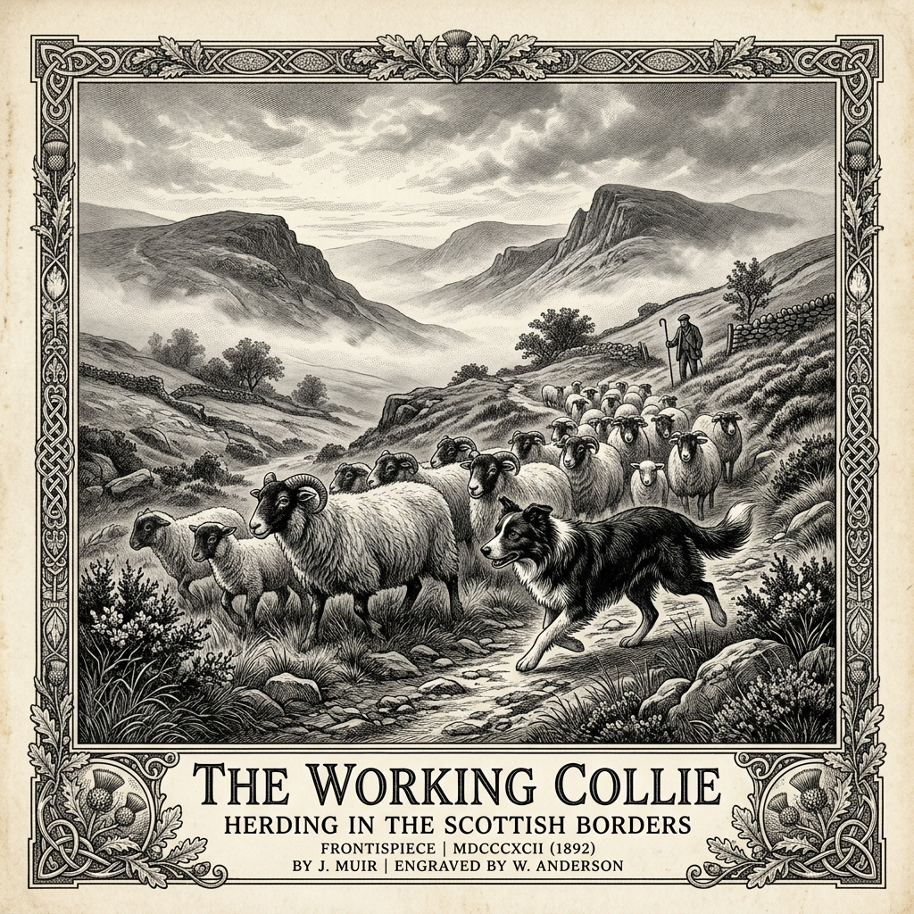
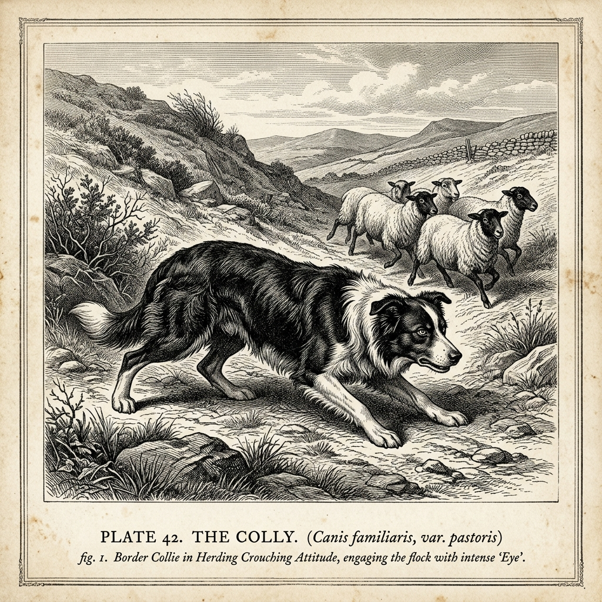
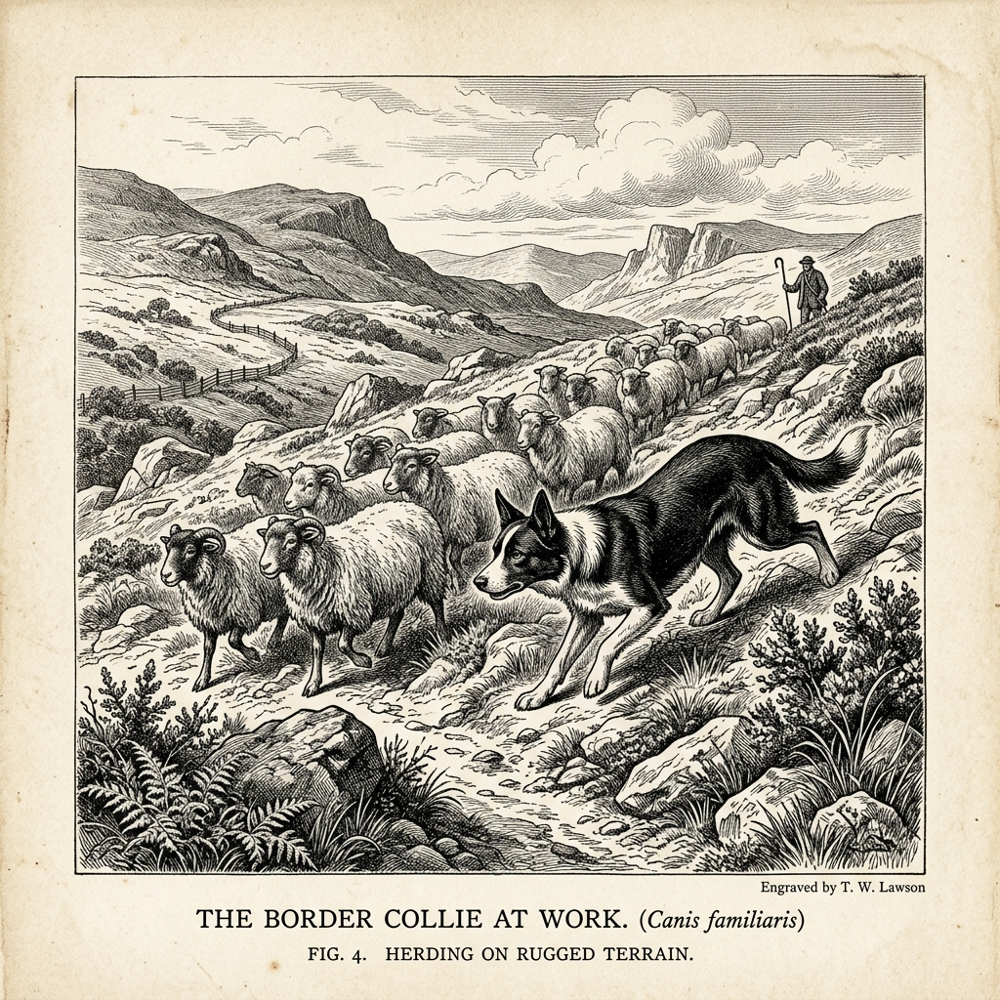
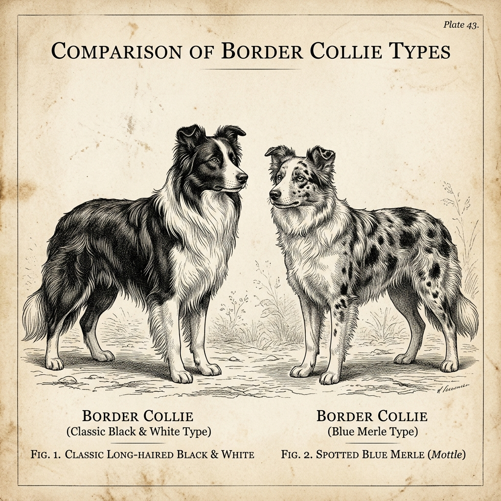
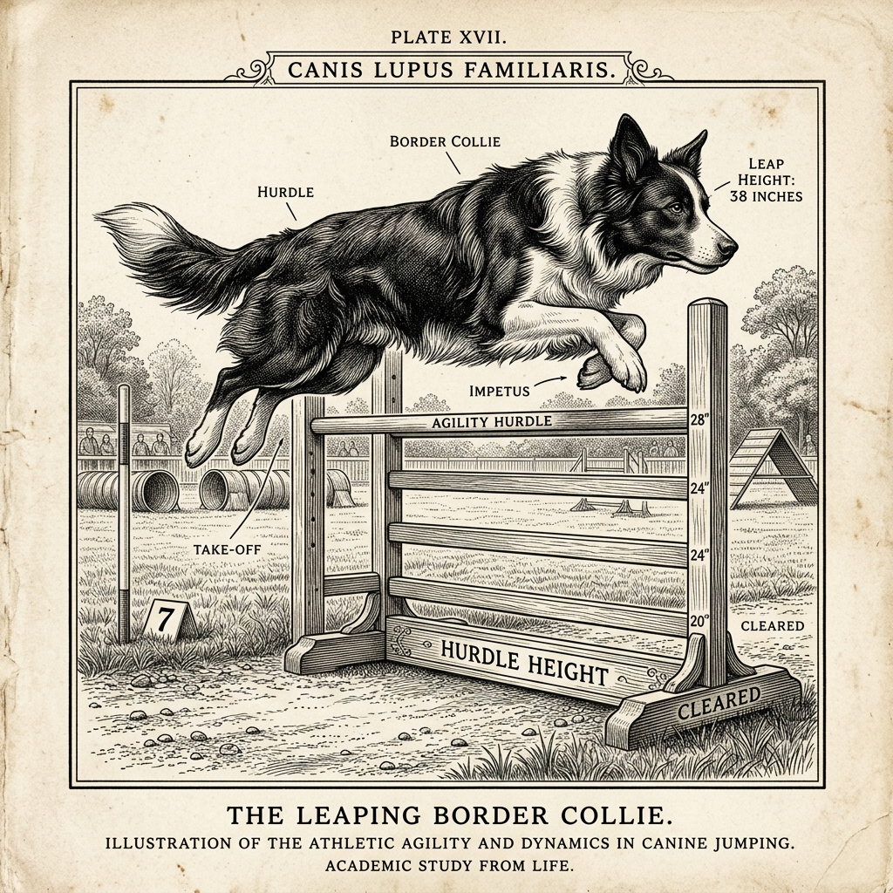

<h1>Wszystko co powinieneś wiedzieć o Border Collie</h1>

Kompleksowe opracowanie historyczno-genetyczne oraz profesjonalny podręcznik pracy z rasą

Monografia Dysertacyjna

Antigravity Research Press

Rok Pański 2026

<h2>Spis Treści</h2>
<ul class="toc-list">
<li class="toc-item">
<a href="#wstp-u-progu-kynologicznego-fenomenu">Wstęp: U progu kynologicznego fenomenu</a>

Tekst główny
</li>
<li class="toc-item">
<a href="#korzenie-staroytne-i-redniowieczne-ewolucja-wczesnobrytyjskich-psw-pasterskich">Rozdział 1: Korzenie starożytne i średniowieczne: Ewolucja wczesnobrytyjskich psów pasterskich</a>

Rozdział 1
</li>
<li class="toc-item">
<a href="#rodowisko-i-klimat-border-country-tygiel-selekcji-uytkowej">Rozdział 2: Środowisko i klimat Border Country: Tygiel selekcji użytkowej</a>

Rozdział 2
</li>
<li class="toc-item">
<a href="#protoplasta-rasy-legendarny-old-hemp-1893-1901">Rozdział 3: Protoplasta rasy: Legendarny Old Hemp (1893-1901)</a>

Rozdział 3
</li>
<li class="toc-item">
<a href="#dziedzictwo-capa-i-kluczowe-linie-genetyczne">Rozdział 4: Dziedzictwo Capa i kluczowe linie genetyczne</a>

Rozdział 4
</li>
<li class="toc-item">
<a href="#ewolucja-prb-pracy-sheepdog-trials-i-powstanie-isds">Rozdział 5: Ewolucja prób pracy (Sheepdog Trials) i powstanie ISDS</a>

Rozdział 5
</li>
<li class="toc-item">
<a href="#james-reid-i-zdefiniowanie-rasy-1915">Rozdział 6: James Reid i zdefiniowanie rasy (1915)</a>

Rozdział 6
</li>
<li class="toc-item">
<a href="#mechanizmy-pracy-pasterskiej-i-kognicja">Rozdział 7: Mechanizmy pracy pasterskiej i kognicja</a>

Rozdział 7
</li>
<li class="toc-item">
<a href="#spr-o-wzorzec-rasy-uytkowo-vs-eksterier">Rozdział 8: Spór o wzorzec rasy: Użytkowość vs. Eksterier</a>

Rozdział 8
</li>
<li class="toc-item">
<a href="#podsumowanie-dziedzictwo-pogranicza-w-xxi-wieku">Podsumowanie: Dziedzictwo pogranicza w XXI wieku</a>

Tekst główny
</li>
<li class="toc-item">
<a href="#cz-ii-wspczesne-odmiany-border-collie---wstp">Część II: Współczesne odmiany Border Collie - Wstęp</a>

Tekst główny
</li>
<li class="toc-item">
<a href="#uytkowe-vs-wystawowe-anatomia-popdy-i-psychika">Rozdział 11: Użytkowe vs. Wystawowe: Anatomia, popędy i psychika</a>

Rozdział 11
</li>
<li class="toc-item">
<a href="#odmiany-szaty-i-umaszczenia-paleta-barw-i-wzorw">Rozdział 12: Odmiany szaty i umaszczenia: Paleta barw i wzorów</a>

Rozdział 12
</li>
<li class="toc-item">
<a href="#genetyka-umaszcze-i-niebezpieczestwo-double-merle">Rozdział 13: Genetyka umaszczeń i niebezpieczeństwo Double Merle</a>

Rozdział 13
</li>
<li class="toc-item">
<a href="#zdrowie-i-predyspozycje-genetyczne-cea-tns-mdr1-i-inne-schorzenia">Rozdział 14: Zdrowie i predyspozycje genetyczne: CEA, TNS, MDR1 i inne schorzenia</a>

Rozdział 14
</li>
<li class="toc-item">
<a href="#podsumowanie-czci-ii-wyzwania-wspczesnej-hodowli">Podsumowanie Części II: Wyzwania współczesnej hodowli</a>

Tekst główny
</li>
<li class="toc-item">
<a href="#cz-iii-metodyka-szkolenia-kynologia-sportowa-i-psychologia-pracy-border-collie">Rozdział 16: Część III: Metodyka szkolenia, kynologia sportowa i psychologia pracy Border Collie</a>

Rozdział 16
</li>
<li class="toc-item">
<a href="#biomechanika-pasienia-i-etologiczne-podstawy-szkolenia-pasterskiego">Rozdział 17: Biomechanika pasienia i etologiczne podstawy szkolenia pasterskiego</a>

Rozdział 17
</li>
<li class="toc-item">
<a href="#praktyczny-program-szkolenia-pasterskiego-border-collie">Rozdział 18: Praktyczny program szkolenia pasterskiego Border Collie</a>

Rozdział 18
</li>
<li class="toc-item">
<a href="#trening-i-metodyka-sportu-agility-u-border-collie">Rozdział 19: Trening i metodyka sportu Agility u Border Collie</a>

Rozdział 19
</li>
<li class="toc-item">
<a href="#precyzja-posuszestwa-sportowego-obedience-i-rally-o">Rozdział 20: Precyzja posłuszeństwa sportowego (Obedience i Rally-O)</a>

Rozdział 20
</li>
<li class="toc-item">
<a href="#dynamika-i-aerodynamika-dogfrisbee-oraz-flyballu">Rozdział 21: Dynamika i aerodynamika dogfrisbee oraz flyballu</a>

Rozdział 21
</li>
<li class="toc-item">
<a href="#stymulacja-kognitywna-uczenie-pojciowe-i-praca-wchowa-nosework">Rozdział 22: Stymulacja kognitywna, uczenie pojęciowe i praca węchowa (Nosework)</a>

Rozdział 22
</li>
<li class="toc-item">
<a href="#zarzdzanie-reaktywnoci-przebodcowaniem-i-zaburzeniami-zachowania-ocd">Rozdział 23: Zarządzanie reaktywnością, przebodźcowaniem i zaburzeniami zachowania (OCD)</a>

Rozdział 23
</li>
<li class="toc-item">
<a href="#budowanie-wyciszenia-off-switch-i-protok-relaksacyjny">Rozdział 24: Budowanie wyciszenia („off-switch”) i protokół relaksacyjny</a>

Rozdział 24
</li>
<li class="toc-item">
<a href="#przygotowanie-fizyczne-propriocepcja-i-profilaktyka-urazw">Rozdział 25: Przygotowanie fizyczne, propriocepcja i profilaktyka urazów</a>

Rozdział 25
</li>
<li class="toc-item">
<a href="#harmonogramy-i-plany-treningowe-modele-tygodniowe">Rozdział 26: Harmonogramy i plany treningowe: Modele tygodniowe</a>

Rozdział 26
</li>
<li class="toc-item">
<a href="#podsumowanie-monografii-trzy-wymiary-border-collie">Podsumowanie monografii: Trzy wymiary Border Collie</a>

Tekst główny
</li>
<li class="toc-item">
<a href="#bibliografia-naukowa-i-historyczna">Bibliografia naukowa i historyczna</a>

Literatura
</li>
</ul>

# Wstęp: U progu kynologicznego fenomenu

B
order Collie stanowi bezprecedensowy fenomen w historii udomowienia psa domowego (*Canis lupus familiaris*). Jako rasa ukształtowana nie przez selekcję estetyczną, lecz przez bezwzględny rygor użytkowy, reprezentuje ona szczytowe osiągnięcie inżynierii behawioralnej i hodowlanej człowieka. Przez stulecia w surowym klimacie pogranicza szkocko-angielskiego wykuwano psa o unikalnej architekturze kognitywnej, zdolnego do samodzielnej pracy w trudnym terenie, wykazującego się niezwykłą plastycznością zachowań oraz rzadką zdolnością do odczytywania najsubtelniejszych sygnałów przewodnika.

Celem niniejszej monografii jest szczegółowe przedstawienie historycznej drogi, jaką przebyła ta rasa - od starożytnych i średniowiecznych landrasów pasterskich, poprzez kluczowy moment narodzin i upowszechnienia linii genetycznej psa Old Hemp, aż po współczesne wyzwania związane z definicją wzorca i próbami pracy. W pracy tej przeanalizowano nie tylko czynniki genetyczne i geograficzne, ale również tło społeczno-gospodarcze brytyjskiego rolnictwa, które wymusiło ewolucję metod zarządzania stadami owiec.

Historia Border Collie to opowieść o koewolucji człowieka, owcy i psa w specyficznej niszy ekologicznej pogranicza. Zrozumienie tej historii pozwala lepiej pojąć naturę inteligencji roboczej psów oraz mechanizmy leżące u podstaw selekcji cech psychicznych.

Poniższy diagram przedstawia kluczowe filary, na których opiera się fenomen rasy:

Genetyka użytkowa

Selekcja oparta wyłącznie na cechach pracy i behawiorze pasterskim.

➔

Presja klimatyczna

Surowe warunki Border Country kształtujące wytrzymałość i odporność.

➔

Architektura kognitywna

Unikalne cechy takie jak "eye" (kontrola wzrokowa) oraz styl czający.

# Rozdział 1: Korzenie starożytne i średniowieczne: Ewolucja wczesnobrytyjskich psów pasterskich

K
orzenie genetyczne współczesnego Border Collie sięgają czasów sprzed formalnej kynologii o ponad dwa tysiąclecia. Brytyjskie wyspy przed podbojem rzymskim zamieszkiwane były przez ludy celtyckie, które prowadziły gospodarkę opartą na pasterstwie. Ich psy były najprawdopodobniej szybkimi, lekkimi psami goniącymi, przystosowanymi do pracy w gęstych lasach i na wyżynach. Dopiero zderzenie kultur w okresie rzymskim oraz późniejsze najazdy wikingów położyły podwaliny pod rozwój specyficznej populacji psów pasterskich w Wielkiej Brytanii.

## Wpływ rzymski i psów stróżujących

W I wieku n.e., wraz z inwazją rzymską pod wodzą cesarza Klaudiusza, na wyspy brytyjskie sprowadzono duże, ciężkie psy pasterskie i stróżujące. Pisarze starożytnego Rzymu, tacy jak Columella w swoim dziele *De Re Rustica* (ok. 65 r. n.e.), opisywali idealnego psa pasterskiego jako dużego, silnego, o białym umaszczeniu (co pozwalało pasterzowi odróżnić go w ciemności od wilka). Psy te były przede wszystkim psami stróżującymi stada (ang. *livestock guardian dogs*), których zadaniem była obrona przed drapieżnikami, a nie precyzyjne sterowanie ruchem owiec.

W miarę jak rzymskie garnizony osiedlały się na wyspach, ich psy krzyżowały się z lokalnymi psami celtyckimi. Połączenie to dało początek rasom o większej masie, które potrafiły kontrolować stada w otwartym terenie, ale wciąż brakowało im zwinności potrzebnej na górzystym pograniczu Szkocji i Anglii.

## Wpływ skandynawski: Najazdy wikingów

Drugim kluczowym czynnikiem kształtującym przodków Collies były najazdy wikingów w VIII-XI wieku. Skandynawscy najeźdźcy i osadnicy sprowadzili ze sobą własne psy pasterskie - mniejsze, zwinne szpice pasterskie, będące przodkami dzisiejszego Islandzkiego Psa Pasterskiego (*Íslenskur fjárhundur*) oraz Norsk Buhund. 

Psy te charakteryzowały się:

- Wyjątkową zwinnością i szybkością reakcji w trudnym, górzystym terenie.
- Metodą pracy opartą na szczekaniu i aktywnym zaganianiu (styl "driving" i "heeling").
- Odpornością na skrajnie niskie temperatury i wilgoć dzięki gęstej, dwuwarstwowej okrywie włosowej.

Krzyżowanie rzymskich, masywnych psów pasterskich z lekkimi, bystrymi szpicami wikingów dało początek populacjom psów, które w średniowieczu zaczęto nazywać "Colleys". Psy te łączyły w sobie siłę i odporność z niebywałą zwinnością i chęcią współpracy z człowiekiem.

## Średniowieczne świadectwa piśmiennicze

Pierwsze wzmianki o psach pasterskich pracujących w stylu przypominającym współczesne psy pasterskie pojawiają się w literaturze angielskiej w XVI wieku. Najważniejszym z nich jest traktat Johna Caiusa *De Canibus Britannicis* (1570), przetłumaczony na język angielski przez Abrahama Fleminga w 1576 roku pod tytułem *Of Englishe Dogges*. Caius opisuje psa pasterskiego (ang. *The Shepherd's Dogge*):

> „Nasz pies pasterski nie jest olbrzymem, lecz psem średniej postury, zwinnym i posłusznym na głos i gwizd pasterza. Na jego sygnał potrafi sprowadzić zbłąkaną owcę, okrążyć stado lub zatrzymać je w miejscu, działając z niezwykłym sprytem i bez używania zbędnej agresji”.

Opis ten dowodzi, że już w XVI wieku w Anglii istniały psy pasterskie pracujące za pomocą precyzyjnych komend dźwiękowych, co stanowiło wyraźny krok naprzód w porównaniu do starożytnych psów stróżujących. Z tej zróżnicowanej genetycznie populacji landrasów, w specyficznym regionie geograficznym, wyłonił się bezpośredni przodek Border Collie.

# Rozdział 2: Środowisko i klimat Border Country: Tygiel selekcji użytkowej

G
eografia pogranicza szkocko-angielskiego, znanego historycznie jako *Border Country* lub *The Borders*, odegrała kluczową rolę w ukształtowaniu anatomii i psychiki Border Collie. Region ten, rozciągający się od wzgórz Cheviot Hills po wyżyny Northumberland, charakteryzuje się surowym, pagórkowatym terenem, kapryśną pogodą oraz dominacją ekstensywnego pasterstwa owiec. W tych specyficznych warunkach pies pasterski przestał być jedynie pomocnikiem, a stał się niezbędnym elementem przetrwania ekonomicznego gospodarstw.

## Rzeźba terenu i warunki klimatyczne

Wzgórza pogranicza to obszary wyżynne, często pokryte wrzosowiskami, torfowiskami oraz stromymi, skalistymi zboczami. Średnie roczne opady są tu wysokie, a mgły i nagłe burze śnieżne stanowią codzienność. Praca w takim terenie wymagała od psa:

- **Wyjątkowej wydolności krążeniowo-oddechowej:** Psy musiały pokonywać dziesiątki kilometrów dziennie na stromych zboczach, często poszukując owiec zasypanych przez śnieg lub ukrytych w głębokich parowach.
- **Odporności na wilgoć i zimno:** Naturalna selekcja promowała psy o dwuwarstwowej okrywie włosowej - z gęstym, wełnistym podszerstkiem i odpornym na warunki atmosferyczne włosem okrywowym.
- **Niezależności decyzyjnej:** Ze względu na ogromne odległości i ukształtowanie terenu, pasterz często nie widział psa ani stada. Pies musiał samodzielnie odnajdywać owce, grupować je i bezpiecznie sprowadzać w doliny bez bezpośredniego nadzoru.

## Czynniki społeczno-gospodarcze: Przemiana agrarna

W XVIII i XIX wieku w Wielkiej Brytanii nastąpił gwałtowny rozwój przemysłu tekstylnego, co drastycznie zwiększyło popyt na wełnę. Wielkie reformy agrarne (tzw. *enclosure acts* - grodzenia pól) doprowadziły do konsolidacji gruntów. Tradycyjne metody wypasu, polegające na pilnowaniu stad na małych obszarach, ustąpiły miejsca wielkoobszarowemu wypasowi na nieogrodzonych wzgórzach.

W tym nowym modelu ekonomicznym pasterz musiał zarządzać stadami liczącymi tysiące owiec rasy *Scottish Blackface* lub *Cheviot* na obszarach liczących setki hektarów. Tradycyjne psy pasterskie pracujące głośno (szczekaniem) nie sprawdzały się - płoszyły one owce na strome zbocza, co prowadziło do strat w inwentarzu. Potrzebny był pies pracujący bezgłośnie, kontrolujący stado samym spojrzeniem i potrafiący poruszać się w sposób, który nie wywoływał paniki u owiec.

## Selekcja zorientowana na wydajność

Na pograniczu nikt nie zwracał uwagi na wygląd psa. Liczyła się wyłącznie jego przydatność do pracy. Pasterze kojarzyli ze sobą zwierzęta, kierując się prostymi, ale bezwzględnymi kryteriami:

- Czy pies potrafi pracować przez cały dzień w deszczu i chłodzie?
- Czy potrafi sprowadzić trudne, dzikie owce z najwyższych partii Cheviot Hills?
- Czy jest posłuszny gwizdkom na odległość kilkuset metrów?
- Czy oszczędza siły owiec, nie zmuszając ich do panicznej ucieczki?

Ta bezwzględna presja selekcyjna, trwająca przez pokolenia w odizolowanych dolinach pogranicza, doprowadziła do skrystalizowania się unikalnej puli genetycznej. Border Country stał się tyglem hodowlanym, z którego wyłonił się pies o nieporównywalnej z żadną inną rasą sprawności pasterskiej.

# Rozdział 3: Protoplasta rasy: Legendarny Old Hemp (1893-1901)

W
 historii niemal każdej rasy psów można wskazać osobnika, którego wpływ genetyczny zdominował całą populację. W przypadku Border Collie psem tym był **Old Hemp** (zarejestrowany w księdze rodowodowej International Sheep Dog Society pod numerem 9). Urodzony we wrześniu 1893 roku w West Woodburn w hrabstwie Northumberland, pies ten zrewolucjonizował styl pracy psów pasterskich i stał się ojcem założycielem współczesnej rasy.

## Rodowód i narodziny geniuszu

Hodowcą Old Hempa był Adam Telfer, doświadczony pasterz i uczestnik pierwszych prób pracy psów pasterskich. Telfer skojarzył ze sobą dwa psy o skrajnie odmiennych charakterach i stylach pracy:

- **Roy:** Był czarnym-podpalanym psem o silnym charakterze, który pracował bardzo głośno (szczekaniem), wykazując małą tendencję do używania wzroku ("little eye"). Był psem dynamicznym, ale jego styl pracy często płoszył bardziej wrażliwe owce.
- **Meg:** Była całkowicie czarną suką o niezwykle silnym instynkcie pasterskim i hipnotyzującym spojrzeniu ("strong eye"). Pracowała w absolutnej ciszy, wykazując wręcz ekstremalną koncentrację na owcach, lecz brakowało jej czasem dynamiki i pewności siebie w trudnych sytuacjach.

Telfer miał nadzieję, że połączenie tych dwóch odmiennych cech da psa zrównoważonego. Rezultat przeszedł jednak jego najśmielsze oczekiwania. Urodzony z tego skojarzenia trójkolorowy pies (czarno-biały z podpalanymi znaczeniami na pyszczku i łapach) od szczenięcia wykazywał niezwykłe uzdolnienia.

## Rewolucja w stylu pracy

Tradycyjne psy pasterskie pod koniec XIX wieku pracowały głośno, często podgryzając owce i zmuszając je do ruchu siłą fizyczną. Old Hemp zapoczątkował zupełnie nową erę. Jego styl pracy charakteryzował się następującymi cechami:

- **Absolutna cisza:** Hemp nigdy nie szczekał podczas pracy z owcami.
- **Wykorzystanie wzroku ("eye"):** Potrafił kontrolować owce samym spojrzeniem, wykazując silną koncentrację, ale bez wpadania w stany hipnotycznego otępienia.
- **Naturalne wyczucie dystansu (flankowanie):** Hemp intuicyjnie poruszał się szerokim łukiem wokół stada, nie wchodząc w strefę ucieczki owiec bez potrzeby, dzięki czemu stado poruszało się spokojnie i płynnie.
- **Niezwykła łagodność i autorytet:** Owce reagowały na jego obecność natychmiast, poddając się jego woli bez paniki. Pasterze wspominali, że owce "szły za nim same", jakby magnetycznie przyciągane.

Adam Telfer opisał talent Hempa słowami, które przeszły do historii kynologii:

> „Błysnął jak meteor na horyzoncie psów pasterskich. Pracował tak cicho i płynnie, że wydawało się, iż owce same wiedzą, gdzie mają iść, a on jedynie im towarzyszy. Był psem o niezwykłej inteligencji i najłagodniejszym usposobieniu, jakiego kiedykolwiek widziałem”.

## Dziedzictwo genetyczne i potomstwo

Old Hemp szybko zyskał sławę wśród pasterzy w Northumberland i Scottish Borders. Jego wyjątkowe zdolności użytkowe sprawiły, że stał się najbardziej pożądanym reproduktorem w regionie. Szacuje się, że w ciągu swojego ośmioletniego życia Hemp spłodził ponad **200 szczeniąt**, z których ogromna część odziedziczyła jego unikalny styl pracy i wybitną inteligencję.

Badania rodowodów przeprowadzone przez International Sheep Dog Society (ISDS) wykazały, że praktycznie każdy żyjący współcześnie Border Collie nosi w sobie krew Old Hempa. Jego linia genetyczna zdominowała rasę, wypierając stare, głośno pracujące landrasy. Old Hemp stał się żywym wzorcem, według którego pasterze zaczęli definiować idealnego psa do pracy z owcami.

<video autoplay loop muted playsinline>
<source src="animations/PedigreeScene_m.mp4" type="video/mp4">
Twój browser nie obsługuje wideo.
</video>

<h4>Cyfrowy suplement: Rodowód Old Hempa</h4>

W wersji cyfrowej opracowania w tym miejscu znajduje się animacja rodowodu psa Old Hemp, przedstawiająca unikalną syntezę cech jego rodziców: głośnego, dynamicznego Roya oraz cichej, silnie wpatrującej się Meg. Wszystkie współczesne linie Border Collie pochodzą bezpośrednio od tego skojarzenia.

Wizualizacja rodowodu i syntezy cech wczesnych linii pasterskich (Old Hemp, 1893).

# Rozdział 4: Dziedzictwo Capa i kluczowe linie genetyczne

O
 ile Old Hemp położył fundamenty pod styl pracy i charakter Border Collie pod koniec XIX wieku, o tyle inny pies ukształtował fizyczny i behawioralny wzorzec współczesnego przedstawiciela rasy w drugiej połowie XX wieku. Był to **Wiston Cap** (ISDS 31154), pies urodzony w 1963 roku, który do dziś pozostaje najbardziej wpływowym reproduktorem w historii rasy, kształtując sylwetkę i umaszczenie, które większość ludzi kojarzy z typowym Border Collie.

## Wiston Cap: Triumfator z 1965 roku

Wiston Cap został wyhodowany przez J. H. Wilsona, a jego przewodnikiem i właścicielem był John Wilson. Cap był psem o wybitnej inteligencji i niezwykle dynamicznym stylu pracy. W wieku zaledwie dwóch lat, w 1965 roku, zdobył prestiżowy tytuł *International Supreme Champion* podczas międzynarodowych prób pracy w Cardiff. 

Styl pracy Capa charakteryzował się:

- **Niezrównaną precyzją:** Potrafił kontrolować owce na ogromnych dystansach z chirurgiczną dokładnością.
- **Niską sylwetką (crouch):** Jego ciało podczas pracy było mocno obniżone, niemal pełzające, co potęgowało wrażenie drapieżnika kontrolującego stado.
- **Wybitnym posłuszeństwem:** Reagował na gwizdki przewodnika w ułamkach sekund, wykazując doskonałą równowagę między własną inicjatywą a komendami człowieka.

## Wpływ na fenotyp rasy

Przed Wiston Capem Border Collies charakteryzowały się ogromnym zróżnicowaniem wyglądu zewnętrznego. Były wśród nich psy czarno-podpalane, trójkolorowe, marmurkowe, o uszach wiszących lub stojących, z długim i krótkim włosem. Cap posiadał bardzo charakterystyczny fenotyp: był czarno-białym psem o szerokiej, białej strzałce na głowie, pełnym białym kołnierzu na szyi, białych skarpetkach i końcówce ogona. Miał lekko stojące uszy z załamanymi końcówkami (tzw. uszy półstojące).

Ze względu na swoje spektakularne sukcesy na zawodach, Cap stał się niezwykle popularnym reproduktorem. Przekazał swoje cechy fizyczne oraz styl pracy tysiącom potomków. To właśnie dzięki niemu klasyczne, czarno-białe umaszczenie z białym kołnierzem stało się dominującym i najbardziej rozpoznawalnym wzorcem rasy na świecie. Szacuje się, że geny Wiston Capa stanowią fundament rodowodów większości współczesnych psów tej rasy.

## Inne kluczowe linie rodowodowe

Oprócz Wiston Capa, historia rasy wyróżnia jeszcze kilka innych psów, które odegrały niebagatelną rolę w konsolidacji cech użytkowych:

- **Tommy (ISDS 16):** Urodzony w tym samym okresie co Old Hemp, znany ze swojej niezwykłej siły charakteru. Wprowadził do rasy odporność psychiczną i zdolność radzenia sobie z agresywnymi baranami.
- **Gilhope Sunny (ISDS 70):** Jeden z pierwszych championów, który skonsolidował cechę szerokiego flankowania (omijania stada szerokim łukiem bez wywierania presji).
- **Craig (ISDS 10515):** Legendarny pies z połowy XX wieku, który wyróżniał się doskonałym instynktem wyszukiwania (ang. *outrun*) i potrafił odnaleźć owce w najbardziej niedostępnych partiach górskich.

Te historyczne linie, skumulowane i utrwalone w rodowodach poprzez rygorystyczną selekcję na próbach pracy, stworzyły psa o niezrównanej wszechstronności i plastyczności kognitywnej. Współczesny Border Collie to genetyczna mozaika tych wybitnych jednostek, z których każda wniosła unikalny element do fenotypu i behawioru rasy.

# Rozdział 5: Ewolucja prób pracy (Sheepdog Trials) i powstanie ISDS

K
luczowym stymulatorem rozwoju rasy i przejścia od lokalnych psów wiejskich do jednolitej rasy użytkowej było powstanie i ewolucja prób pracy psów pasterskich (ang. *Sheepdog Trials*). Te publiczne zawody nie tylko dostarczały rozrywki, ale przede wszystkim stały się platformą selekcyjną, na której hodowcy mogli obiektywnie porównać umiejętności użytkowe psów z różnych regionów. To właśnie na próbach pracy zrodził się nowoczesny sport pasterski i narodziła się potrzeba sformalizowania rejestru psów.

## Pierwsze próby pracy: Bala 1873

Pierwsze udokumentowane zawody psów pasterskich odbyły się 9 października 1873 roku w Bala w Walii. Inicjatorem wydarzenia był Sewallis Evelyn Shirley, zamożny właściciel ziemski i założyciel Kennel Clubu. W zawodach wzięło udział dziesięć psów, a ich zadaniem było przeprowadzenie małej grupy owiec przez wyznaczony tor przeszkód.

Zwycięzcą pierwszych prób został Szkot James Thompson pracujący z psem o imieniu **Tweed**. Tweed zademonstrował styl pracy, który wprawił w zdumienie walijską publiczność: pracował cicho, precyzyjnie reagował na najcichsze komendy głosowe i potrafił kontrolować owce bez fizycznego kontaktu. Sukces Thompsona i Tweeda udowodnił, że psy z pogranicza szkocko-angielskiego prezentują zupełnie nową jakość pracy pasterskiej.

Kolejne zawody odbyły się w 1874 roku w Hawick w Szkocji i szybko zyskały ogromną popularność. Próby te pokazały, jak ważne dla rolnictwa jest posiadanie wybitnego psa pasterskiego - pies potrafiący wykonać pracę kilku pasterzy w krótszym czasie stał się towarem luksusowym i pożądanym.

## Założenie International Sheep Dog Society (ISDS)

Wraz ze wzrostem popularności zawodów i handlu psami pasterskimi, pojawiła się potrzeba stworzenia organizacji dbającej o czystość linii użytkowych. 15 czerwca 1906 roku w Cardiff, podczas spotkania wpływowych pasterzy i hodowców z Anglii, Szkocji i Walii, powołano do życia **International Sheep Dog Society (ISDS)**.

Głównymi celami statutowymi ISDS były:

- Promowanie i doskonalenie umiejętności psów pasterskich w celu ułatwienia pracy rolnikom.
- Prowadzenie oficjalnej księgi rodowodowej (ang. *ISDS Stud Book*), w której rejestrowano wyłącznie psy na podstawie ich wykazanych zdolności użytkowych, a nie wyglądu.
- Organizowanie corocznych Międzynarodowych Prób Pracy (ang. *International Supreme Championship*), wyłaniających najlepszego psa pasterskiego roku.

Pierwszy tom księgi rodowodowej ISDS został opublikowany w 1913 roku. Rejestrowano w nim psy, które pomyślnie przeszły weryfikację na oficjalnych próbach pracy. Old Hemp został pośmiertnie wpisany do księgi z numerem 9, co oficjalnie potwierdziło jego status jako założyciela rasy.

## Struktura prób pracy jako kryterium hodowlane

Próby pracy organizowane przez ISDS zostały zaprojektowane tak, aby odzwierciedlać realne sytuacje z pracy pasterza na wrzosowiskach. Klasyczny tor przeszkód składa się z następujących faz:

1. **Outrun (Wybieg):** Pies wysyłany jest szerokim łukiem na odległość kilkuset metrów, aby zajść owce z tyłu bez płoszenia ich.
2. **Lift (Podjęcie):** Moment pierwszego kontaktu wzrokowego psa z owcami, w którym pies musi delikatnie poruszyć stado w kierunku przewodnika.
3. **Fetch (Przygnanie):** Przeprowadzenie owiec przez bramki w kierunku przewodnika stojącego na stanowisku.
4. **Drive (Odgnanie):** Przeprowadzenie owiec przez tor przeszkód z dala od przewodnika pod kątem komend kierunkowych.
5. **Shed (Rozdzielenie):** Oddzielenie wyznaczonych owiec od stada, co wymaga od psa precyzji i skupienia.
6. **Pen (Zagroda):** Wprowadzenie owiec do ciasnej zagrody, sprawdzające cierpliwość i siłę obecności psa.
7. **Single (Wydzielenie pojedynczej owcy):** Zaawansowany element, w którym pies musi kontrolować jedną owcę odłączoną od grupy.

Dzięki tak wymagającym próbom pracy, ISDS stworzyło najostrzejszy filtr selekcyjny w historii hodowli psów. Zwierzęta, które nie radziły sobie z presją owiec, nie były dopuszczane do rozrodu, co zagwarantowało przetrwanie i udoskonalenie cech psychicznych rasy przez kolejne dziesięciolecia.

# Rozdział 6: James Reid i zdefiniowanie rasy (1915)

M
imo że psy z pogranicza szkocko-angielskiego pracowały według wspólnego wzorca użytkowego już od końca XIX wieku, przez długi czas nie posiadały jednej, oficjalnej nazwy. Nazywano je "szarymi psami", "psami roboczymi", "collies z pogranicza" lub po prostu "psami pasterskimi". Sytuacja ta zmieniła się dramatycznie w 1915 roku dzięki Jamesowi Reidowi, sekretarzowi International Sheep Dog Society, który jako pierwszy oficjalnie wprowadził termin **Border Collie**.

## James Reid: Architekt odrębności rasy

James Reid objął funkcję sekretarza ISDS w okresie intensywnego rozwoju kynologii wystawowej w Wielkiej Brytanii. Zauważył on, że Kennel Club (główna brytyjska organizacja kynologiczna) zaczął rejestrować i promować Collies ( Rough i Smooth Collie) jako psy wystawowe. Selekcja wystawowa koncentrowała się na cechach eksterieru:

- Wydłużonej, wąskiej głowie o płaskiej czaszce.
- Bardzo gęstej, obfitej okrywie włosowej, utrudniającej ruch w trudnym terenie.
- Drobnej budowie ciała, nieprzystosowanej do ciężkiej pracy fizycznej.

Reid dostrzegł ogromne zagrożenie dla psów użytkowych. Rozumiał, że jeśli psy pasterskie z pogranicza zostaną wchłonięte przez wystawowy wzorzec Kennel Clubu, ich unikalne cechy psychiczne, inteligencja i styl pracy szybko zanikną pod presją mody wystawowej.

W 1915 roku, rejestrując psy w oficjalnej księdze rodowodowej ISDS, Reid po raz pierwszy użył nazwy **Border Collie** (gdzie *Border* odnosiło się bezpośrednio do regionu ich pochodzenia - Border Country, a *Collie* było tradycyjnym szkockim określeniem psa pasterskiego). Nazwa ta miała jasny cel polityczny i hodowlany: zadeklarować światu kynologicznemu, że pies ten stanowi odrębną, niezależną rasę, której głównym i jedynym kryterium oceny jest przydatność do pracy.

## Odrębność od Show Collies (Rough i Smooth)

Wprowadzenie nazwy Border Collie zapoczątkowało trwający do dziś rozdział między psami pracującymi a wystawowymi. Reid i hodowcy zrzeszeni w ISDS stworzyli własną filozofię hodowlaną, opartą na następujących postulatach:

- **Brak standardu estetycznego:** Rasa nie może posiadać sztywnego wzorca wyglądu (np. określonego wzrostu, koloru oczu czy kształtu uszu). Każdy pies, który pracuje wybitnie, jest dobrym Border Collie, niezależnie od tego, jak wygląda.
- **Krytyka selekcji eksterieru:** Hodowcy ISDS uważali selekcję wystawową za szkodliwą dla zdrowia psychicznego i fizycznego psów. Twierdzili, że ocena psa w ringu wystawowym prowadzi do degeneracji jego naturalnych instynktów.
- **Autonomia rejestru:** ISDS konsekwentnie odmawiało współpracy z Kennel Clubem w zakresie przekazania swojej księgi rodowodowej, dbając o to, by rejestr psów pozostał w rękach pasterzy i praktyków.

Decyzja Jamesa Reida o nazwaniu i odseparowaniu Border Collie uratowała rasę przed losem wielu innych psów pasterskich, które po uznaniu przez organizacje wystawowe utraciły swoje naturalne zdolności użytkowe. Przez kolejne pół wieku Border Collie rozwijał się w izolacji od kynologii salonowej, szlifując swoje legendarne cechy na pastwiskach i próbach pracy.

# Rozdział 7: Mechanizmy pracy pasterskiej i kognicja

B
iologia i psychologia behawioralna Border Collie stanowią przedmiot intensywnych badań naukowych z zakresu kognitywistyki zwierzęcej. Rasa ta wykazuje nie tylko najwyższy iloraz inteligencji użytkowej wśród psów domowych, ale także unikalną modyfikację łańcucha łowieckiego oraz specyficzną mechanikę ruchu, która pozwala jej na precyzyjne kontrolowanie innych gatunków bez użycia przemocy. Kluczem do zrozumienia tego fenomenu jest analiza mechanizmów neurobehawioralnych.

## Modyfikacja łańcucha łowieckiego

U dzikich kanidów (np. wilków) pełny łańcuch łowiecki składa się z następujących sekwencji:

$$\text{Namierzenie} \rightarrow \text{Wpatrywanie się (Eye)} \rightarrow \text{Podchód (Stalk)} \rightarrow \text{Pogoń} \rightarrow \text{Chwycenie} \rightarrow \text{Zabicie} \rightarrow \text{Rozszarpanie / Konsumpcja}$$

U Border Collie, w wyniku wielowiekowej sztucznej selekcji, łańcuch ten został głęboko zmodyfikowany i zatrzymany na wczesnych etapach. Sekwencja behawioralna tej rasy wygląda następująco:

- **Ekstremalne wzmocnienie fazy wpatrywania się (*Eye*) i podchodu (*Stalk*):** Te dwa elementy stały się dominującym zachowaniem psa w obecności owiec.
- **Całkowite wygaszenie (inhibicja) faz chwycenia, zabicia i konsumpcji:** Pies kierowany instynktem pasterskim nie dąży do zranienia owcy. Zamiast tego traktuje ją jako obiekt do kontrolowania i przemieszczania. Owca dla Border Collie staje się bodźcem wyzwalającym zachowania podchodu i gromadzenia.

<video autoplay loop muted playsinline>
<source src="animations/PredatorySequenceScene_m.mp4" type="video/mp4">
Twój browser nie obsługuje wideo.
</video>

<h4>Cyfrowy suplement: Modyfikacja łańcucha łowieckiego</h4>

W wersji cyfrowej opracowania w tym miejscu znajduje się animacja ilustrująca różnice w łańcuchu łowieckim między dzikim wilkiem a użytkującym Border Collie. Wskazuje ona na zablokowanie sekwencji pogoni, chwycenia oraz zabicia na rzecz wzmocnienia namierzenia, oka oraz podchodu owiec.

Wizualizacja modyfikacji sekwencji łowieckiej i behawioralnej u ras pasterskich.

## Mechanika "oka" (*Eye*) i postawy czającej (*Crouch*)

Najbardziej uderzającą cechą Border Collie jest jego charakterystyczna sylwetka podczas pracy. Pies obniża środek ciężkości, ugina łapy, unika kontaktu bezpośredniego i wpatruje się w owce w sposób niemal hipnotyczny. Behawioralnie zachowanie to opiera się na dwóch mechanizmach:

- **The Eye (Oko):** Jest to zdolność psa do wywierania presji psychicznej na owce za pomocą intensywnego wzroku. Pies nie szczeka ani nie podbiega agresywnie; zamiast tego „blokuje” ruch owiec samym spojrzeniem. Silne oko pozwala psu kontrolować stada na odległość, wyczuwając najmniejszą intencję owcy do ucieczki.
- **Crouch (Czajenie się):** Obniżenie sylwetki imituje postawę drapieżnika szykującego się do skoku. Owce, jako zwierzęta uciekające, instynktownie reagują na tę sylwetkę respektem i skupieniem, grupując się w zwartą gromadę. Border Collie wykorzystuje ten pierwotny lęk do sterowania ruchem stada.

Rycina przedstawiająca Border Collie w charakterystycznej czającej się postawie z silnym "okiem".

## Inteligencja robocza i badania kognitywne

Border Collie jest powszechnie uznawany za najinteligentniejszą rasę psów pod względem inteligencji roboczej i posłuszeństwa (sklasyfikowany na 1. miejscu w słynnym rankingu Stanleya Corena). Badania naukowe potwierdzają ich wyjątkową zdolność do uczenia się słów i pojęć abstrakcyjnych.

Najbardziej znanym przykładem była suka **Chaser** wyhodowana i badana przez dr. Johna W. Pilley'a. Chaser przeszła do historii jako pies o największym udokumentowanym słowniku:

- Potrafiła zidentyfikować i przynieść **1022 różne zabawki** na podstawie ich unikalnych nazw.
- Wykazywała zdolność do wnioskowania przez eliminację (rozumiała, że nowo usłyszane słowo odnosi się do nowej, nieznanej jej dotąd zabawki leżącej wśród znanych przedmiotów).
- Rozumiała podstawową gramatykę języka ludzkiego (odróżniała komendę „przynieś zabawkę A do zabawki B” od „przynieś zabawkę B do zabawki A”).

Ta elastyczność poznawcza, połączona z niezwykłą potrzebą współpracy z człowiekiem (ang. *will to please*), sprawia, że Border Collie wymaga nie tylko stymulacji fizycznej, ale przede wszystkim intensywnej pracy umysłowej. W przypadku braku odpowiednich zadań, ich silne instynkty mogą ulec wypaczeniu, prowadząc do zachowań obsesyjno-kompulsywnych (np. zaganiania samochodów, dzieci czy cieni).

# Rozdział 8: Spór o wzorzec rasy: Użytkowość vs. Eksterier

W
 historii kynologii niewiele tematów wywołuje tak silne emocje i głębokie podziały jak konflikt wokół definicji wzorca Border Collie. Przez dziesięciolecia rasa rozwijała się wyłącznie pod skrzydłami International Sheep Dog Society (ISDS), które stawiało na pierwszym miejscu cechy użytkowe. Sytuacja uległa zmianie w drugiej połowie XX wieku, kiedy to tradycyjne stowarzyszenia kynologiczne, na czele z brytyjskim Kennel Clubem, postanowiły oficjalnie zarejestrować rasę i wprowadzić ją na ringi wystawowe.

## Uznanie rasy przez Kennel Club (1976)

W 1976 roku, po latach nacisków ze strony części właścicieli pragnących pokazywać swoje psy na wystawach piękności, brytyjski Kennel Club oficjalnie uznał Border Collie za pełnoprawną rasę. Wydarzenie to wywołało falę protestów w środowisku pasterzy i hodowców zrzeszonych w ISDS. Obawiano się, że wprowadzenie sztywnego standardu wyglądu zewnętrznego (eksterieru) doprowadzi do nieuchronnego upadku inteligencji użytkowej i zdrowia rasy.

Główne punkty sporne dotyczyły kryteriów hodowlanych:

- **ISDS (Stanowisko purystów użytkowych):** Uważano, że jedynym kryterium dopuszczenia psa do hodowli powinny być jego wykazane umiejętności na próbach pracy z owcami. Wygląd psa (uszy, umaszczenie, wzrost) jest całkowicie nieistotny.
- **Kennel Club (Stanowisko wystawowe):** Wprowadzono szczegółowy pisany standard rasy (ang. *breed standard*), opisujący idealne proporcje ciała, kątowanie kończyn, kształt głowy i umaszczenie. Psy na wystawach oceniane były wyłącznie na podstawie wyglądu i ruchu w kłusie na ringu, bez jakiejkolwiek weryfikacji instynktu pasterskiego.

## Podział na dwie linie: Show i Working

Konflikt ten doprowadził do trwałego rozłamu w rasie, w wyniku którego współcześnie mamy do czynienia z dwoma zupełnie odmiennymi typami Border Collie, które różnią się zarówno wyglądem, jak i charakterem:

### Typ użytkowy (Working Line - ISDS)
Psy te są hodowane wyłącznie z myślą o pracy. Charakteryzują się lżejszą budową ciała, mniejszą ilością okrywy włosowej (często mają włos krótki lub średni, co ułatwia pielęgnację) oraz ogromnym zróżnicowaniem wyglądu. Uszy mogą być stojące, półstojące lub całkowicie wiszące. Cechuje je ekstremalny popęd pracy (ang. *work drive*), wysoki poziom reaktywności i intensywne spojrzenie ("oko").

### Typ wystawowy (Show Line - KC/FCI)
Psy te są hodowane pod kątem sukcesów na wystawach piękności. Charakteryzują się mocniejszą, bardziej krępą kośćcem, obfitą, puszystą szatą oraz bardziej zaokrąglonymi proporcjami głowy. Ich uszy są niemal zawsze idealnie półstojące, zgodnie ze standardem FCI. Pod względem charakteru są zazwyczaj spokojniejsze, mają niższy próg reaktywności i mniejszy popęd pasterski, co czyni je łatwiejszymi psami do towarzystwa, ale często nieprzydatnymi do profesjonalnej pracy przy dużych stadach.

## Walka o zachowanie dziedzictwa

W Stanach Zjednoczonych spór ten przybrał jeszcze ostrzejszy obrót pod koniec XX wieku. Kiedy American Kennel Club (AKC) uznał Border Collie w 1995 roku, organizacje zrzeszające pasterzy (takie jak *American Border Collie Association* - ABCA) złożyły pozew sądowy, próbując zablokować rejestrację. Choć proces zakończył się niepowodzeniem, ABCA wprowadziła rygorystyczne przepisy: każdy pies zarejestrowany w AKC, który bierze udział w wystawach piękności, traci prawo do rejestracji w ABCA.

Ten radykalny krok miał na celu ochronę puli genetycznej psów pracujących przed wpływem psów hodowanych wyłącznie dla urody. Podział ten pokazuje, jak trudne jest zachowanie unikalnych cech psychicznych rasy w świecie, w którym kynologia użytkowa ustępuje miejsca kynologii estetycznej.

# Podsumowanie: Dziedzictwo pogranicza w XXI wieku

B
order Collie przebył długą i fascynującą drogę ewolucyjną - od bezimiennych psów pasterskich celtyckich i rzymskich klanów, poprzez genetyczną unifikację zapoczątkowaną przez Old Hempa w XIX wieku, aż po status globalnego fenomenu kynologicznego. Rasa ta stanowi namacalny dowód na to, jak rygorystyczna selekcja zorientowana wyłącznie na cechy użytkowe potrafi ukształtować zwierzę o niebywałej sprawności fizycznej i zaawansowanych zdolnościach kognitywnych.

W XXI wieku rola Border Collie uległa znacznemu poszerzeniu. Choć wciąż pozostają niezastąpionymi pomocnikami na farmach w Wielkiej Brytanii, Nowej Zelandii, Australii i obu Amerykach, z powodzeniem opanowały również inne sfery aktywności ludzkiej:

- **Psie sporty:** Zdominowały dyscypliny takie jak agility, frisbee (discdogging), obedience czy flyball. Ich szybkość, zwinność i chęć współpracy z człowiekiem czynią je bezkonkurencyjnymi na arenach sportowych.
- **Służby ratownicze i detekcja:** Pracują jako psy poszukiwawczo-ratownicze (SAR) w gruzowiskach i lawiniskach oraz jako psy do detekcji substancji zapachowych, gdzie ich wytrzymałość i skupienie są kluczem do sukcesu.
- **Badania nad kognicją:** Służą jako model badawczy w laboratoriach na całym świecie (takich jak Family Dog Project w Budapeszcie), pomagając naukowcom zrozumieć mechanizmy uczenia się języka, komunikacji międzygatunkowej oraz ewolucji inteligencji społecznej.

Jednak ten spektakularny sukces niesie za sobą poważne wyzwania. Globalna popularność rasy sprawia, że coraz więcej psów trafia do rąk osób nieprzygotowanych na specyficzne wymagania Border Collie. Bez odpowiedniej stymulacji umysłowej i pracy pasterskiej lub sportowej, te wysoce reaktywne psy mogą wykazywać poważne problemy behawioralne. 

Zadaniem współczesnych hodowców i miłośników rasy jest dbanie o to, aby w pogoni za sukcesami wystawowymi czy popularnością medialną nie zatracić tego, co najważniejsze - unikalnego umysłu Border Collie, który rodził się w chłodnych mgłach i na wymagających wzgórzach Border Country. Prawdziwe dziedzictwo tej rasy leży nie w wyglądzie zewnętrznym, ale w jej niebywałej inteligencji i pasji do pracy z człowiekiem.

# Część II: Współczesne odmiany Border Collie - Wstęp

W
spółczesna populacja Border Collie charakteryzuje się niezwykłym bogactwem fenotypowym oraz wyraźną polaryzacją kierunków hodowlanych. Choć rasa ta ma wspólnego przodka w postaci Old Hempa, to w ciągu XX i XXI wieku uległa ona głębokiemu zróżnicowaniu pod wpływem zróżnicowanych oczekiwań hodowców, właścicieli oraz organizacji kynologicznych. Część II monografii poświęcona jest analizie tego, jak Border Collie wygląda i funkcjonuje w dzisiejszym świecie, ze szczególnym uwzględnieniem podziałów użytkowych, bogactwa szaty i umaszczenia, genetyki barw oraz współczesnych wyzwań zdrowotnych.

Główne obszary zróżnicowania współczesnego Border Collie można podzielić na trzy obszary:

- **Dywersyfikacja użytkowa:** Rozłam między liniami pracującymi a psami selekcjonowanymi pod kątem sukcesów na wystawach piękności (eksterier).
- **Zróżnicowanie morfologiczne:** Szeroka gama umaszczeń (od klasycznego czarno-białego do marmurkowatości) oraz typów okrywy włosowej (rough i smooth).
- **Zdrowie i profilaktyka:** Rozwój badań DNA pozwalający na wykrywanie i eliminację groźnych chorób dziedzicznych obciążających rasę.

Zrozumienie tych mechanizmów jest kluczowe dla każdego, kto pragnie świadomie hodować lub pracować z tą wyjątkową rasą psów. W kolejnych rozdziałach przyjrzymy się szczegółowo każdemu z tych aspektów.

# Rozdział 11: Użytkowe vs. Wystawowe: Anatomia, popędy i psychika

R
ozdział między psami z linii użytkowych (*working lines*) a psami z linii wystawowych (*show lines*) jest najbardziej widoczną cechą współczesnej populacji Border Collie. Choć oficjalnie stanowią one jedną rasę według standardów takich organizacji jak FCI czy AKC, w rzeczywistości reprezentują one dwie odmienne filozofie hodowlane, co bezpośrednio przekłada się na ich anatomię, zachowanie i psychikę.

## Różnice anatomiczne i budowa ciała

Selekcja pod kątem sukcesów na wystawach piękności oraz precyzyjnych kryteriów estetycznych ukształtowała psa o odmiennej mechanice ruchu niż pies pracujący przy stadach:

- **Show Line (Eksterier):** Psy te charakteryzują się zwartą, mocną, bardziej krępą kośćcem. Ich głowy są szersze, z wyraźniej zaznaczonym stopem. Klatka piersiowa jest głęboka i szeroka, co w ringu daje wrażenie stabilności. Szata jest niezwykle obfita, długa, z bogatym podszerstkiem i imponującą kryzą. Ruch w ringu musi być płynny, z długim wykrokiem w kłusie.
- **Working Line (Użytki):** Budowa ciała tych psów jest zoptymalizowana pod kątem prędkości, zwinności i wytrzymałości. Są one lżejsze, bardziej smukłe, z dłuższymi kończynami. Ich głowy są węższe, z łagodniejszym stopem. Okrywa włosowa jest zazwyczaj znacznie krótsza i mniej obfita, co minimalizuje przyczepianie się rzepów i błota podczas pracy w terenie. Ich ruch nie musi być efektownym kłusem; zamiast tego wykazują niesamowity instynktowny galop i umiejętność błyskawicznych zwrotów.

## Różnice behawioralne i popędy

Najgłębsze różnice leżą jednak w sferze psychicznej i neurobehawioralnej. Border Collie użytkowy i wystawowy reagują na bodźce w zupełnie inny sposób:

- **Work Drive (Popęd pracy):** U psów użytkowych popęd pasterski jest na skrajnie wysokim poziomie. Psy te potrzebują ciągłego ukierunkowania swojej energii na zadanie. Wykazują silną potrzebę kontrolowania ruchu (zaganiania). U psów wystawowych popęd ten został celowo stłumiony, aby uczynić je łatwiejszymi psami domowymi. Wystawowy Border Collie często nie wykazuje instynktu pasterskiego w obecności owiec lub jest on szczątkowy.
- **Reaktywność i próg pobudzenia:** Psy użytkowe mają niezwykle niski próg pobudzenia - reagują ułamkiem sekundy na najdrobniejszy ruch owcy czy gest pasterza. Są wysoce wrażliwe na bodźce dźwiękowe i wzrokowe. Psy wystawowe charakteryzują się wyższym progiem reaktywności, są bardziej zrównoważone, mniej lękliwe w tłumie i łatwiej przystosowują się do miejskiego zgiełku.
- **Eye (Oko) i Crouch (Czajenie):** Typowy pracujący Border Collie porusza się w sposób czający, z mocno obniżonym tyłem i skupionym spojrzeniem. Psy wystawowe w ringu poruszają się z wysoko podniesioną głową i dumną postawą, co uniemożliwia im efektywną pracę z trudnymi owcami, ale prezentuje się elegancko na ringu wystawowym.

Poniższa tabela przedstawia porównanie cech w syntetycznej formie:

<table class="academic-table">
<thead>
<tr>
<th>Cecha</th>
<th>Linia Użytkowa (Working Line)</th>
<th>Linia Wystawowa (Show Line)</th>
</tr>
</thead>
<tbody>
<tr>
<td><strong>Budowa ciała</strong></td>
<td>Lekka, zwinna, wydłużona, o długich łapach</td>
<td>Mocna, zwarta, z głęboką klatką piersiową</td>
</tr>
<tr>
<td><strong>Szata i podszerstek</strong></td>
<td>Krótka/średnia, rzadka, łatwa w pielęgnacji</td>
<td>Długa, obfita, puszysta, z bogatym kołnierzem</td>
</tr>
<tr>
<td><strong>Reaktywność</strong></td>
<td>Bardzo wysoka, błyskawiczne reakcje na bodźce</td>
<td>Umiarkowana, bardziej stabilna psychicznie</td>
</tr>
<tr>
<td><strong>Instynkt pasterski</strong></td>
<td>Ekstremalnie silny, trudny do kontrolowania bez pracy</td>
<td>Umiarkowany lub słaby, łatwiejszy do wyciszenia</td>
</tr>
<tr>
<td><strong>Rejestr</strong></td>
<td>Głównie ISDS (International Sheep Dog Society)</td>
<td>FCI, AKC (Kluby kynologiczne eksterieru)</td>
</tr>
</tbody>
</table>

Rozdźwięk ten rodzi pytania o przyszłość rasy. Hodowcy użytkowi ostrzegają, że selekcja wystawowa niszczy dziedzictwo Old Hempa, zamieniając najinteligentniejszego psa pracującego świata w kolejną ozdobną zabawkę wystawową.

# Rozdział 12: Odmiany szaty i umaszczenia: Paleta barw i wzorów

B
order Collie jest jedną z najbardziej zróżnicowanych fenotypowo ras pod względem umaszczenia i struktury szaty. Choć klasyczny wizerunek czarno-białego psa z białym kołnierzem dominuje w świadomości społecznej, standardy rasy akceptują niemal wszystkie kolory i wzory, o ile biały kolor nie przeważa w umaszczeniu. To bogactwo jest efektem zachowania szerokiej puli genetycznej przez pasterzy, dla których kolor psa był cechą całkowicie drugorzędną.

## Typy okrywy włosowej: Rough vs. Smooth

Zgodnie z klasyfikacją kynologiczną, Border Collie występują w dwóch odmianach okrywy włosowej:

- **Rough (Długowłosy / półdługowłosy):** Jest to odmiana najbardziej powszechna. Włos okrywowy jest gęsty, o średniej twardości, podszerstek jest miękki i wełnisty. U psów tej odmiany tworzy się charakterystyczna grzywa na szyi, "portki" na udach oraz obfite pióro na ogonie.
- **Smooth (Krótkowłosy):** Włos na całym ciele jest krótki, przylegający i gęsty. Podszerstek jest równie gęsty jak u odmiany długowłosej, co zapewnia psu pełną ochronę przed wilgocią i chłodem. Odmiana ta jest niezwykle popularna wśród pasterzy pracujących (Working Lines) ze względu na łatwość utrzymania - do krótkiej sierści nie przyczepiają się nasiona roślin i gałęzie.

Rycina przedstawiająca krótkowłosą odmianę (smooth coat) Border Collie podczas pracy na zboczu wzgórza.

## Podstawowe umaszczenia

Paleta barw Border Collie opiera się na kombinacjach pigmentów eumelaniny (czarny/brązowy) oraz feomelaniny (czerwony/żółty):

- **Czarno-białe (Black and White):** Klasyczne, najczęściej spotykane umaszczenie.
- **Tricolor (Trójkolorowe):** Czarno-białe z wyraźnymi podpalanymi (rudymi) znaczeniami nad oczami, na policzkach oraz na łapach.
- **Czekoladowe (Chocolate / Brown):** Głęboki brąz z białymi znaczeniami. Nos i brzegi powiek są brązowe, a oczy często mają jasnobursztynowy odcień.
- **Niebieskie (Blue):** Rozjaśniony czarny dający odcień stalowoszary lub łupkowy. Nos i oczy są dopasowane do koloru sierści.
- **Lilac (Liliowe):** Rzadkie, luksusowe umaszczenie będące wynikiem jednoczesnego rozjaśnienia i czekoladowego koloru podstawowego. Daje to unikalny odcień ciepłego, beżowo-szarego z różowym połyskiem.
- **Red (Saddleback / Australijski Czerwony / ee-Red):** Jasnożółty, piaskowy lub rudy kolor (feomelanina), w którym pigment czarny jest całkowicie zablokowany. Pies ma czarny lub brązowy nos i jasne oczy.

## Wzory marmurkowe (Merle)

Umaszczenie marmurkowe to nie osobny kolor, lecz wzór powstały w wyniku działania genu Merle, który częściowo rozjaśnia podstawowy pigment:

- **Blue Merle (Niebieski marmurkowy):** Podstawowy kolor czarny zostaje rozjaśniony do srebrzysto-niebieskich plam na czarnym tle. Często występują niebieskie oczy (całkowicie lub częściowo).
- **Red Merle (Czekoladowy marmurkowy):** Rozjaśnienie pigmentu czekoladowego dające plamy o barwie mlecznej czekolady i beżu na jasnobrązowym tle.

Bogactwo to sprawia, że każdy Border Collie jest unikalny pod względem wyglądu, co stanowi miłą odmianę od wielu mocno ujednoliconych ras wystawowych.

Rycina przedstawiająca porównanie odmiany długowłosej czarno-białej (po lewej) oraz odmiany marmurkowej blue merle (po prawej).

# Rozdział 13: Genetyka umaszczeń i niebezpieczeństwo Double Merle

Z
łożoność genetyczna umaszczeń Border Collie to klasyczny przykład interakcji różnych loci genowych dziedziczonych zgodnie z prawami Mendla. Choć różnorodność ta zachwyca miłośników rasy, wiąże się z nią jedno z najpoważniejszych zagrożeń zdrowotnych w kynologii - syndrom Double Merle. Odpowiedzialne planowanie skojarzeń wymaga od hodowcy głębokiej wiedzy z zakresu genetyki molekularnej.

## Główne loci genów umaszczenia

Umaszczenie Border Collie kontrolowane jest przez kilka kluczowych genów:

- **Locus B (Brown):** Odpowiada za syntezę pigmentu czarnego (dominujący allel `B`) lub brązowego/czekoladowego (recesywny allel `b`). Aby pies był czekoladowy, musi odziedziczyć zestaw `bb`.
- **Locus D (Dilution):** Odpowiada za gęstość upakowania pigmentu. Dominujący allel `D` daje pełny kolor, natomiast recesywny `d` powoduje rozjaśnienie. Pies o genotype `dd` i umaszczeniu czarnym staje się niebieski (Blue), a czekoladowy `bb dd` staje się liliowy (Lilac).
- **Locus E (Extension):** Kontroluje produkcję czarnego pigmentu. Recesywny homozygotyczny układ `ee` blokuje produkcję eumelaniny, przez co pies ma wyłącznie żółty/rudy pigment feomelaniny (umaszczenie ee-red lub australijskie czerwone).
- **Locus M (Merle):** Gen odpowiedzialny za marmurkowatość. Jest to mutacja w genie PMEL17. Allel `M` (merle) jest niepełnie dominujący nad allelem `m` (brak merle / jednolity). Pies o genotypie `Mm` jest klasycznym, zdrowym marmurkiem.

## Zjawisko Double Merle (MM) i jego konsekwencje

Problem pojawia się w przypadku skojarzenia ze sobą dwóch psów o umaszczeniu marmurkowym (`Mm` $\times$ `Mm`). Zgodnie z rozkładem statystycznym:

- 25% potomstwa odziedziczy genotyp `mm` (psy o jednolitym umaszczeniu - zdrowe).
- 50% potomstwa odziedziczy genotyp `Mm` (psy marmurkowe - zdrowe).
- **25% potomstwa odziedziczy genotyp `MM` (Double Merle / podwójny marmurek).**

Genotyp `MM` niesie za sobą katastrofalne skutki dla zdrowia szczeniąt. Brak pigmentu melaniny w kluczowych strukturach zarodka podczas rozwoju płodowego prowadzi do poważnych wad rozwojowych narządów zmysłów:

- **Głuchota:** Komórki rzęsate w uchu wewnętrznym (ślimaku) wymagają melanocytów do prawidłowego funkcjonowania. Ich brak powoduje obumarcie tych komórek w pierwszych tygodniach życia, prowadząc do trwałej, obustronnej głuchoty.
- **Ślepota i wady wzroku:** Brak pigmentu w naczyniówce i siatkówce oka prowadzi do poważnych wad anatomicznych, takich jak małoocze (microphthalmia), zniekształcenie źrenicy (corectopia), zaćma wrodzona oraz całkowita ślepota.
- **Umaszczenie "białe":** Psy te charakteryzują się niemal całkowicie białym umaszczeniem, różowym nosem i jasnoniebieskimi oczami o nieregularnym kształcie źrenic.

## Zasady etyki hodowlanej

Ze względu na wysokie prawdopodobieństwo urodzenia kalekich szczeniąt, wszystkie odpowiedzialne organizacje kynologiczne (w tym ISDS oraz FCI) bezwzględnie zakazują skojarzeń dwóch psów marmurkowych (`Merle` $\times$ `Merle`). 

Etyczna hodowla wymaga:

- **Kojarzenia psów marmurkowych wyłącznie z psami o jednolitym umaszczeniu** (`Mm` $\times$ `mm`), co daje 50% zdrowych marmurków i 50% zdrowych psów jednolicie umaszczonych, całkowicie eliminując ryzyko powstania Double Merle.
- **Badania genetycznego w kierunku genu Merle** u psów o umaszczeniu ee-red przed dopuszczeniem do rozrodu. Gen ee-red potrafi zamaskować obecność marmurka (pies jest fenotypowo czerwony, ale genetycznie niesie allel `M` - tzw. ukryty marmer/phantom merle), co stwarza ryzyko przypadkowego skojarzenia `Merle` $\times$ `Merle`.

Zrozumienie genetyki barw u Border Collie to nie tylko wiedza teoretyczna, ale przede wszystkim narzędzie ochrony zdrowia i dobrostanu rasy przed nieodpowiedzialnymi praktykami hodowlanymi.

# Rozdział 14: Zdrowie i predyspozycje genetyczne: CEA, TNS, MDR1 i inne schorzenia

M
imo że Border Collie uchodzi za rasę odporną i długowieczną, intensywny rozwój hodowli w XX wieku doprowadził do ujawnienia się szeregu chorób dziedzicznych. Dzięki postępom biologii molekularnej hodowcy dysponują dziś komercyjnymi testami DNA, które pozwalają na identyfikację nosicieli wadliwych genów i zapobieganie narodzinom chorych psów. Kluczowe znaczenie ma zrozumienie mechanizmów dziedziczenia najpoważniejszych schorzeń.

## Anomalie Oczne: CEA i inne wady wzroku

Najbardziej znaną i powszechną chorobą oczu w rasie jest **Anomalia Oczu Collie (CEA - Collie Eye Anomaly)**:

- Jest to wrodzona, dziedziczona autosomalnie recesywnie wada rozwojowa naczyniówki i siatkówki oka.
- Powoduje niedorozwój naczyniówki (choroid hypoplasia), co w ciężkich przypadkach prowadzi do odwarstwienia siatkówki, wylewów krwi do wnętrza oka i trwałej ślepoty.
- Dzięki testom DNA można zidentyfikować nosicieli (psy o genotypie `Carrier` - posiadające jeden wadliwy i jeden zdrowy gen), którzy sami nie chorują, ale mogą przekazać wadę potomstwu.

Inne schorzenia okulistyczne to jaskra pierwotna (Primary Angle Closure Glaucoma) oraz postępujący zanik siatkówki (PRA).

## Syndrom Uwięzionych Neutrofili (TNS)

**Syndrom Uwięzionych Neutrofili (TNS - Trapped Neutrophil Syndrome)** to unikalne i śmiertelne schorzenie immunologiczne występujące u Border Collie:

- Jest to choroba dziedziczona autosomalnie recesywnie.
- Organizm psa produkuje białe krwinki (neutrofile) w szpiku kostnym, lecz nie jest w stanie uwolnić ich do krwiobiegu z powodu defektu białka transportującego.
- Szczenięta cierpią na chroniczny brak odporności, co prowadzi do nawracających infekcji bakteryjnych, zahamowania wzrostu i zgonu w wieku od kilku tygodni do kilku miesięcy. Testy DNA są jedyną metodą wykluczenia nosicieli z hodowli.

## Neuropatia Czuciowa (SN) oraz Hipertermia Złośliwa (MH)

- **Sensory Neuropathy (SN - Neuropatia czuciowa):** Ciężkie schorzenie neurologiczne, w którym dochodzi do degeneracji włókien nerwowych odpowiedzialnych za odczuwanie bólu i temperatury. Psy dotknięte tą chorobą samookaleczają się (np. obgryzają własne łapy), ponieważ nie odczuwają bólu. Dziedziczenie ma charakter autosomalny recesywny.
- **Malignant Hyperthermia (MH - Hipertermia złośliwa):** Zagrażająca życiu reakcja na powszechnie stosowane środki znieczulenia ogólnego (np. halotan). Powoduje gwałtowny wzrost temperatury ciała, sztywność mięśni i niewydolność wielonarządową.

## Mutacja genu MDR1 (nadwrażliwość na leki)

Wielkim zagrożeniem dla Border Collie jest **mutacja genu MDR1 (Multi-Drug Resistance gene)**:

- Gen ten koduje glikoproteinę P, która działa jako bariera krew-mózg, uniemożliwiając przedostawanie się toksyn i leków do ośrodkowego układu nerwowego.
- Psy z mutacją genu MDR1 (zwłaszcza homozygoty mutanty `-/-`) wykazują ekstremalną nadwrażliwość na popularne leki weterynaryjne, w tym iwermektynę (stosowaną w preparatach odrobaczających), loperamid (lek przeciwbiegunkowy) oraz niektóre anestetyki.
- Podanie tych substancji psu o statusie `-/-` prowadzi do ciężkiego zatrucia neurologicznego, śpiączki i śmierci. Hodowcy i weterynarze muszą bezwzględnie znać status MDR1 pacjenta.

## Dysplazja stawów biodrowych i łokciowych

Podobnie jak inne rasy aktywne, Border Collie są podatne na dysplazję stawów biodrowych (HD) i łokciowych (ED). Jest to schorzenie wieloczynnikowe (poligeniczne), na którego rozwój wpływ ma zarówno genetyka, jak i warunki środowiskowe (zbyt intensywny trening szczenięcia, nieprawidłowa dieta). Wycofanie z hodowli psów z dysplazją (weryfikowane zdjęciami RTG) jest podstawowym wymogiem zdrowotnym we wszystkich klubach kynologicznych.

Świadoma i nowoczesna hodowla Border Collie opiera się na pełnym profilowaniu genetycznym rodziców w celu eliminacji nosicielstwa chorób recesywnych, co gwarantuje rodzenie zdrowych i silnych psów pracujących i sportowych.

# Podsumowanie Części II: Wyzwania współczesnej hodowli

B
ogactwo współczesnego Border Collie - zarówno pod względem umaszczeń, jak i różnorodności kierunków użytkowych - to ogromny atut, ale i wyzwanie odpowiedzialności hodowlanej. Przejście od dawnej, prostej selekcji pasterskiej opartej wyłącznie na sprawności użytkowej do skomplikowanej kynologii współczesnej (wystawy, badania genetyczne, sporty) wymaga od dzisiejszych hodowców wszechstronnej wiedzy naukowej i etycznego podejścia.

Podsumowując współczesne odmiany Border Collie, należy podkreślić trzy kluczowe wnioski:

- **Potrzeba zachowania równowagi:** Rozdźwięk między liniami Show a Working niesie ryzyko utraty unikalnych cech psychicznych rasy. Wyzwaniem jest hodowanie psów wystawowych o zrównoważonym charakterze oraz dbanie o to, by linie użytkowe nie były marginalizowane.
- **Rygor genetyczny barw:** Różnorodność kolorystyczna nie może stać się celem samym w sobie kosztem zdrowia. Etyczne kojarzenia (eliminacja skojarzeń Merle-Merle) i profilaktyka Double Merle to absolutny priorytet.
- **Świadome badania DNA:** Testowanie rodziców pod kątem CEA, TNS, SN i mutacji MDR1 pozwala na planowanie zdrowych miotów i całkowitą eliminację śmiertelnych i okaleczających schorzeń dziedzicznych.

Tylko dzięki takiemu wielokierunkowemu podejściu możliwe jest zachowanie Border Collie w pełni sił fizycznych i psychicznych. W kolejnej, III Części monografii przyjrzymy się metodom szkolenia i pracy z tą rasą - jak spożytkować ich niebywały potencjał umysłowy i popęd pracy w codziennej praktyce treningowej.

# Rozdział 16: Część III: Metodyka szkolenia, kynologia sportowa i psychologia pracy Border Collie

N
iebywałe zdolności kognitywne oraz ekstremalny popęd pracy (*work drive*) czynią z Border Collie rasę o unikalnych, wysoce specyficznych wymaganiach szkoleniowych. Metody tradycyjne, oparte na przymusie, mechanicznej powtarzalności oraz presji awersyjnej, w przypadku tych psów nie tylko zawodzą, ale wykazują silną korelację z powstawaniem głębokich zaburzeń behawioralnych. Praca szkoleniowa z Border Collie wymaga od przewodnika zaawansowanej wiedzy z zakresu etologii, neurobiologii oraz psychologii uczenia się zwierząt.

## Neurobiologiczne podstawy popędu pracy (*work drive*)

Popęd pracy u Border Collie nie jest jedynie cechą charakteru, lecz uwarunkowanym genetycznie i neurologicznie stanem wysokiej motywacji popędowej. Badania neuroanatomiczne i behawioralne wskazują na specyficzną budowę układu dopaminergicznego u tej rasy:

- **Nadreaktywność osi mezolimbicznej:** Ośrodek nagrody (jądro półleżące oraz pole brzuszne nakrywki) u Border Collie wykazuje niezwykle silną reakcję na bodźce ruchowe. Czynność pasienia owiec lub pogoń za zabawką wyzwala gwałtowny wyrzut dopaminy, co sprawia, że sama praca staje się dla psa nagrodą autoteliczną (wzmocnieniem pierwotnym).
- **Zahamowanie lęku w zadaniu:** Podczas wykonywania pracy użytkowej, układ dopaminergiczny czasowo wycisza aktywność ciała migdałowatego. Oznacza to, że Border Collie w stanie pobudzenia zadaniowego wykazuje wysoki próg odporności na ból oraz zmęczenie fizyczne, co stwarza ryzyko skrajnego wycieńczenia organizmu, jeśli przewodnik nie przerwie treningu.
- **Selektywne przetwarzanie bodźców:** Wzrok i słuch psa pracującego są całkowicie sfokusowane na obiekcie pracy (owcach lub przewodniku), wygaszając nieistotne tło sensoryczne.

## Wrażliwość sensoryczna i reaktywność

Border Collie charakteryzuje się ekstremalnie niskim progiem pobudliwości sensorycznej. Ich układ nerwowy jest zorientowany na detekcję mikrozmian w środowisku:

- **Reaktywność słuchowa:** Rasa ta wykazuje wysoką podatność na fobie dźwiękowe. Wynika to z ewolucyjnej konieczności słyszenia gwizdków pasterza z odległości przekraczających kilometr, co wiąże się z wysoką czułością aparatu słuchowego na częstotliwości z zakresu ultrasonograficznego.
- **Detekcja ruchu:** Próg reakcji siatkówki na ruch jest u Border Collie drastycznie niższy niż u większości innych ras. Cechuje ich wysokie zagęszczenie fotoreceptorów typu pręcikowego, co pozwala na błyskawiczne wyłapywanie zmian kierunku ruchu obiektów.

Ta wrażliwość sensoryczna sprawia, że nieodpowiednio prowadzony trening lub przebodźcowanie środowiskowe mogą prowadzić do przeciążenia układu nerwowego, objawiającego się reaktywnością lękową, agresją frustracyjną lub fiksacjami.

## „Will to please” vs. manipulacja poznawcza

Powszechne w literaturze popularnej pojęcie *will to please* (chęć przypodobania się człowiekowi) jest w świetle współczesnej kognitywistyki uproszczeniem. Inteligencja Border Collie nie polega na ślepym posłuszeństwie, lecz na wybitnej zdolności do tworzenia map poznawczych oraz analizy zależności przyczynowo-skutkowych. 

Pies tej rasy nie dąży do zadowolenia przewodnika dla samej idei; dąży do uzyskania dostępu do zasobu (pracy, ruchu, łupu) poprzez precyzyjne odczytywanie sygnałów społecznych emitowanych przez człowieka. Border Collie potrafi błyskawicznie wykryć niekonsekwencję przewodnika i wypracować strategie alternatywne (np. wymuszanie zachowań, manipulowanie tempem pracy), co sprawia, że trening wymaga od człowieka absolutnej precyzji w wysyłaniu sygnałów oraz precyzyjnego timingu nagradzania.

# Rozdział 17: Biomechanika pasienia i etologiczne podstawy szkolenia pasterskiego

T
rening pasterski (*herding*) to najbardziej zbliżona do naturalnych predyspozycji i zarazem najbardziej wymagająca intelektualnie forma pracy z Border Collie. W przeciwieństwie do innych dyscyplin kynologicznych, praca przy stadzie nie opiera się na mechanicznym powtarzaniu wyuczonych schematów ruchowych, lecz na dynamicznym zarządzaniu relacją trójstronną: przewodnik - pies - stado owiec. Sukces szkoleniowy uwarunkowany jest głębokim zrozumieniem etologii owiec oraz fizycznych mechanizmów wywierania presji behawioralnej.

## Psychologia owiec jako mechanizm sterowania psem

Owca rasy *Cheviot* lub *Scottish Blackface* jest zwierzęciem uciekającym, którego główną strategią obronną jest ucieczka w grupie. Pies pasterski wykorzystuje te ewolucyjne mechanizmy obronne do sterowania ruchem stada. Przewodnik Border Collie musi nauczyć psa czytania i szanowania dwóch kluczowych stref w psychologii owcy:

- **Strefa ucieczki (ang. *flight zone*):** Wirtualna bariera otaczająca owcę lub stado. Jeśli pies przekroczy tę strefę, owce zaczną uciekać; jeśli pozostanie poza nią, owce będą stać spokojnie lub ignorować jego obecność. Rozmiar strefy ucieczki zależy od stopnia dzikości owiec, pogody oraz terenu (waha się od kilku do kilkudziesięciu metrów).
- **Strefa presji (ang. *pressure zone*):** Obszar tuż przed strefą ucieczki. Wejście psa w ten obszar powoduje, że owce zaczynają się niepokoić, skupiać i przygotowywać do ruchu. Idealnie wyszkolony Border Collie porusza się w obrębie strefy presji, wywołując pożądany kierunek ruchu owiec bez wprowadzania ich w stan paniki.

Owce wykazują również silne zjawisko *social attraction* (potrzeby przebywania w grupie). Rozproszenie stada jest dla owiec sytuacją skrajnie stresującą. Border Collie wykorzystuje to, okrążając stado szerokimi łukami (flankując) i zmuszając odłączone osobniki do powrotu do grupy, zanim zacznie pchać stado przed siebie.

## Biomechanika presji pasterskiej i punkt balansu

Praca psa z owcami opiera się na fizycznej relacji geometrycznej. Kluczowym pojęciem w biomechanice pasienia jest **punkt balansu (ang. *point of balance*)**. Znajduje się on zazwyczaj na wysokości łopatki owcy. 

- Jeśli pies znajdzie się za punktem balansu (bliżej zadu owcy), owca ruszy naprzód.
- Jeśli pies wyprzedzi punkt balansu (znajdzie się bliżej głowy), owca zatrzyma się lub zmieni kierunek ucieczki na przeciwny.
- W tradycyjnym stylu pracy Border Collie (styl zbierający - *fetching*), idealny punkt balansu znajduje się dokładnie naprzeciwko pasterza. Pies pasterski musi stale pozycjonować się w tym dynamicznym punkcie (na tzw. "godzinie 12" względem pasterza stojącego na "godzinie 6"), aby pchać owce po linii prostej do przewodnika.

Border Collie wykazuje naturalną skłonność do pracy w niskiej pozycji (*crouch*), co pozwala mu na efektywne kierowanie stadem za pomocą wzroku. Z etologicznego punktu widzenia, niska, pełzająca sylwetka psa imituje zachowanie skradającego się wilka. Reakcja owiec na taką postawę jest natychmiastowa: owce czują zagrożenie ze strony drapieżnika, co zmusza je do skupienia i uległości, jednak brak fizycznego ataku (szczekania, podgryzania) zapobiega wybuchowi paniki.

## Akustyka i frekwencja sygnałów gwizdanych

Na otwartych, górzystych pastwiskach Northumberland czy Cheviot Hills, gdzie odległość między przewodnikiem a psem może przekraczać 1000 metrów, ludzki głos jest całkowicie niesłyszalny lub ulega zniekształceniu przez wiatr. Z tego powodu w pracy z Border Collie stosuje się system gwizdków pasterskich (wykonanych z metalu, plastiku lub rogu bawolego), które pozwalają na wydawanie tonów o wysokiej częstotliwości i czystości.

Gwizd pasterski pozwala na modulację tonu, długości i rytmu. System komend gwizdanych opiera się na fizyce fal dźwiękowych:

- **Wysokie, krótkie, wznoszące się tony** pobudzają psa i sygnalizują konieczność dynamicznego ruchu (np. flankowania).
- **Długie, opadające, niskie tony** wyciszają układ nerwowy psa, sygnalizując potrzebę zatrzymania (waruj) lub spowolnienia tempa (*steady*).
- **Złożone sekwencje melodyczne** służą do wydawania precyzyjnych komend kierunkowych (np. inna melodia dla ruchu w lewo, inna dla ruchu w prawo).

Dzięki temu pies potrafi precyzyjnie zinterpretować komendę nawet w skrajnie trudnych warunkach akustycznych, co stanowi podstawę bezpieczeństwa stada oraz efektywności zarządzania inwentarzem.

Precyzyjna kontrola nad tymi elementami pozwala pasterzowi na sterowanie psem na odległość z dokładnością do kilkunastu centymetrów, co czyni Border Collie najbardziej efektywnym narzędziem do zarządzania inwentarzem w nowoczesnym rolnictwie wielkoobszarowym.

<video autoplay loop muted playsinline>
<source src="animations/HerdingCommandsScene_m.mp4" type="video/mp4">
Twój browser nie obsługuje wideo.
</video>

<h4>Cyfrowy suplement: Komendy kierunkowe w pracy pasterskiej</h4>

W wersji cyfrowej opracowania w tym miejscu znajduje się animacja przedstawiająca ruch psa pasterskiego na komendy flankowania wokół stada owiec: „Come Bye” (ruch w lewo, zgodnie z ruchem wskazówek zegara) oraz „Away to Me” (ruch w prawo, przeciwnie do ruchu wskazówek zegara). Obie komendy są kluczem do precyzyjnego pozycjonowania psa pasterskiego względem stada.

Wizualizacja komend kierunkowych flankowania w tradycyjnym treningu pasterskim Border Collie.

# Rozdział 18: Praktyczny program szkolenia pasterskiego Border Collie

W
drożenie psa w pracę przy stadzie wymaga systematycznego, etapowego podejścia. Ponieważ instynkt pasterski jest uwarunkowany genetycznie, szkolenie nie polega na nauce samego zaganiania, lecz na budowaniu kontroli, posłuszeństwa i precyzji w warunkach silnego pobudzenia instynktownego. Poniższy program przedstawia metodykę szkoleniową podzieloną na cztery główne fazy rozwojowe.

## Faza I: Przygotowanie i posłuszeństwo bez stada (Wiek: 2-9 miesięcy)

Zanim pies zostanie wprowadzony do stada owiec, musi opanować absolutne posłuszeństwo w środowisku pozbawionym rozproszeń pasterskich. Kluczem jest wypracowanie reakcji automatycznych na komendy przewodnika.

### Kluczowe cele szkoleniowe:
- **Zatrzymanie na odległość (*Lie Down*):** Pies musi natychmiast kłaść się na komendę słowną lub gwizd, niezależnie od odległości od przewodnika i tempa ruchu. Jest to najważniejsza komenda bezpieczeństwa.
- **Odwołanie z pogoni (*Recall*):** Natychmiastowy powrót do przewodnika po usłyszeniu komendy, nawet w fazie ekscytacji.
- **Kierunki "na sucho":** Wstępne kodowanie komend *Come Bye* (ruch w lewo) oraz *Away to Me* (ruch w prawo) przy użyciu pachołków treningowych lub drzew, bez obecności zwierząt.

## Faza II: Praca w Round Penie i budowanie balansu (Wiek: 9-12 miesięcy)

Pierwszy kontakt z owcami odbywa się w kontrolowanym środowisku okrągłego wybiegu (Round Pen) o średnicy 15-18 metrów. Okrągła konstrukcja zapobiega blokowaniu się owiec w narożnikach i ułatwia psu płynne okrążanie stada.

<svg class="svg-diagram" viewBox="0 0 500 500" width="100%" height="auto" xmlns="http://www.w3.org/2000/svg">
  
  <rect width="500" height="500" rx="8" class="ground"/>
  <circle cx="250" cy="250" r="210" class="fence" />
  <circle cx="250" cy="220" r="30" class="node-sheep" fill-opacity="0.2"/>
  <circle cx="235" cy="210" r="8" fill="#FFF" stroke="#475569"/>
  <circle cx="250" cy="230" r="10" fill="#FFF" stroke="#475569"/>
  <circle cx="265" cy="215" r="9" fill="#FFF" stroke="#475569"/>
  <text x="250" y="224" class="label" fill="#1E293B" font-size="12px">Owce</text>
  <circle cx="250" cy="360" r="16" class="node-handler"/>
  <text x="250" y="395" class="label" fill="#5B21B6">Pasterz / Przewodnik</text>
  <text x="250" y="412" class="label-sub">(Godzina 6)</text>
  <circle cx="250" cy="80" r="14" class="node-dog"/>
  <text x="250" y="55" class="label" fill="#0D9488">Pies (w balansie)</text>
  <text x="250" y="40" class="label-sub">(Godzina 12)</text>
  <path d="M 210,80 A 170,170 0 0,0 90,230" class="arrow" stroke="#0D9488"/>
  <path d="M 90,230 L 85,220 M 90,230 L 100,225" stroke="#0D9488" stroke-width="3" fill="none"/>
  <text x="120" y="150" class="label" fill="#0D9488" text-anchor="end">Come Bye</text>
  <text x="120" y="168" class="label-sub" text-anchor="end">(Ruch w lewo)</text>
  <path d="M 290,80 A 170,170 0 0,1 410,230" class="arrow" stroke="#0D9488"/>
  <path d="M 410,230 L 415,220 M 410,230 L 400,225" stroke="#0D9488" stroke-width="3" fill="none"/>
  <text x="380" y="150" class="label" fill="#0D9488" text-anchor="start">Away to Me</text>
  <text x="380" y="168" class="label-sub" text-anchor="start">(Ruch w prawo)</text>
  <line x1="250" y1="94" x2="250" y2="344" stroke="#64748B" stroke-width="1.5" stroke-dasharray="8,4" />
  <text x="260" y="290" class="label-sub" text-anchor="start" font-size="11px">Oś balansu</text>
  <text x="250" y="465" class="label-title">SCHEMAT PRACY W OKRĄGŁEJ ZAGRODZIE (ROUND PEN)</text>
</svg>

### Metodyka pracy w zagrodzie:
1. **Wprowadzenie i asekuracja:** Przewodnik wchodzi do round penu wraz z psem na długiej lince treningowej. Pies ma naturalną tendencję do bezpośredniego ataku na owce. Zadaniem przewodnika jest zablokowanie tej próby i skierowanie energii psa na ruch okrężny.
2. **Użycie tyczki pasterskiej:** Tyczka (lub długa batuta) służy jako przedłużenie ręki przewodnika. Nie służy do bicia psa, lecz do fizycznego blokowania strefy presji. Jeśli pies próbuje podejść zbyt blisko owiec, przewodnik stawia tyczkę przed jego pyszczkiem, wymuszając poszerzenie łuku flankowania.
3. **Praca w balansie:** Przewodnik pozycjonuje się po przeciwnej stronie owiec niż pies. Jeśli pies zatrzyma się, przewodnik wykonuje krok w bok, prowokując psa do ruchu w celu wyrównania balansu i doprowadzenia owiec do człowieka.

## Faza III: Przejście na otwarte pastwisko i Outrun (Wiek: 12-18 miesięcy)

Gdy pies opanuje zatrzymanie i kierunki w round penie, trening przenosi się na otwarty teren. W tym etapie dystans pracy wzrasta z kilkunastu metrów do kilkuset metrów.

### Metodyka szkolenia Outrunu (Wybiegu):
Outrun to wysłanie psa po owce znajdujące się w dużej odległości. Prawidłowy outrun musi mieć kształt gruszki - pies powinien biec szerokim łukiem, oddalając się od stada, aby zajść owce od tyłu bez ich spłoszenia.

1. **Wysłanie na krótkim dystansie:** Przewodnik wysyła psa na dystansie 30-50 metrów.
2. **Korekta szerokości łuku:** Jeśli pies ścina zakręt i biegnie zbyt blisko owiec, przewodnik wysyła sygnał ostrzegawczy (gwizd lub komendę słowną) i blokuje jego tor ruchu ruchem własnego ciała.
3. **Spowolnienie przy podejściu (*The Lift*):** Gdy pies dobiega za owce, musi zwolnić i delikatnie nawiązać kontakt wzrokowy, aby owce ruszyły spokojnie w kierunku przewodnika. Gwałtowne wbiegnięcie w stado na tym etapie jest błędem dyskwalifikującym.

## Faza IV: Zaawansowane techniki użytkowe i ISDS (Wiek: powyżej 18 miesięcy)

Ostatnia faza szkolenia przygotowuje psa do samodzielnej pracy na farmie oraz startów w zawodach klasy Supreme ISDS.

### Zaawansowane elementy:
- **Odgnanie (*Driving*):** Pies musi pchać owce przed sobą, poruszając się za nimi, w kierunku wskazanym przez przewodnika stojącego w oddali. Jest to nienaturalne dla Border Collie, który instynktownie chce zaganiać owce do człowieka. Trening opiera się na precyzyjnym sterowaniu komendami kierunkowymi.
- **Rozdzielanie stada (*Shedding*):** Przewodnik i pies wchodzą w środek stada owiec. Zadaniem psa jest wbiegnięcie na komendę w wyznaczoną szczelinę i odcięcie określonej grupy owiec od reszty stada, a następnie uniemożliwienie im ponownego połączenia.
- **Wprowadzanie do zagrody (*Penning*):** Wprowadzenie owiec do małej, zamkniętej zagrody. Pies musi wywierać precyzyjną, minimalną presję, stojąc tuż przy bramie zagrody, szanując sygnały owiec i nie dopuszczając do strat tratowania.

# Rozdział 19: Trening i metodyka sportu Agility u Border Collie

A
gility to dyscyplina, która w najwyższym stopniu eksploatuje predyspozycje motoryczne i kognitywne Border Collie. Prędkości osiągane przez wybitne psy na torze przekraczają 6 m/s, co wymaga od zwierzęcia perfekcyjnej koordynacji ruchowej, błyskawicznego przetwarzania informacji przestrzennych oraz doskonałego porozumienia z przewodnikiem. Osiągnięcie poziomu mistrzowskiego wymaga wdrożenia specjalistycznych metod treningowych.

## Biomechanika skoku i trening plyometryczny (*Gridwork*)

Skakanie przez tyczki w agility nie jest dla psa czynnością naturalną - wymaga specyficznego zginania kręgosłupa, pracy obręczy barkowej oraz precyzyjnego odbicia z tylnych kończyn. Wczesny trening młodego psa opiera się na **gridworku (pracy na siatkach skokowych)**:

- **Cel metody:** Nauczenie psa samodzielnej oceny odległości między przeszkodami, punktu odbicia (*take-off point*) oraz optymalizacji trajektorii lotu.
- **Konstrukcja ćwiczeń:** Wykorzystuje się sekwencje niskich przeszkód ustawionych w stałych odległościach (np. 2.5-3.5 metra). Zmieniając dystans i wysokość tyczek, przewodnik zmusza psa do skracania lub wydłużania kroku galopu bez utraty prędkości.
- **Plyometryka:** Ćwiczenia budują siłę eksplozywną mięśni czworogłowych oraz elastyczność ścięgien, co minimalizuje obciążenie stawów skokowych i nadgarstkowych podczas lądowania.

<svg class="svg-diagram" viewBox="0 0 600 250" width="100%" height="auto" xmlns="http://www.w3.org/2000/svg">
  
  <rect width="600" height="250" rx="8" fill="#FAF9F6"/>
  <line x1="50" y1="200" x2="550" y2="200" class="ground-line"/>
  <path d="M 120,200 Q 300,30 480,200" class="traj-curve"/>
  <rect x="290" y="110" width="6" height="90" class="hurdle-post"/>
  <rect x="304" y="110" width="6" height="90" class="hurdle-post"/>
  <line x1="285" y1="125" x2="315" y2="125" class="hurdle-bar"/>
  <line x1="295" y1="125" x2="305" y2="125" class="hurdle-stripe"/>
  <circle cx="120" cy="200" r="6" class="point-dot"/>
  <text x="120" y="222" class="label-svg" text-anchor="middle">Punkt Odbicia</text>
  <text x="120" y="238" class="label-sub-svg" text-anchor="middle">(Take-off point)</text>
  <circle cx="480" cy="200" r="6" class="point-dot"/>
  <text x="480" y="222" class="label-svg" text-anchor="middle">Punkt Lądowania</text>
  <text x="480" y="238" class="label-sub-svg" text-anchor="middle">(Landing point)</text>
  <circle cx="300" cy="115" r="5" class="point-dot"/>
  <text x="300" y="90" class="label-svg" text-anchor="middle" fill="#0D9488">Szczyt Trajektorii (Apex)</text>
  <text x="300" y="74" class="label-sub-svg" text-anchor="middle">Odbicie optymalne i oszczędność czasu</text>
  <path d="M 220,135 Q 240,125 260,122" fill="none" stroke="#0D9488" stroke-width="1.5"/>
  <polygon points="260,122 252,118 255,126" fill="#0D9488"/>
  <text x="300" y="30" class="label-title-svg">BIOMECHANIKA SKOKU I OPTYMALNA TRAJEKTORIA LOTU</text>
</svg>

## Metodyka pokonywania przeszkód strefowych

Przeszkody strefowe (kładka, palisada, huśtawka) wymagają od psa dotknięcia tzw. strefy kontaktu (zazwyczaj oznaczonej czerwonym kolorem) co najmniej jedną łapą. W treningu Border Collie stosuje się dwa główne systemy szkolenia stref:

### 1. Zatrzymywane strefy (System 2On-2Off)
Pies zbiega z przeszkody i zatrzymuje się w pozycji, w której tylne łapy pozostają na strefie zbiegu przeszkody, a przednie opierają się na ziemi.

- **Zalety:** Absolutna kontrola i powtarzalność. Pozwala przewodnikowi na wyprzedzenie psa na torze.
- **Metodyka:** Uczy się psa targetowania (dotykania nosem lub łapą) podkładki treningowej umieszczonej na ziemi. Pozycja ta jest silnie nagradzana zabawką lub smakołykiem.

### 2. Strefy zbiegane (Running Contacts)
Pies pokonuje przeszkodę pełnym galopem bez zatrzymywania się, precyzyjnie trafiając łapą w strefę kontaktu.

- **Zalety:** Maksymalna prędkość i oszczędność czasu na torze (nawet o 0.5-1 sekundy na jednej przeszkodzie).
- **Metodyka:** Wykorzystuje się elektroniczne maty sensoryczne oraz specjalne wygięte tunele/barierki prowadzące, które wymuszają obniżenie sylwetki psa w strefie zbiegu kładki. Metoda ta wymaga setek powtórzeń w celu wyrobienia pamięci mięśniowej.

Rycina przedstawiająca Border Collie pokonującego przeszkodę skokową na torze agility.

## Systemy prowadzenia psa na torze

Prowadzenie Border Collie na torze przy prędkościach maksymalnych wymaga spójnego systemu sygnałów werbalnych oraz fizycznych (mowa ciała). Współczesne agility opiera się na zaawansowanych systemach prowadzenia, takich jak **OneMind Dogs** lub system **Grega Derretta**:

- **Ruch klatki piersiowej i ramion:** Klatka piersiowa przewodnika wskazuje psu kierunek ruchu. Obrócenie klatki piersiowej do psa ściąga go z toru skoku; obrócenie w kierunku kolejnej przeszkody wysyła go naprzód.
- **Linia wzroku:** Pies stale monitoruje spojrzenie przewodnika. Brak kontaktu wzrokowego w kluczowym momencie może prowadzić do ominięcia przeszkody.
- **Pozycja stóp:** Stopy przewodnika wskazują kierunek i tor biegu. Każde nagłe zatrzymanie się przewodnika powoduje skrócenie kroku psa i zacieśnienie zakrętu.

### Podstawowe manewry handlingowe:
- **Front Cross (Zwrot przed psem):** Przewodnik wykonuje obrót o 180 stopni przed psem, zmieniając swoją pozycję z jednej strony psa na drugą po wylądowaniu przez psa z przeszkody. Służy do zacieśniania zakrętów.
- **Blind Cross (Ślepy zwrot):** Przewodnik przebiega przed psem, obracając się tyłem do niego w fazie lotu psa nad przeszkodą, zmieniając stronę prowadzenia bez utraty prędkości.
- **Rear Cross (Zwrot za psem):** Przewodnik krzyżuje tor ruchu za psem przed przeszkodą, zmieniając kierunek jego skrętu. Stosowany, gdy pies jest szybszy od przewodnika.
- **Ketschker / Blind do tyłu:** Zaawansowana technika ściągania psa na przeszkodę od tyłu poprzez fałszywy zwrot przedni z jednoczesnym cofaniem się.

Prawidłowy handling wymaga od przewodnika doskonałej kondycji fizycznej oraz precyzji w wysyłaniu mikro-sygnałów, ponieważ opóźnienie rzędu 0.1 sekundy przy prędkości Border Collie skutkuje błędem na torze lub dyskwalifikacją.

# Rozdział 20: Precyzja posłuszeństwa sportowego (Obedience i Rally-O)

O
bedience to korona posłuszeństwa sportowego, sprawdzająca dokładność, szybkość oraz entuzjazm psa podczas wykonywania złożonych sekwencji zadań. O ile w agility liczy się prędkość, o tyle w obedience kluczem jest chirurgiczna precyzja i symetria ruchu. Dzięki wybitnej inteligencji roboczej i pamięci operacyjnej, Border Collie stanowią absolutną czołówkę tej dyscypliny na arenie międzynarodowej.

## Aktywne chodzenie przy nodze (*Heelwork*) i świadomość zadu (*Rear-end awareness*)

Klasyczne chodzenie przy nodze w obedience klasy mistrzowskiej wymaga, aby pies poruszał się w stałej pozycji względem lewej nogi przewodnika (łopatka psa na wysokości kolana człowieka), utrzymując ciągły kontakt wzrokowy, patrząc pionowo w górę na twarz przewodnika.

<svg class="svg-diagram" viewBox="0 0 500 300" width="100%" height="auto" xmlns="http://www.w3.org/2000/svg">
  
  <rect width="500" height="300" rx="8" class="bg-rec"/>
  <text x="250" y="30" class="text-title">GEOMETRIA POZYCJI PRZY NODZE (HEELWORK)</text>
  <ellipse cx="270" cy="150" rx="20" ry="45" class="footprint" />
  <text x="270" y="154" class="text-label" fill="#5B21B6" text-anchor="middle">Lewa Noga</text>
  <text x="270" y="215" class="text-sub" text-anchor="middle">Przewodnik</text>
  <rect x="130" y="120" width="60" height="110" rx="15" class="dog-shape" />
  <ellipse cx="160" cy="105" rx="12" ry="18" fill="#0D9488" fill-opacity="0.4" stroke="#0D9488" stroke-width="2"/>
  <text x="160" y="175" class="text-label" fill="#0D9488" text-anchor="middle">Pies</text>
  <text x="160" y="250" class="text-sub" text-anchor="middle">Oś kręgosłupa równoległa</text>
  <line x1="100" y1="145" x2="340" y2="145" class="alignment-line" />
  <circle cx="160" cy="145" r="5" fill="#475569" stroke="#FFF" stroke-width="1.5"/>
  <text x="105" y="135" class="text-sub">Linia ramion (łopatka)</text>
  <path d="M 160,105 Q 160,70 260,70" class="gaze-line" />
  <polygon points="260,70 252,66 254,74" class="gaze-arrow" />
  <text x="165" y="62" class="text-label" fill="#0D9488">Kąt wzroku ~90° (kontakt wzrokowy)</text>
  <text x="165" y="78" class="text-sub">Pies patrzy bezpośrednio w twarz</text>
  <rect x="235" y="248" width="240" height="40" rx="4" fill="#FFF" stroke="#E2E8F0" stroke-width="1"/>
  <text x="245" y="264" class="text-sub" font-size="11px" font-weight="bold">Kryterium oceny:</text>
  <text x="245" y="278" class="text-sub" font-size="11px">Brak odstawania zadu i fiksacja na twarzy.</text>
</svg>

Aby pies poruszał się sprężyście, nie deptał przewodnika i zachowywał idealny tor ruchu przy zwrotach i chodzie w tył, kluczowy jest trening **świadomości zadu (ang. *rear-end awareness*)**:

- **Ćwiczenie na podwyższeniu (misce/dysku):** Przednie łapy psa spoczywają na stabilnym podwyższeniu, podczas gdy pies uczy się poruszać tylnymi łapami wokół miski, dopasowując pozycję do poruszającego się przewodnika.
- **Praca na platformach:** Używanie wąskich podestów treningowych, które wymuszają na psie precyzyjne stawianie wszystkich czterech łap w jednej linii. Zapobiega to tzw. "krzywemu siadaniu" lub odstawaniu zadu.

## Metodyka szkolenia zaawansowanych ćwiczeń obedience

Trening opiera się na metodach pozytywnego wzmocnienia, głównie na **naprowadzaniu (*luring*)**, **targetowaniu (*targeting*)** oraz **kształtowaniu behawioralnym (*shaping*)** przy użyciu klikera:

### 1. Wysyłanie do kwadratu (ang. *Send Away*)
Pies musi pobiec po linii prostej na odległość 25 metrów do wyznaczonego stożkami kwadratu (o wymiarach 3x3 metra), zatrzymać się w nim w pozycji stojącej, a na kolejną komendę położyć się.

- **Szkolenie:** Uczy się psa targetowania małego krążka (targetu) umieszczonego na środku kwadratu. Stopniowo dystans jest zwiększany, a target wycofywany. Precyzyjne zatrzymanie w kwadracie wymaga szybkiego przełączenia psa z fazy galopu w fazę natychmiastowego stopu.

### 2. Aportowanie kierunkowe (ang. *Directed Retrieve*)
Na ziemi leżą trzy aporty (drewniane koziołki). Przewodnik losuje jeden z nich, a pies na komendę musi pobiec po wskazany aport (lewy, środkowy lub prawy), podnieść go i przynieść do przewodnika.

- **Szkolenie:** Uczy się psa orientacji przestrzennej oraz rozróżniania gestów ręką. Pies uczy się patrzeć na wskazaną przeszkodę i ignorować dwa pozostałe aporty leżące w polu widzenia.

### 3. Identyfikacja zapachowa (ang. *Scent Discrimination*)
Pies otrzymuje do nawąchania drewniany patyczek dotykany przez przewodnika. Następnie patyczek ten jest umieszczany wśród kilku innych, identycznych patyczków (dotykanych przez obcych ludzi lub neutralnych). Pies musi odnaleźć właściwy patyczek za pomocą węchu, przynieść go i zaprezentować przewodnikowi.

- **Szkolenie:** Trening opiera się na wygaszaniu chęci aportowania przypadkowych przedmiotów i wzmacnianiu zachowań węszenia. Klikerem zaznacza się moment, w którym pies kieruje nos na patyczek z zapachem przewodnika, odróżniając go od próbek neutralnych i obcych.

## Rally-O (Posłuszeństwo na luzie)

Rally-O to alternatywna odmiana posłuszeństwa, łącząca elementy obedience i agility. Przewodnik i pies pokonują trasę złożoną ze stacji z tabliczkami instruującymi o konkretnym zadaniu (np. „obrót o 360 stopni w lewo przy nodze”, „siad-stój-siad”). W Rally-O, w przeciwieństwie do klasycznego obedience, dopuszcza się ciągłe chwalenie psa, mówienie do niego oraz używanie gestów. Dla Border Collie Rally-O jest doskonałym wstępem do posłuszeństwa sportowego, budującym więź, motywację oraz precyzję u młodych psów w bezstresowej atmosferze.

# Rozdział 21: Dynamika i aerodynamika dogfrisbee oraz flyballu

D
ogfrisbee i flyball to dyscypliny o najwyższej dynamice ruchu, bazujące na silnym popędzie łupu (*prey drive*) Border Collie. Ze względu na gwałtowne przyspieszenia, wysokie skoki akrobatyczne oraz ostre zwroty przy pełnej prędkości, sporty te wymagają od psa doskonałego przygotowania motorycznego, a od przewodnika - najwyższej dbałości o bezpieczeństwo i technikę wykonywanych ewolucji.

## Dogfrisbee: Freestyle i konkurencje dystansowe

W dogfrisbee kluczem jest aerodynamika lotu dysku oraz precyzja chwytu w locie. Wyróżnia się dwie główne kategorie konkurencji:

### 1. Toss & Fetch (Aport dystansowy)
Przewodnik wykonuje rzuty dyskiem na odległość (tor o długości do 50 metrów), a pies musi przechwycić dysk w locie w odpowiednich strefach punktowych. Trening opiera się na nauce optymalnego toru biegu psa. Pies nie może biec pod spadający dysk; musi wyprzedzić dysk, biec równolegle do jego trajektorii i chwycić go z przodu (tzw. chwyt w locie bez spowalniania).

### 2. Freestyle (Konkurencje akrobatyczne)
Program choreograficzny trwający 2 minuty, złożony z zaawansowanych ewolucji:

- **Overs (Przeskoki):** Pies chwyta dysk, przeskakując nad ciałem przewodnika (np. nad nogą, plecami).
- **Vaults (Odbicia):** Pies wykorzystuje ciało przewodnika jako platformę do odbicia, aby wyskoczyć pionowo w górę i przechwycić dysk na dużej wysokości.
- **Passing (Mijanki) i Zig-Zag:** Szybkie sekwencje rzutów wymagające od psa błyskawicznego powrotu i ponownego startu.

## Bezpieczeństwo i biomechanika lądowania w dogfrisbee

Akrobatyczne skoki w dogfrisbee generują ogromne przeciążenia podczas lądowania (nawet do czterokrotności masy ciała psa). Aby zapobiec zerwaniom więzadeł krzyżowych (ACL) oraz uszkodzeniom kręgosłupa, należy wdrożyć następujące zasady:

- **Lądowanie na cztery łapy (ang. *four-paw landing*):** Pies musi uczyć się kontrolować pozycję ciała w locie. Prawidłowy chwyt dysku odbywa się w locie poziomym lub z lekko obniżoną głową, co pozwala na bezpieczne wylądowanie najpierw na przednie, a ułamek sekundy później na tylne kończyny, amortyzując siłę uderzenia.
- **Optymalizacja rzutu:** Przewodnik odpowiada za bezpieczeństwo psa. Rzut pod ewolucję typu *vault* musi być stabilny, zawieszony w powietrzu (ang. *hover*), dający psu czas na kalkulację punktu odbicia i lądowania. Rzuty rotujące pionowo lub zbyt niskie są niebezpieczne.
- **Używanie dysków bezpiecznych:** Stosuje się wyłącznie elastyczne dyski z tworzyw sztucznych przeznaczone dla psów (np. z gumy jaw-z lub elastycznego polimeru), które nie pękają w pysku i nie ranią dziąseł.

<svg class="svg-diagram" viewBox="0 0 600 250" width="100%" height="auto" xmlns="http://www.w3.org/2000/svg">
  
  <rect width="600" height="250" rx="8" fill="#FAF9F6"/>
  <text x="300" y="30" class="label-title-f">BIOMECHANIKA BEZPIECZNEGO LĄDOWANIA (FOUR-PAW LANDING)</text>
  <line x1="50" y1="200" x2="550" y2="200" class="ground-line-frisbee"/>
  <path d="M 80,160 Q 250,60 450,110" class="frisbee-traj"/>
  <ellipse cx="330" cy="85" rx="14" ry="4" class="disc"/>
  <text x="330" y="72" class="label-sub-f" text-anchor="middle">Trajektoria dysku (Hover)</text>
  <path d="M 180,200 Q 280,50 460,200" class="dog-traj"/>
  <circle cx="180" cy="200" r="5" class="dot-f"/>
  <text x="180" y="220" class="label-f" text-anchor="middle">Wybicie</text>
  <circle cx="330" cy="85" r="6" class="dot-f"/>
  <text x="330" y="110" class="label-f" text-anchor="middle" fill="#0D9488">PUNKT CHWYTU</text>
  <text x="330" y="126" class="label-sub-f" text-anchor="middle">Dysk chwytany w locie poziomym</text>
  <circle cx="460" cy="200" r="5" class="dot-f"/>
  <text x="470" y="220" class="label-f" text-anchor="start">Lądowanie na 4 łapy</text>
  <text x="470" y="236" class="label-sub-f" text-anchor="start">Przednie łapy amortyzują siłę uderzenia</text>
  <path d="M 440,150 L 440,190" class="vector-arrow"/>
  <polygon points="440,190 436,182 444,182" class="vector-head"/>
  <text x="430" y="165" class="label-sub-f" text-anchor="end" fill="#E11D48">Amortyzacja</text>
</svg>

## Flyball: Sztafeta szybkościowa

Flyball to sport drużynowy, w którym czteroosobowe sztafety psów ścigają się na równoległych torach. Każdy pies musi pokonać cztery niskie przeszkody, nacisnąć pedał boksu flyballowego (który wyrzuca piłkę), chwycić piłkę i wrócić z nią przez przeszkody na start, gdzie następuje zgranie mijanki z kolejnym psem.

### Biomechanika zwrotu na boksie (Zwrot pływacki - *Swimmer's Turn*):
Najważniejszym elementem rzutującym na czas biegu i stawy psa jest sposób odbicia od boksu flyballowego. Tradycyjne, frontalne uderzenie w boks generuje silny nacisk na nadgarstki i kręgosłup. Współczesne szkolenie opiera się na **zwrocie pływackim**:

- Pies uczy się nbiegać na boks po skosie, wykonując obrót ciała w locie na skośnej tarczy boksu, odbijając się wszystkimi czterema łapami jednocześnie (podobnie do pływaka nawracającego na ścianie basenu).
- Taki zwrot minimalizuje przeciążenia stawów, przekierowuje pęd psa na powrót i skraca czas reakcji o 0.2-0.3 sekundy.

### Mijanki sztafetowe (ang. *Passing*):
Zgranie psów na linii start/meta odbywa się przy pełnej prędkości obu zwierząt. Drugi pies startuje tak, aby przekroczyć linię startu w ułamku sekundy, gdy powracający pierwszy pies mija go "nos w nos" (idealny margines błędu to mniej niż 0.05 sekundy). Border Collie ze względu na swoją reaktywność i orientację przestrzenną idealnie wyczuwają moment wejścia w tor mijanki.

# Rozdział 22: Stymulacja kognitywna, uczenie pojęciowe i praca węchowa (Nosework)

I
nteligencja Border Collie to nie tylko zdolność do wykonywania komend ruchowych, lecz przede wszystkim wysoki potencjał poznawczy (kognitywny). Rasa ta wykazuje rzadką u zwierząt zdolność do tworzenia pojęć abstrakcyjnych, kategoryzacji oraz szybkiego uczenia się językowego. Wprowadzenie stymulacji umysłowej oraz pracy węchowej jest kluczem do zachowania równowagi psychicznej psa i zapobiegania frustracji poznawczej.

## Protokół Chaser: Uczenie nazw i wnioskowanie przez eliminację

Badania nad suką Chaser udowodniły, że Border Collie potrafią opanować słownictwo na poziomie dwuletniego dziecka. Proces uczenia nazw przedmiotów (zabawek) opiera się na specyficznym protokole treningowym:

### Metodyka szkolenia słownikowego (Protokół Chaser):
1. **Izolacja bodźca:** Wprowadza się jeden nowy przedmiot (np. niebieską gumową piłkę) o unikalnej nazwie (np. "Bluey").
2. **Kojarzenie nazwy z obiektem:** Przewodnik wielokrotnie powtarza nazwę przedmiotu podczas zabawy z psem wyłącznie tym obiektem (np. "Przynieś Bluey", "Gdzie jest Bluey?"). Sesje trwają po 10-15 minut dziennie.
3. **Test wyboru:** Nowy przedmiot kładzie się obok przedmiotu dobrze znanego (np. pluszowego misia o nazwie "Teddy"). Przewodnik prosi psa o przyniesienie jednego z nich. Prawidłowy wybór jest natychmiast wzmacniany zabawą.
4. **Wprowadzanie kolejnych nazw:** Gdy pies osiągnie 95% skuteczności na krótkiej liście, wprowadza się kolejne obiekty.

### Wnioskowanie przez eliminację (*Fast Mapping*):
Chaser wykazała zdolność do przypisywania nowo usłyszanej nazwy do nowego przedmiotu bez wcześniejszej nauki. Jeśli pośród 8 znanych zabawek umieszczono jedną nową (wcześniej niewidzianą), a przewodnik wydał komendę używając nowego słowa, pies na drodze eliminacji logicznej przynosił nowy przedmiot, rozumiejąc, że znane obiekty mają już swoje nazwy, więc nowe słowo musi oznaczać nowy obiekt.

## Nosework: Detekcja węchowa i jej rola w regulacji emocji

Nosework to sport kynologiczny wywodzący się z pracy psów użytkowych do wykrywania materiałów wybuchowych i narkotyków. Zadaniem psa jest zlokalizowanie próbek zapachowych (olejki eteryczne: cynamon, goździk, pomarańcza) ukrytych w różnych środowiskach (przedmioty, wnętrza, teren otwarty, pojazdy).

### Anatomia węszenia i wyciszenie układu nerwowego:
Praca węchowa u Border Collie ma ogromne znaczenie terapeutyczne. Z punktu widzenia neurofizjologii:

- **Stymulacja nerwu błędnego:** Proces aktywnego, głębokiego węszenia stymuluje układ przywspółczulny (parasympatyczny) poprzez nerw błędny, co obniża tętno, ciśnienie krwi oraz poziom kortyzolu we krwi.
- **Zmęczenie psychiczne (*Mental Fatigue*):** Analiza zapachów w opuszce węchowej mózgu wymaga ogromnego nakładu energii metabolicznej. 15 minut intensywnego węszenia męczy psa bardziej niż godzinny bieg, nie obciążając przy tym stawów i nie pobudzając układu współczulnego do produkcji adrenaliny.

Krok I - Węszenie (Nosework)

Aktywność węchowa stymuluje wysiłek umysłowy i pobudza receptor węchowy.

➔

Krok II - Nerw Błędny

Stymulacja nerwu błędnego aktywuje przywspółczulny układ nerwowy.

➔

Krok III - Układ Przywspółczulny

Spadek poziomu kortyzolu i tętna, wyciszenie emocjonalne (off-switch).

### Metodyka wprowadzania zapachu:
- **Metoda sparowania (ang. *pairing*):** Ukryty zapach (np. cynamon na patyczku kosmetycznym w metalowej puszce) kładzie się bezpośrednio obok smakołyka. Pies szuka jedzenia i jednocześnie wdycha zapach.
- **Wycofywanie jedzenia:** Po kilkunastu powtórzeniach jedzenie jest usuwane, a pies nagradzany jest z ręki dopiero w momencie wskazania (zaznaczenia nosem) samego źródła zapachu.
- **Wskazanie (ang. *indication*):** Uczy się psa tzw. "zamrożenia" (zastygania nosem przy źródle zapachu bez drapania czy gryzienia puszki), co jest kluczowe w pracy detekcyjnej.

# Rozdział 23: Zarządzanie reaktywnością, przebodźcowaniem i zaburzeniami zachowania (OCD)

B
order Collie to rasa o niezwykle plastycznym układzie nerwowym, co oznacza, że równie szybko jak zachowań pożądanych, uczy się zachowań patologicznych. Ich ekstremalna wrażliwość na ruch i dźwięk w połączeniu z niewłaściwym prowadzeniem szkoleniowym często prowadzi do głębokich zaburzeń emocjonalnych. Zrozumienie dynamiki pobudzenia i wdrożenie terapii behawioralnej jest kluczem do stabilizacji emocjonalnej psa.

## Mit wybiegania i krzywa kortyzolowa

Najczęstszym błędem popełnianym przez właścicieli Border Collie jest próba fizycznego „zmęczenia” psa w celu uzyskania spokoju w domu. Typowy scenariusz to wielogodzinne sesje rzucania piłki za pomocą wyrzutni (Chuckit) lub bieganie przy rowerze.

### Konsekwencje fizjologiczne:
- **Pętla pobudzeniowa:** Intensywny ruch połączony z pogonią za zabawką wyzwala wysokie stężenie adrenaliny i kortyzolu. 
- **Skumulowany kortyzol:** Czas rozpadu kortyzolu w organizmie psa wynosi od 48 do 72 godzin. Jeśli pies codziennie biega za piłką, jego poziom stresu nigdy nie spada do normy fizjologicznej. Pies żyje w stanie permanentnego pobudzenia układu współczulnego (ang. *chronic high arousal*).
- **Efekt maratończyka:** Pies buduje wybitną kondycję fizyczną, przez co potrzebuje coraz więcej ruchu, aby osiągnąć zmęczenie, stając się jednocześnie coraz bardziej reaktywnym na bodźce środowiskowe.

### Rozwiązanie:
Zastąpienie bezmyślnej pogoni za łupem pracą węchową, treningiem posłuszeństwa precyzyjnego oraz wymuszonym, głębokim snem w środowisku pozbawionym bodźców.

## Zachowania obsesyjno-kompulsywne (OCD) i fiksacje pasterskie

Niezrealizowany popęd pasterski i brak stymulacji poznawczej u Border Collie wyrodzenie się instynktów w zachowania kompulsywne. Najczęstsze patologie behawioralne to:

- **Gonienie ruchomych obiektów (samochody, rowery, dzieci):** Jest to wypaczona próba pasienia stada zastępczego. Pies czai się, kładzie na widok zbliżającego się obiektu, a następnie rusza w pogoń, próbując zablokować ruch (często podgryzając koła lub nogi rowerzysty/dziecka). Zachowanie to niesie ryzyko śmierci pod kołami pojazdu.
- **Obsesje świetlne i cieniowe:** Gonienie plam światła, cieni, refleksów na ścianie lub światełek lasera. Jest to patologiczna fiksacja na mikroruchach wzrokowych. Zabawa laserem jest u Border Collie zakazana - brak możliwości fizycznego pochwycenia celu (frustracja braku domknięcia łańcucha łowieckiego) drastycznie niszczy stabilność psychiczną psa i prowadzi do trwałych uszkodzeń poznawczych.

Krok I - Brak Domknięcia Łańcucha

Pies goni plamę światła (lasera), lecz nie może jej pochwycić w pysk, co blokuje zaspokojenie instynktu łowieckiego.

➔

Krok II - Wzrost Frustracji

Brak fizycznej nagrody i domknięcia sekwencji wyzwala gwałtowny skok neuroprzekaźników stresu w mózgu.

➔

Krok III - Utrwalona Kompulsja

Pies rozwija zachowanie obsesyjne - nieustannie poszukuje cieni, odbić i plam świetlnych (shadow chasing).

## Protokoły desensytyzacji i przeciwwarunkowania (DS/CC)

Leczenie reaktywności i gonienia obiektów opiera się na systematycznym odczulaniu (desensytyzacji) i zmianie skojarzeń emocjonalnych (przeciwwarunkowaniu):

1. **Ustalenie progu reakcji:** Znalezienie odległości od bodźca (np. jadącego samochodu), przy której pies zauważa obiekt, ale nie wykazuje jeszcze pobudzenia (nie napina ciała, nie kładzie się, przyjmuje smakołyki). Może to być np. 50 metrów.
2. **Przeciwwarunkowanie klasyczne:** W momencie pojawienia się bodźca w bezpiecznej odległości, przewodnik podaje psu serię wysoko wartościowych nagród (np. mięso, pasztet), parując obecność bodźca z pozytywnym stanem emocjonalnym.
3. **Zmniejszanie dystansu:** Stopniowe, rozłożone na tygodnie przybliżanie się do źródła bodźca (np. o 2-3 metry na sesję), pod warunkiem, że pies pozostaje w stanie pełnej samokontroli.
4. **Przekierowanie na zachowanie alternatywne:** Uczenie psa rezygnacji z bodźca na rzecz kontaktu wzrokowego z przewodnikiem (np. protokół *Look at That* dr Leslie McDevitt). Pies uczy się sygnalizować obecność bodźca spojrzeniem na człowieka zamiast startem w pogoń.

# Rozdział 24: Budowanie wyciszenia („off-switch”) i protokół relaksacyjny

N
ajbardziej poszukiwaną i najmniej docenianą cechą u Border Collie nie jest popęd pracy, lecz zdolność do odpoczynku - tzw. **off-switch**. O ile selekcja użytkowa wyposażyła tę rasę w nieskończony silnik do pracy, o tyle umiejętność wyłączania tego silnika w warunkach domowych musi zostać celowo wyuczona przez przewodnika w procesie szkolenia.

## Protokół relaksacyjny dr Karen Overall

Protokół relaksacyjny to ustrukturyzowany, 15-dniowy program szkoleniowy mający na celu nauczenie psa pozostawania w stanie fizycznego i emocjonalnego relaksu w obecności narastających bodźców rozpraszających. W przeciwieństwie do zwykłej komendy „zostań”, protokół nie nagradza sztywnego trwania w pozycji, lecz stan rozluźnienia mięśni i wyciszenia emocjonalnego.

### Zasady treningu:
- **Pozycja startowa:** Pies leży na dedykowanym kocyku (macie relaksacyjnej), który staje się sygnałem kontekstowym wyciszenia.
- **Kryteria nagradzania:** Przewodnik podaje smakołyk tylko wtedy, gdy pies leży spokojnie, ma rozluźnione mięśnie (np. biodro ułożone na boku, brak napięcia w uszach i pysku), oddycha miarowo i nie wpatruje się intensywnie w przewodnika.
- **Stopniowanie trudności:** Każdy dzień zawiera listę zadań (np. przewodnik klaszcze w dłonie, robi krok w tył, znika za drzwiami na 3 sekundy, wydaje nietypowy dźwięk). Jeśli pies wykaże napięcie lub wstanie, przewodnik cofa się do poprzedniego, łatwiejszego kroku.

Pozycja Napięta (Sfokusowana)

<ul class="comparison-list">
<li><strong>Uszy:</strong> Stojące, skierowane w przód, nasłuchujące najmniejszych dźwięków.</li>
<li><strong>Wzrok:</strong> Intensywna fiksacja wzrokowa (tzw. "oko") na przewodniku lub bodźcach.</li>
<li><strong>Szyja i głowa:</strong> Uniesione w gotowości do natychmiastowej reakcji ruchowej.</li>
<li><strong>Ciało i łapy:</strong> Spięte, ułożone w tzw. "sfinxa" lub kucnięcie gotowe do startu.</li>
<li><strong>Oddech:</strong> Krótki, spłycony, wstrzymywany w oczekiwaniu na komendę.</li>
</ul>

Pozycja Rozluźniona (Akceptowalna)

<ul class="comparison-list">
<li><strong>Uszy:</strong> Luźne, oklapnięte na boki, bez reakcji na neutralne odgłosy.</li>
<li><strong>Wzrok:</strong> Rozproszony, zrelaksowany, oczy półprzymknięte, brak wpatrywania.</li>
<li><strong>Szyja i głowa:</strong> Oparte swobodnie na ziemi, kocyku lub boku ciała.</li>
<li><strong>Ciało i łapy:</strong> Biodro ułożone płasko na boku (kończyny bez napięcia).</li>
<li><strong>Oddech:</strong> Głęboki, miarowy, z przepony (widoczne westchnięcia).</li>
</ul>

## Trening klatkowy (Crate Training) jako narzędzie regulacji emocjonalnej

Klatka kennelowa (metalowa lub materiałowa) to kluczowe narzędzie w wychowaniu Border Collie. Zapewnia ona psu schronienie przed nadmiarem bodźców docierających z otoczenia domowego.

### Fizjologia snu i izolacji sensorycznej:
Border Collie ze względu na reaktywność sensoryczną wybudza się przy każdym ruchu domownika, dźwięku kroków na klatce schodowej czy szumie za oknem. Chroniczny niedobór snu (dorosły pies potrzebuje minimum 14-16 godzin głębokiej fazy NREM na dobę) prowadzi do neurodegeneracji receptorów serotoninowych i potęguje stany lękowe.

- **Klatka jako filtr sensoryczny:** Klatka powinna być nakryta ciemnym pokrowcem (kocem), co ogranicza bodźce wzrokowe o 90%.
- **Pozytywne skojarzenia:** W klatce pies otrzymuje wyłącznie najatrakcyjniejsze gryzaki, kongi z zamrożonym jedzeniem oraz tam spędza czas po intensywnym treningu fizycznym. Klatka uczy psa, że po aktywności następuje bezwzględna faza regeneracji.

## Wyłapywanie spokoju (Capturing Calmness)

Metoda opracowana przez trenerkę Kikopup polega na nagradzaniu psa za zachowania spokojne podejmowane z jego własnej inicjatywy, bez komendy.

- Przewodnik ma przy sobie dyskretnie przygotowane smakołyki w ciągu dnia.
- Ilekroć pies sam z siebie kładzie się pod biurkiem, wzdycha głęboko i kładzie głowę na łapach, przewodnik spokojnym ruchem, bez zbędnej ekscytacji głosowej, kładzie smakołyk tuż przed jego pyszczkiem.
- Pies uczy się, że bierność i spokój są opłacalne i stanowią integralną część jego codziennej rutyny.

# Rozdział 25: Przygotowanie fizyczne, propriocepcja i profilaktyka urazów

B
order Collie pracujący w sporcie lub przy stadzie jest narażony na ekstremalne obciążenia aparatu ruchu. Nagłe zwroty, hamowania z pełnego galopu oraz wysokie skoki akrobatyczne wymagają od psa nie tylko wrodzonej zwinności, ale również precyzyjnie zbudowanego gorsetu mięśniowego i doskonałej koordynacji ruchowej. Ignorowanie profilaktyki fizjoterapeutycznej drastycznie zwiększa ryzyko kontuzji wykluczających psa z aktywności na całe życie.

## Zamykanie płytek wzrostowych (*Growth Plates*) u szczeniąt

Najważniejszą zasadą wczesnego rozwoju Border Collie jest ochrona młodego kośćca przed zbyt wczesnym obciążeniem. 

- **Fizjologia płytek wzrostu:** Płytki wzrostu to obszary tkanki chrzestnej na końcach kości długich szczenięcia, które z czasem ulegają mineralizacji i kostnieniu. Proces ten u Border Collie kończy się zazwyczaj między 12. a 15. miesiącem życia.
- **Zasada bezwzględnego unikania obciążeń:** Do czasu zamknięcia płytek wzrostu (potwierdzonego ewentualnie zdjęciem RTG stawów biodrowych i łokciowych) szczeniakowi nie wolno:
  - Skakać przez przeszkody o wysokości przekraczającej linię jego łokci.
  - Wykonywać gwałtownych zwrotów i odbić (np. frisbee vaults).
  - Biegać przy rowerze lub na długich dystansach po twardym podłożu (asfalt).
  - Wchodzić w intensywny kontakt z dorosłymi psami o agresywnej dynamice zabawy.

Wczesne obciążenia prowadzą do mikrourazów chrząstek wzrostowych, co objawia się w dorosłym życiu dysplazją stawów biodrowych (HD), łokciowych (ED) lub osteochondrozą (OCD).

## Protokół rozgrzewki (*Warm-up*) przed treningiem

Każda aktywność sportowa lub pasterska musi być poprzedzona systematyczną rozgrzewką trwającą 10-15 minut. Rozgrzewka przygotowuje układ krążenia, podnosi temperaturę mięśni i zwiększa elastyczność więzadeł.

### Etapy rozgrzewki:
1. **Aktywacja krążenia (5 minut):** Spokojny kłus na smyczy, przechodzący w łagodny galop po łukach.
2. **Rozgrzewka dynamiczna (3 minuty):** Wykonywanie ciasnych ósemek wokół nóg przewodnika (aktywacja giętkości kręgosłupa), obroty w lewo i w prawo (*spin / twist*), cofanie się na dystansie kilku metrów.
3. **Rozciąganie aktywne (2 minuty):** Ukłon pasterski (rozciąganie mięśni grzbietu i obręczy barkowej), stajanie na tylnych łapach z oparciem przednich na dłoni przewodnika.
4. **Pobudzenie neurologiczne (1 minuta):** Krótkie szarpnięcie zabawką w celu pobudzenia szybkości przewodnictwa nerwowo-mięśniowego tuż przed startem.

## Protokół chłodzenia (*Cool-down*) po wysiłku

Po zakończeniu biegu na torze lub pracy przy owcach, przewodnik nie może natychmiast zamknąć psa w klatce lub samochodzie. Wymaga to przeprowadzenia procedury wyciszania fizjologicznego:

- **Trucht regeneracyjny (5 minut):** Spokojny spacer stępem/truchtem na luźnej smyczy, pozwalający na stopniowe obniżenie tętna i temperatury ciała oraz usunięcie kwasu mlekowego z mięśni.
- **Hydratacja:** Podanie małych ilości letniej wody (opcjonalnie z izotonikiem kynologicznym). Zakaz podawania zimnej wody (ryzyko wstrząsu lub skrętu żołądka).
- **Rozciąganie statyczne (stretch):** Delikatne, bierne rozciąganie kończyn tylnych i przednich przez przewodnika, gdy pies leży rozluźniony.

## Trening ogólnorozwojowy i propriocepcja (FitPaws i Cavaletti)

Propriocepcja to zmysł orientacji położenia części własnego ciała w przestrzeni. Border Collie mają naturalną tendencję do "zapominania" o istnieniu tylnych kończyn (ich napęd pochodzi z tyłu, ale uwaga koncentruje się z przodu). Trening propriocepcji buduje stabilizację głęboką (*core muscles*).

### Narzędzia i ćwiczenia propriocepcyjne:
- **Praca na poduszkach sensomotorycznych (FitPaws):** Pies uczy się stać na niestabilnym podłożu (np. gumowych dyskach, piłkach typu orzeszek). Wymusza to ciągłą mikrotelewizyjną pracę mięśni głębokich kręgosłupa i stabilizatorów stawów.
- **Cavaletti:** Sekwencja niskich tyczek (ustawionych na wysokości stawu skokowego) rozstawionych w odległościach odpowiadających długości kroku psa w kłusie. Praca na cavaletti uczy psa precyzji w unoszeniu każdej łapy z osobna, koryguje wady chodu i buduje świadomość przestrzenną aparatu ruchu.

# Rozdział 26: Harmonogramy i plany treningowe: Modele tygodniowe

A
by ustrukturyzować pracę z Border Collie i zapobiec zarówno przetrenowaniu (przebodźcowaniu), jak i nudzie poznawczej, przewodnik powinien operować zrównoważonym harmonogramem tygodniowym. Poniżej przedstawiono trzy profesjonalne modele planów treningowych, dostosowane do różnych profili użytkowych rasy. Każdy model opiera się na fizjologicznej zasadzie superkompensacji oraz zachowaniu stref regeneracji (min. 14-16 godzin snu na dobę).

---

## Model A: Pies Sportowy (Profil: Agility / Obedience)

Ten model koncentruje się na budowaniu siły dynamicznej, precyzji przewodnictwa oraz wysokiej samokontroli przy dużych prędkościach.

| Dzień | Rano (Aktywność dynamiczna) | Popołudnie (Stymulacja umysłowa) | Uwagi / Regeneracja |
| :--- | :--- | :--- | :--- |
| **Poniedziałek** | Rozgrzewka + Trening plyometryczny (Gridwork): 3 sesje po 2 minuty. | Nosework: 2 przeszukania w kartonach (zapach cynamonu). | Dzień lekkiej pracy. Skupienie na technice skoku. |
| **Wtorek** | **Trening Agility na torze:** Sekwencje handlingowe (20-30 przeszkód). Łącznie 15 minut (krótkie wejścia). | Protokół relaksacyjny Karen Overall (sesja na kocyku, 10 min). | Wysokie obciążenie układu nerwowego. Wymagany głęboki cool-down. |
| **Środa** | **Regeneracja aktywna:** Spacer fizjoterapeutyczny w stępie po miękkim podłożu (las/łąka) - 60 min. | Trening propriocepcji (poduszki sensomotoryczne, cavaletti) - 15 min. | Brak skoków i dynamicznych startów. Odbudowa tkanki mięśniowej. |
| **Czwartek** | **Trening Obedience:** Precyzja pozycji przy nodze (*heelwork*), wysyłanie do kwadratu - 15 min. | Nauka nowych słów / targetowanie przedmiotów - 10 min. | Skupienie na precyzji kognitywnej i samokontroli. |
| **Piątek** | Rozgrzewka + Krótka sesja dogfrisbee (Toss & Fetch): 5 rzutów (maks. wysokość chwytu). | Nosework: Przeszukanie pojazdu lub trudnego terenu zewnętrznego. | Przygotowanie do weekendu. Budowanie motywacji popędowej. |
| **Sobota** | **Dzień Wolny:** Tylko spacery fizjologiczne na długiej lince, swobodne węszenie. | Masaż regeneracyjny i statyczny stretch grzbietu. | Całkowity reset układu nerwowego i obniżenie poziomu kortyzolu. |
| **Niedziela** | Spacer eksploracyjny (nowy teren, socjalizacja) - 90 min na luźnej smyczy. | Kształtowanie klikerowe: Rozwiązywanie prostych zadań (np. zamykanie szuflad) - 10 min. | Utrzymanie elastyczności poznawczej. |

---

## Model B: Pies Pracujący (Profil: Szkolenie Pasterskie - Herding)

Model dedykowany psom przygotowywanym do pracy użytkowej przy stadzie owiec lub startów w zawodach ISDS.

| Dzień | Sesja Pastwiskowa I (Rano) | Sesja Pastwiskowa II (Popołudnie) | Uwagi / Profilaktyka |
| :--- | :--- | :--- | :--- |
| **Poniedziałek** | Praca w Round Penie: Balans i kierunki *Come Bye* / *Away to Me* (10 min). | Posłuszeństwo bez owiec: Natychmiastowe zatrzymanie na gwizd w biegu (10 min). | Budowanie autorytetu przewodnika. Tyczka asekuracyjna w użyciu. |
| **Wtorek** | Trening Outrunu (Wybiegu): Praca na dystansie 80-100 metrów. Kontrola fazy *Lift* (2 powtórzenia). | Praca nad tempem podejścia do owiec (*Walk On* / *Steady*) - 10 min. | Unikanie zbytniego zbliżania się do stada. Nauka szacunku do owiec. |
| **Środa** | **Regeneracja:** Spacer w stępie po płaskim terenie (brak owiec) - 45 min. | Nosework: Rozwiązywanie łamigłówek węchowych w domu (15 min). | Całkowita izolacja od strefy zapachowej owiec. Regeneracja psychiczna. |
| **Czwartek** | Nauka odganiania (*Driving*): Pies pcha owce przed przewodnikiem (dystans 50 m) - 10 min. | Praca nad rozdzielaniem stada (*Shedding*) w ciasnej zagrodzie - 10 min. | Trening wymagający precyzji kierunkowej. Wysoki poziom koncentracji. |
| **Piątek** | Symulacja zawodów ISDS: Pełny tor (Outrun, Lift, Fetch, Drive, Pen) - 1 przejście. | Wyciszenie na kocyku, sesja masażu TTouch na obręczy barkowej. | Ocena postępów szkoleniowych przed weekendem. |
| **Sobota** | **Dzień Wolny:** Pobyt w klatce kennelowej (izolacja sensoryczna), spacery stępem. | Swobodne żucie gryzaków naturalnych (aktywacja układu przywspółczulnego). | Reset układu współczulnego po obciążeniach pasterskich. |
| **Niedziela** | Spacer leśny na lince (brak stymulacji ruchowej) - 60 min. | Trening propriocepcji na niestabilnym podłożu (FitPaws) - 15 min. | Wzmacnianie gorsetu mięśniowego. |

---

## Model C: Pies Domowy (Profil: Aktywny Towarzysz Rodziny)

Zoptymalizowany dla psów mieszkających w miastach. Skupia się na zapobieganiu przebodźcowaniu miejskiemu, nauce relaksu oraz kierowaniu popędów na bezpieczne tory.

| Dzień | Aktywność główna (Rano/Popołudnie) | Trening Wyciszenia (Wieczór) | Kluczowy cel dnia |
| :--- | :--- | :--- | :--- |
| **Poniedziałek** | Spacer dekompresyjny w lesie na lince 10 m (swobodne węszenie) - 60 min. | Protokół relaksacyjny Karen Overall - Dzień 1-3. | Obniżenie poziomu pobudzenia po weekendzie. |
| **Wtorek** | Kształtowanie klikerowe: Nauka trików (np. cofanie, targetowanie dłoni) - 10 min. | Kong z zamrożonym jedzeniem podany wyłącznie w zamkniętej klatce kennelowej. | Stymulacja intelektualna bez obciążenia fizycznego. |
| **Środa** | Spacer miejski z treningiem rezygnacji: Przechodzenie obok rowerów/biegaczy (DS/CC) - 30 min. | Wyłapywanie spokoju (capturing calmness) podczas odpoczynku domowników. | Budowanie samokontroli w trudnym środowisku. |
| **Czwartek** | **Trening Nosework:** Szukanie próbek zapachowych w ogrodzie lub parku - 15 min. | Protokół relaksacyjny Karen Overall - Kolejny dzień. | Zmęczenie psychiczne poprzez węszenie. |
| **Piątek** | Spacer socjalizacyjny (kontrolowane przejście z innym, stabilnym psem) - 45 min. | Masaż relaksacyjny u nasady uszu i karku. | Budowanie pozytywnych skojarzeń z otoczeniem. |
| **Sobota** | Dłuższa wyprawa za miasto (las/góry) - 120 minut spokojnego marszu bez aportowania. | Długi, niezakłócony sen w wyciszonym pokoju (min. 16 godzin na dobę). | Budowanie kondycji tlenowej bez wyrzutów adrenaliny. |
| **Niedziela** | Krótki trening posłuszeństwa (Rally-O na luzie) w ogrodzie - 15 min. | Gryzienie naturalnych gryzaków (np. poroże jelenia, żwacz wołowy). | Integracja z przewodnikiem poprzez wspólną, spokojną pracę. |

# Podsumowanie monografii: Trzy wymiary Border Collie

B
order Collie to rasa trójwymiarowa, której pełne i świadome prowadzenie wymaga zintegrowanego spojrzenia przez pryzmat jej **historii użytkowej**, **biologii genetycznej** oraz **metodyki szkoleniowej**. Żaden z tych trzech wymiarów nie funkcjonuje w izolacji - współczesny pies sportowy czy pracujący to bezpośredni rezultat presji selekcyjnej Cheviot Hills, specyficznej puli genowej Old Hempa, mutacji barwnych i zdrowotnych oraz wypracowanych przez stulecia metod komunikacji akustycznej i behawioralnej.

## Synteza trzech filarów Border Collie

Analiza naukowa i praktyczna prezentowana w niniejszej monografii prowadzi do kluczowych wniosków syntetycznych:

- **Ewolucyjny sukces użytkowości (Filar Historyczny):** Border Collie dowodzi, że najtrwalsze, najzdrowsze i najbardziej zaawansowane cechy psów pasterskich powstają wtedy, gdy jedynym kryterium selekcji hodowlanej jest wydajność pracy oraz inteligencja robocza. Unikanie sztywnych wzorców estetycznych ocaliło rasę przed degeneracją morfologiczną, z którą mierzy się wiele współczesnych ras salonowych.
- **Różnorodność i odpowiedzialność (Filar Genetyczny):** Współczesne bogactwo umaszczeń (w tym marmurkowatość) oraz podział na linie użytkowe (*working*) i wystawowe (*show*) stwarza nowe wyzwania hodowlane. Badania przesiewowe DNA (w kierunku CEA, TNS, MDR1) oraz restrykcyjne unikanie kojarzeń osobników z genem merle (Double Merle) to bezwzględny obowiązek etyczny współczesnego hodowcy.
- **Precyzja i równowaga (Filar Szkoleniowy):** Wybitny aparat kognitywny Border Collie wymaga od przewodnika precyzji sygnałów oraz wdrożenia ustrukturyzowanych metod pracy (pastwiskowej, sportowej czy węchowej). Kluczem do sukcesu nie jest jednak nieustanna stymulacja popędowa, lecz wypracowanie mechanizmu wyciszenia (*off-switch*), dbałość o propriocepcję, rozgrzewkę oraz ochronę młodego kośćca przed zamknięciem płytek wzrostowych.

Inteligencja Użytkowa

Fundament rasy (Old Hemp &amp; Border Country)

Biologia Genetyczna

Badania przesiewowe DNA (CEA, TNS, MDR1), profilaktyka stawowa, selekcja użytkowa merle i kontrola chorób dziedzicznych.

Metodyka Szkoleniowa

Praca użytkowa, sporty kynologiczne (agility, obedience, frisbee), propriocepcja oraz budowanie wyciszenia (off-switch).

Pozostając wiernym dziedzictwu Border Country, współczesny człowiek ma obowiązek chronić ten fascynujący umysł pasterski. Niezależnie od tego, czy Border Collie pracuje przy stadzie owiec w Northumberland, pokonuje tor agility, odnajduje próbki zapachowe w noseworku, czy bierze udział w zaawansowanych badaniach kognitywnych - jego pasja, zwinność i oddanie człowiekowi pozostają jednym z najwspanialszych zjawisk w świecie udomowionych zwierząt.

# Bibliografia naukowa i historyczna

* Caius, J. (1576). *Of Englishe Dogges: The Diversities, the Names, the Natures, and the Properties*. Translated by A. Fleming. London: Richard Jones. (Reprint historyczny).

* Coren, S. (1994). *The Intelligence of Dogs: A Guide to the Thoughts, Emotions, and Inner Lives of Our Canine Companions*. New York: Bantam Books. ISBN: 978-0553374520.

* Horn, S. S., Steinheim, G., Olsen, H. F., Gjerjordet, H. F., & Klemetsdal, G. (2017). Genetic analyses of herding traits in the Border Collie using sheepdog trial data. *Journal of Animal Breeding and Genetics*, 134(2), 144-151. DOI: [10.1111/jbg.12234](https://doi.org/10.1111/jbg.12234).

* Jeong, C., et al. (2025). Genomic evidence for behavioral adaptation of herding dogs. *Science Advances*, 11, eadp4591. DOI: [10.1126/sciadv.adp4591](https://doi.org/10.1126/sciadv.adp4591).

* McDevitt, L. (2007). *Control Unleashed: Creating a Focused and Confident Dog*. Clean Run Productions. ISBN: 978-1892694171.

* Morrill, K., et al. (2022). Ancestry-inclusive dog genomics challenges popular breed stereotypes. *Science*, 376(6592), eabk0639. DOI: [10.1126/science.abk0639](https://doi.org/10.1126/science.abk0639).

* Overall, K. L. (2013). *Manual of Clinical Behavioral Medicine for Dogs and Cats*. St. Louis: Elsevier Health Sciences. ISBN: 978-0323063890.

* Pilley, J. W., & Reid, A. K. (2011). Border collie comprehends object names as verbal referents. *Behavioural Processes*, 86(2), 184-195. DOI: [10.1016/j.beproc.2010.11.007](https://doi.org/10.1016/j.beproc.2010.11.007).

* Reid, J. (1915). *The Border Collie: Stud Book Registry*. Cardiff: International Sheep Dog Society.

* Wallis, L. J., Szabó, D., Erdélyi-Belle, B., & Kubinyi, E. (2014). Lifespan development of attentiveness in domestic dogs. *Frontiers in Psychology*, 5, 71. DOI: [10.3389/fpsyg.2014.00071](https://doi.org/10.3389/fpsyg.2014.00071).

* Wallis, L. J., Szabó, D., & Kubinyi, E. (2016). Aging of attentiveness in Border Collies and other pet dog breeds: the protective benefits of lifelong training. *Frontiers in Aging Neuroscience*, 8, 86. DOI: [10.3389/fnagi.2016.00086](https://doi.org/10.3389/fnagi.2016.00086).

